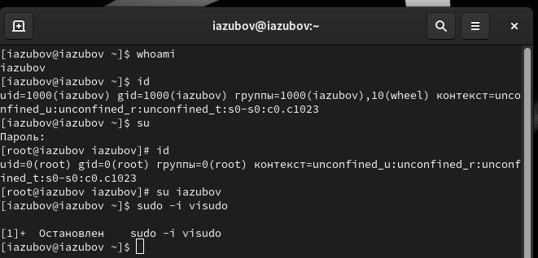
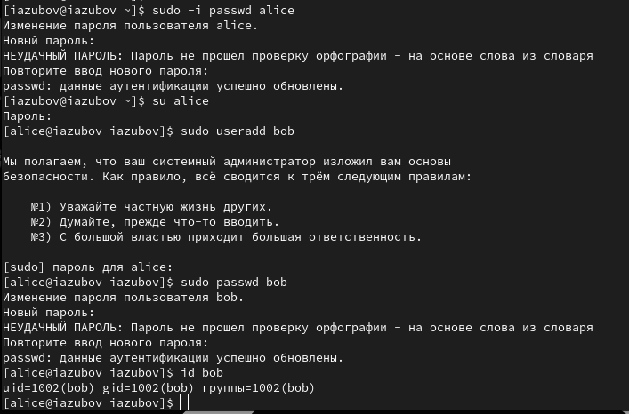
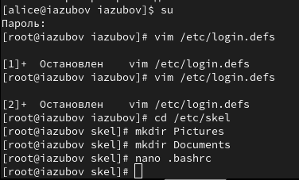
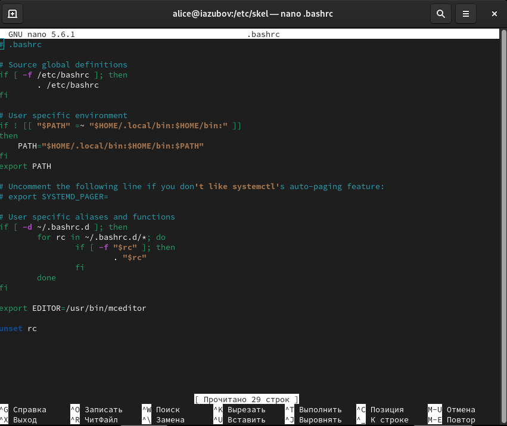
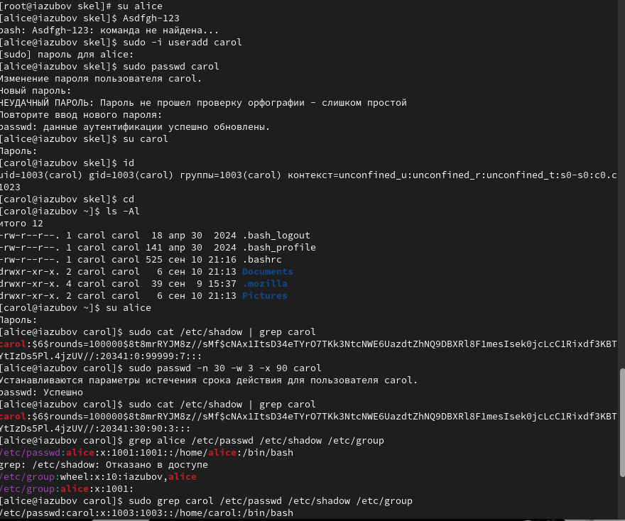
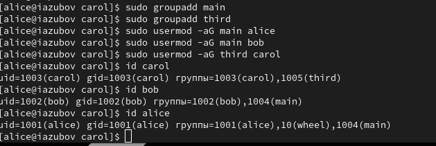

---
## Front matter
lang: ru-RU
title: Лабораторная работа №2
subtitle: Презентация
author:
  - Зубов И.А
institute:
  - Российский университет дружбы народов, Москва, Россия

## i18n babel
babel-lang: russian
babel-otherlangs: english

## Formatting pdf
toc: false
toc-title: Содержание
slide_level: 2
aspectratio: 169
section-titles: true
theme: metropolis
header-includes:
 - \metroset{progressbar=frametitle,sectionpage=progressbar,numbering=fraction}
---

# Информация

## Докладчик

  * Зубов Иван Александрович
  * Студент
  * Российский университет дружбы народов
  * 1132243112@pfur.ru

# Выполнение лабораторной работы

## Команды whoami и id

:::::::::::::: {.columns align=center}
::: {.column width="30%"}

:::
::::::::::::::

## Создадим пользователя alice 

:::::::::::::: {.columns align=center}
::: {.column width="30%"}

:::
::::::::::::::

## Редактируем файл

:::::::::::::: {.columns align=center}
::: {.column width="30%"}

:::
::::::::::::::

## Cозданим каталоги Pictures,Documents. Изменим содержание файла .bashrc

:::::::::::::: {.columns align=center}
::: {.column width="30%"}

:::
::::::::::::::

## Cоздаем пользователя carol

:::::::::::::: {.columns align=center}
::: {.column width="30%"}

:::
::::::::::::::

## Работа с группами

:::::::::::::: {.columns align=center}
::: {.column width="30%"}

:::
::::::::::::::

