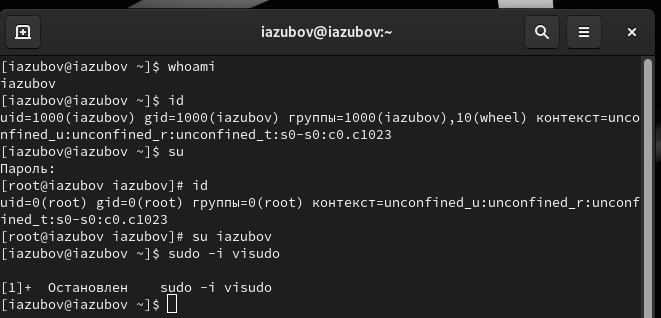
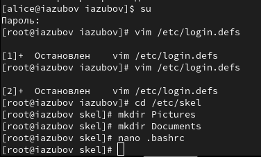
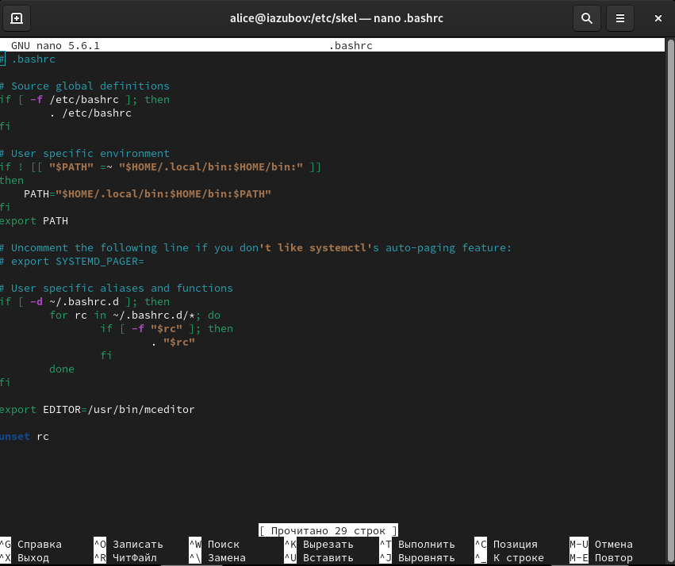
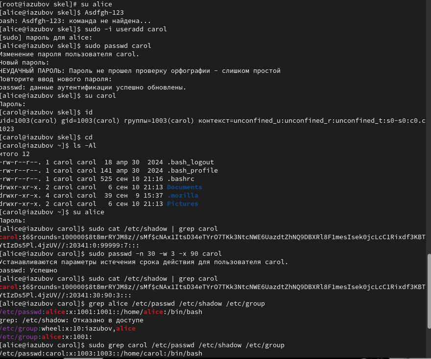
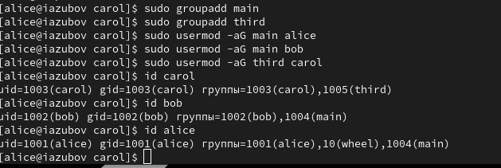

---
## Front matter
title: "Лабораторная работа №2"
subtitle: "Отчёт"
author: "Зубов Иван Александрович"

## Generic otions
lang: ru-RU
toc-title: "Содержание"

## Bibliography
bibliography: bib/cite.bib
csl: pandoc/csl/gost-r-7-0-5-2008-numeric.csl

## Pdf output format
toc: true # Table of contents
toc-depth: 2
lof: true # List of figures
lot: true # List of tables
fontsize: 12pt
linestretch: 1.5
papersize: a4
documentclass: scrreprt
## I18n polyglossia
polyglossia-lang:
  name: russian
  options:
	- spelling=modern
	- babelshorthands=true
polyglossia-otherlangs:
  name: english
## I18n babel
babel-lang: russian
babel-otherlangs: english
## Fonts
mainfont: IBM Plex Serif
romanfont: IBM Plex Serif
sansfont: IBM Plex Sans
monofont: IBM Plex Mono
mathfont: STIX Two Math
mainfontoptions: Ligatures=Common,Ligatures=TeX,Scale=0.94
romanfontoptions: Ligatures=Common,Ligatures=TeX,Scale=0.94
sansfontoptions: Ligatures=Common,Ligatures=TeX,Scale=MatchLowercase,Scale=0.94
monofontoptions: Scale=MatchLowercase,Scale=0.94,FakeStretch=0.9
mathfontoptions:
## Biblatex
biblatex: true
biblio-style: "gost-numeric"
biblatexoptions:
  - parentracker=true
  - backend=biber
  - hyperref=auto
  - language=auto
  - autolang=other*
  - citestyle=gost-numeric
## Pandoc-crossref LaTeX customization
figureTitle: "Рис."
listingTitle: "Листинг"
lofTitle: "Список иллюстраций"
lolTitle: "Листинги"
## Misc options
indent: true
header-includes:
  - \usepackage{indentfirst}
  - \usepackage{float} # keep figures where there are in the text
  - \floatplacement{figure}{H} # keep figures where there are in the text
---

# Цель работы

Целью работы является изучить идеологию и применение средств
контроля версий. Приобрести практические навыки по работе с системой
git.

# Выполнение лабораторной работы

Первым делом создаём учётную запись на сайте https://github.com/ и
заполняем основные данные.

{#fig:001 width=70%}

Сначала сделаем предварительную конфигурацию git. Откройте терминал
и введите следующие команды, указав имя и email владельца репозитория.
Настроим utf-8 в выводе сообщений git. Зададим имя начальной ветки
(будем называть её master). 

{#fig:002 width=70%}

Далее создаем SSH ключ на сайте http: //github.org/

{#fig:003 width=70%}

Откроем терминал и создадим каталог для предмета «Архитектура
компьютера»

{#fig:004 width=70%}

Репозиторий на основе шаблона можно создать через web-интерфейс
github. Перейдем на станицу репозитория с шаблоном курса
https://github.com/yamadharma/cour se-directory-student-template и создаем
репозиторий. 

{#fig:005 width=70%}

Откроем терминал , перейдем в каталог курса и клонируем созданный
репозиторий 

{#fig:006 width=70%}

Перейдем в каталог курса, удаляем лишние файлы и создаем
необходимые каталоги.

{#fig:007 width=70%}

Отправляем файлы на сервер.

{#fig:008 width=70%}

{#fig:009 width=70%}

Проверяем правильность создания иерархии рабочего пространства в
локальном репозитории и на странице github.

{#fig:010 width=70%}

Загрузим файлы на github в соответствующий каталог.

{#fig:011 width=70%}

# Выводы

Мы изучили идеологию и применение средств контроля версий.
Приобрели практические навыки по работе с системой git.

