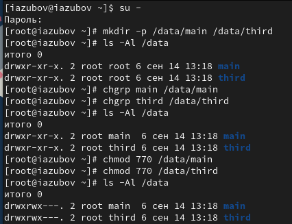
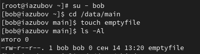
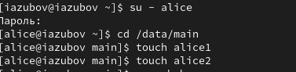
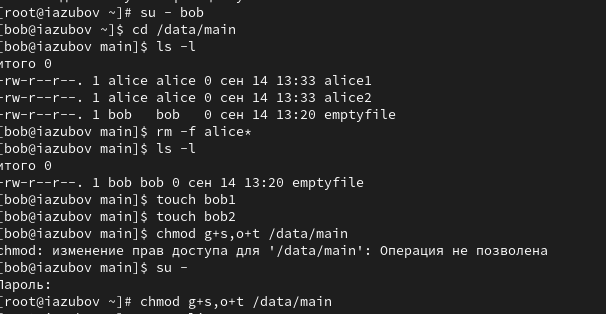
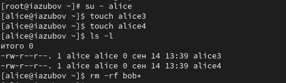
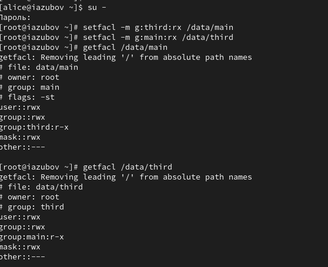
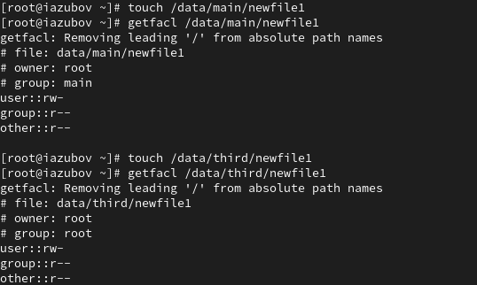
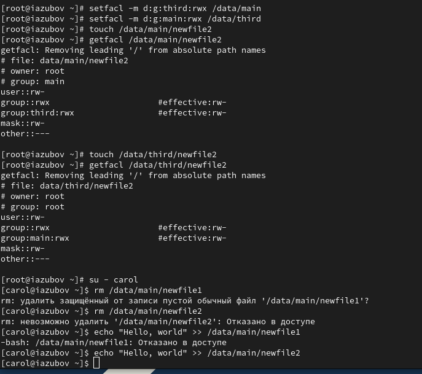

---
## Front matter
lang: ru-RU
title: Лабораторная работа №3
subtitle: Презентация
author:
  - Зубов И.А
institute:
  - Российский университет дружбы народов, Москва, Россия

## i18n babel
babel-lang: russian
babel-otherlangs: english

## Formatting pdf
toc: false
toc-title: Содержание
slide_level: 2
aspectratio: 169
section-titles: true
theme: metropolis
header-includes:
 - \metroset{progressbar=frametitle,sectionpage=progressbar,numbering=fraction}
---

# Информация

## Докладчик

  * Зубов Иван Александрович
  * Студент
  * Российский университет дружбы народов
  * 1132243112@pfur.ru

# Выполнение лабораторной работы

## Устанавливаем разрешение

Откроем терминал с учетной записью root. В корневом каталоге создаем каталоги /data/main и /data/third и устанавливаем разрешения

:::::::::::::: {.columns align=center}
::: {.column width="30%"}

:::
::::::::::::::

## Cоздаем файл emptyfile 

:::::::::::::: {.columns align=center}
::: {.column width="30%"}

:::
::::::::::::::

## Заходим в пользователя alice и создаем два файла

:::::::::::::: {.columns align=center}
::: {.column width="30%"}

:::
::::::::::::::

## Управление специальными разрешениями

Под учетной записью bob перейдем в каталог /data/main и попробуем удалить файлы, принадлежащие пользователю alice. 
Создаем два файла, которые принадлежат пользователю bob
В терминале под пользователем root установим для каталога /data/main бит идентификатора группы, а также stiky-бит для разделяемого (общего) каталога группы

:::::::::::::: {.columns align=center}
::: {.column width="30%"}

:::
::::::::::::::

## Cоздаем в каталоге /data/main файлы alice3 и alice4

:::::::::::::: {.columns align=center}
::: {.column width="30%"}

:::
::::::::::::::

## Установим права на чтение и выполнение

:::::::::::::: {.columns align=center}
::: {.column width="30%"}

:::
::::::::::::::

## Установим права на чтение и выполнение

:::::::::::::: {.columns align=center}
::: {.column width="30%"}

:::
::::::::::::::

## Проверим операции с файлами

:::::::::::::: {.columns align=center}
::: {.column width="30%"}

:::
::::::::::::::

