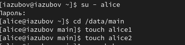

---
## Front matter
title: "Лабораторная работа №3"
subtitle: "Отчёт"
author: "Зубов Иван Александрович"

## Generic otions
lang: ru-RU
toc-title: "Содержание"

## Bibliography
bibliography: bib/cite.bib
csl: pandoc/csl/gost-r-7-0-5-2008-numeric.csl

## Pdf output format
toc: true # Table of contents
toc-depth: 2
lof: true # List of figures
lot: true # List of tables
fontsize: 12pt
linestretch: 1.5
papersize: a4
documentclass: scrreprt
## I18n polyglossia
polyglossia-lang:
  name: russian
  options:
	- spelling=modern
	- babelshorthands=true
polyglossia-otherlangs:
  name: english
## I18n babel
babel-lang: russian
babel-otherlangs: english
## Fonts
mainfont: IBM Plex Serif
romanfont: IBM Plex Serif
sansfont: IBM Plex Sans
monofont: IBM Plex Mono
mathfont: STIX Two Math
mainfontoptions: Ligatures=Common,Ligatures=TeX,Scale=0.94
romanfontoptions: Ligatures=Common,Ligatures=TeX,Scale=0.94
sansfontoptions: Ligatures=Common,Ligatures=TeX,Scale=MatchLowercase,Scale=0.94
monofontoptions: Scale=MatchLowercase,Scale=0.94,FakeStretch=0.9
mathfontoptions:
## Biblatex
biblatex: true
biblio-style: "gost-numeric"
biblatexoptions:
  - parentracker=true
  - backend=biber
  - hyperref=auto
  - language=auto
  - autolang=other*
  - citestyle=gost-numeric
## Pandoc-crossref LaTeX customization
figureTitle: "Рис."
listingTitle: "Листинг"
lofTitle: "Список иллюстраций"
lolTitle: "Листинги"
## Misc options
indent: true
header-includes:
  - \usepackage{indentfirst}
  - \usepackage{float} # keep figures where there are in the text
  - \floatplacement{figure}{H} # keep figures where there are in the text
---

# Цель работы

Получение навыков настройки базовых и специальных прав доступа для групп пользователей в операционной системе типа Linux.

# Задание

1. Прочитайте справочное описание man по командам chgrp, chmod, getfacl, setfacl.
2. Выполните действия по управлению базовыми разрешениями для групп пользователей (раздел 3.3.1).
3. Выполните действия по управлению специальными разрешениями для групп пользователей (раздел 3.3.2).
4. Выполните действия по управлению расширенными разрешениями с использованием
списков ACL для групп пользователей (раздел 3.3.3).

# Выполнение лабораторной работы

Откроем терминал с учетной записью root. В корневом каталоге создаем каталоги /data/main и /data/third и устанавливаем разрешения

{#fig:001 width=70%}

Под учетной записью bob создаем файл emptyfile

{#fig:002 width=70%}

Заходим в пользователя alice и создаем два файла

{#fig:003 width=70%}

Под учетной записью bob перейдем в каталог /data/main и попробуем удалить файлы, принадлежащие пользователю alice. 
Создаем два файла, которые принадлежат пользователю bob
В терминале под пользователем root установим для каталога /data/main бит идентификатора группы, а также stiky-бит для разделяемого (общего) каталога группы

{#fig:004 width=70%}

В терминале под пользователем alice создаем в каталоге /data/main файлы alice3
и alice4

{#fig:005 width=70%}

Установим права на чтение и выполнение

{#fig:006 width=70%}

Устанавливаем ACL для каталога /data/main и /data/third

{#fig:007 width=70%}

Для проверки полномочий группы third в каталоге /data/third войдем в другом
терминале под учётной записью члена группы third:
su - carol
Проверим операции с файлами

{#fig:008 width=70%}

# Выводы

Я получил навыки настройки базовых и специальных прав доступа для групп пользователей в операционной системе типа Linux.

