---
## Front matter
lang: ru-RU
title: Лабораторная работа №4
subtitle: Презентация
author:
  - Зубов И.А
institute:
  - Российский университет дружбы народов, Москва, Россия

## i18n babel
babel-lang: russian
babel-otherlangs: english

## Formatting pdf
toc: false
toc-title: Содержание
slide_level: 2
aspectratio: 169
section-titles: true
theme: metropolis
header-includes:
 - \metroset{progressbar=frametitle,sectionpage=progressbar,numbering=fraction}
---

# Информация

## Докладчик

  * Зубов Иван Александрович
  * Студент
  * Российский университет дружбы народов
  * 1132243112@pfur.ru

# Выполнение лабораторной работы

## Работа с репозитириями

Заходим в режим суперпользователя. Перейдем в каталог /etc/yum.repos.d и изучим содержание каталога и файлов
репозиториев с помощью команды сat

:::::::::::::: {.columns align=center}
::: {.column width="30%"}

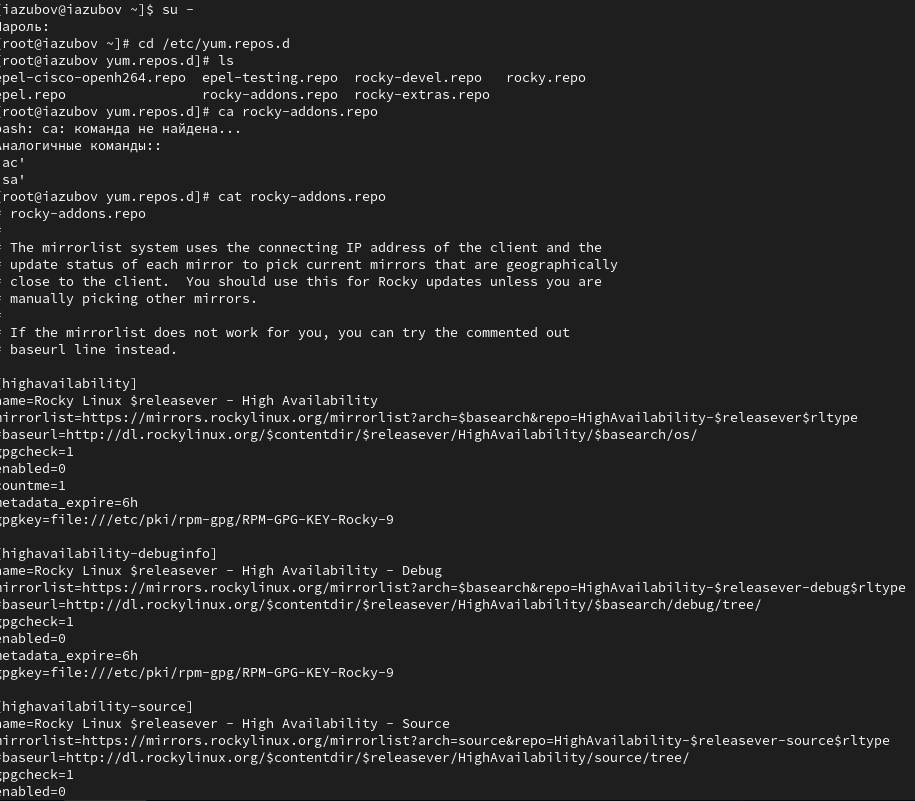

:::
::::::::::::::

## Выводим на экран список репозиториев

:::::::::::::: {.columns align=center}
::: {.column width="30%"}

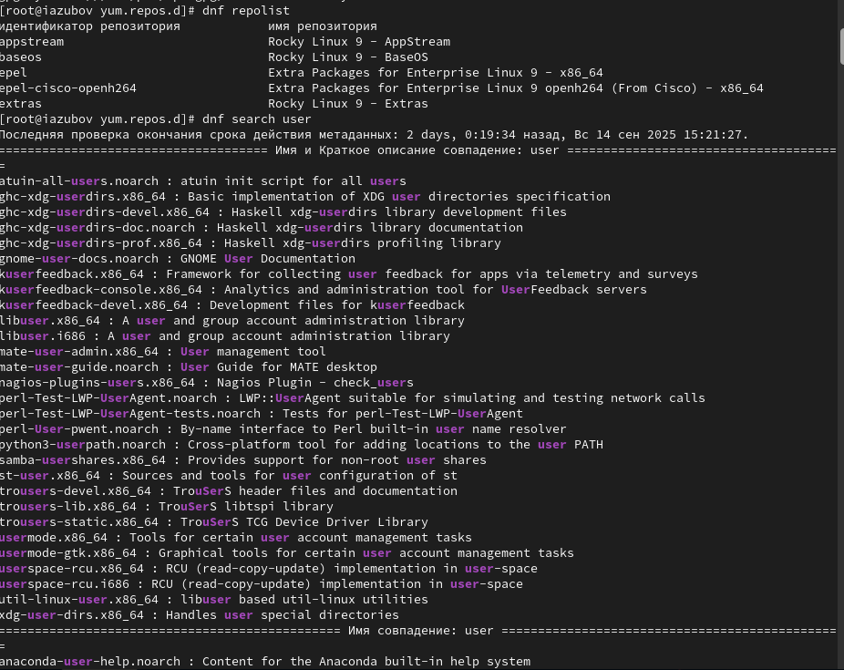

:::
::::::::::::::

## Устанавливаем nmap и nmap\*

Изучаем информацию о пакетах nmap и устанавливаем их

:::::::::::::: {.columns align=center}
::: {.column width="30%"}

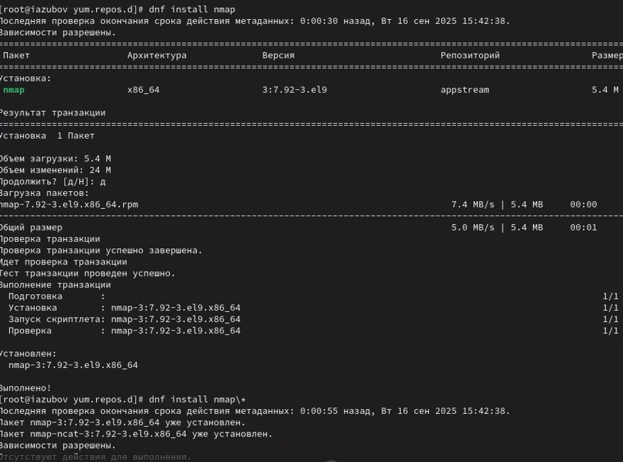

:::
::::::::::::::

## Удаляем nmap

:::::::::::::: {.columns align=center}
::: {.column width="30%"}

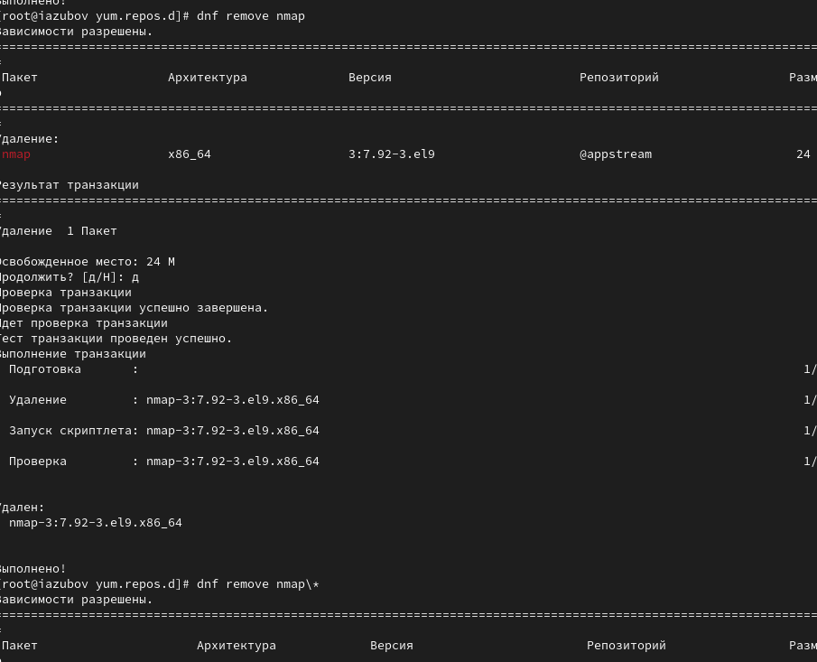

:::
::::::::::::::

## Команды dnf groups

Получите список имеющихся групп пакетов с помощью команды dnf groups

:::::::::::::: {.columns align=center}
::: {.column width="30%"}

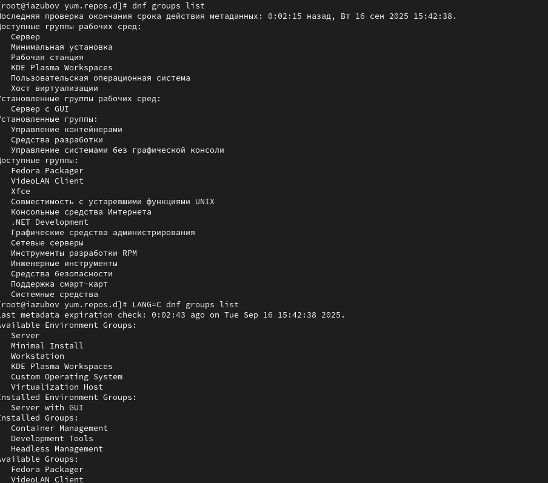

:::
::::::::::::::

## Устанавливаем группу пакетов

:::::::::::::: {.columns align=center}
::: {.column width="30%"}

:::
::::::::::::::

## Смотрим историю использования dnf

:::::::::::::: {.columns align=center}
::: {.column width="30%"}

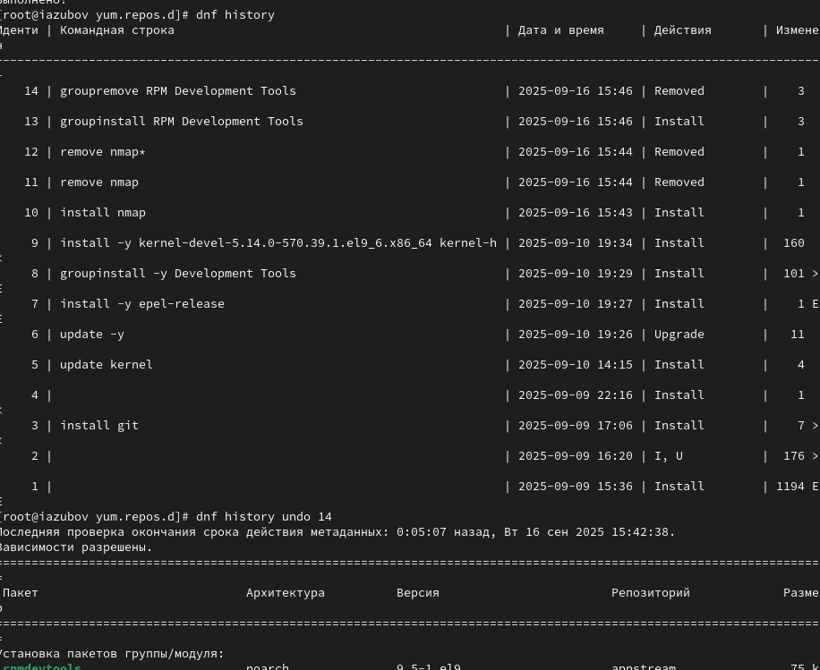

:::
::::::::::::::

## Скачиваем rpm-пакет lynx

:::::::::::::: {.columns align=center}
::: {.column width="30%"}

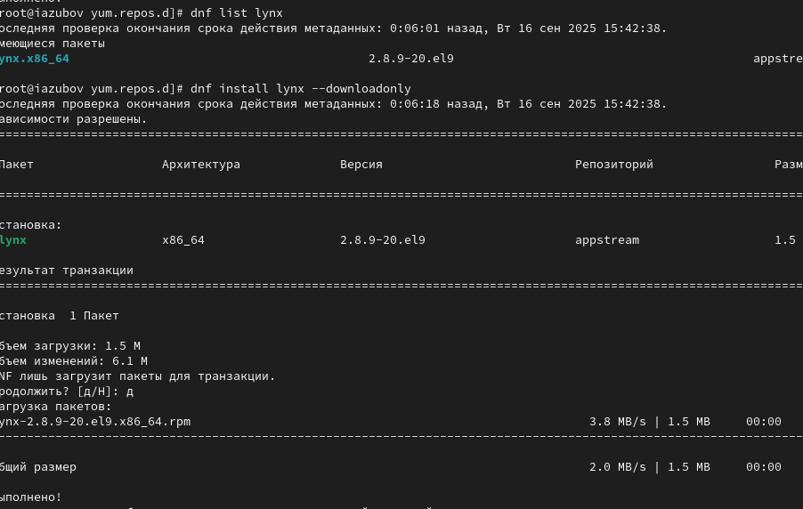

:::
::::::::::::::

## Использование rpm

Найдем каталог, в который был помещён пакет после загрузки командой find /var/cache/dnf/ -name lynx*
Перейдем в этот каталог и затем установите rpm-пакет
Определим расположение исполняемого файла командой which lynx

:::::::::::::: {.columns align=center}
::: {.column width="30%"}

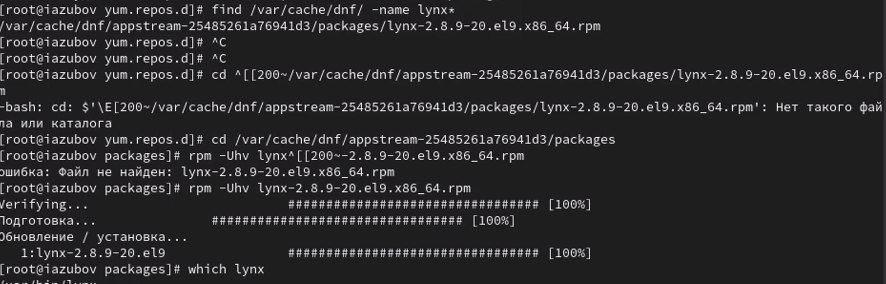

:::
::::::::::::::

## Команда ql,qi,qd,qf

Используя rpm, определите по имени файла, к какому пакету принадлежит lynx командой rpm -qf $(which lynx)
и получите дополнительную информацию о содержимом пакета, введя rpm -qi lynx
Получите список всех файлов в пакете, используя rpm -ql lynx
Также выведите перечень файлов с документацией пакета, введя rpm -qd lynx
Посмотрите файлы документации, применив команду man lynx.
Выведите на экран перечень и месторасположение конфигурационных файлов пакета rpm -qc lynx

:::::::::::::: {.columns align=center}
::: {.column width="30%"}

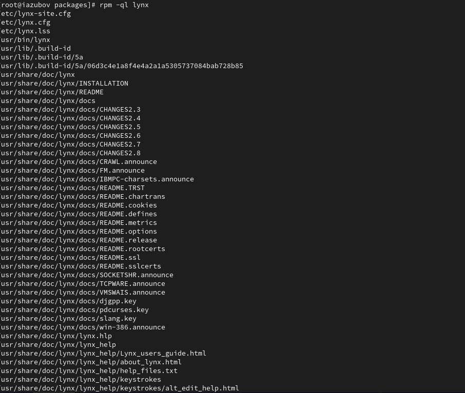

:::
::::::::::::::

:::::::::::::: {.columns align=center}
::: {.column width="30%"}

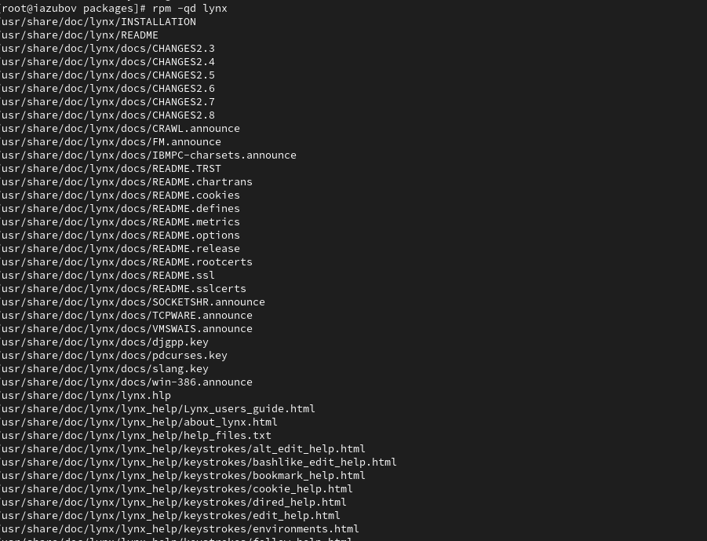

:::
::::::::::::::

## Удалим пакет rpm

:::::::::::::: {.columns align=center}
::: {.column width="30%"}

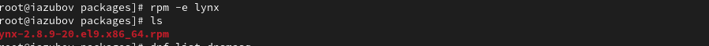

:::
::::::::::::::

## Установим пакет dnsmasq

Установите пакет dnsmasq и определите расположение исполняемого файла командой which dnsmasq

:::::::::::::: {.columns align=center}
::: {.column width="30%"}

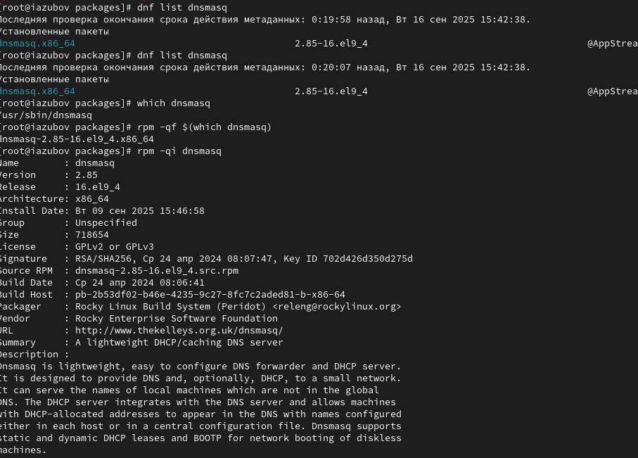

:::
::::::::::::::

## Команды qf,qi,ql,qd

Прописывем те же команды, что и с первой программой.Используя rpm, определите по имени файла, к какому пакету принадлежит lynx командой rpm -qf $(which lynx)
и получим дополнительную информацию о содержимом пакета, введя rpm -qi lynx
Получим список всех файлов в пакете, используя rpm -ql lynx
Также выведим перечень файлов с документацией пакета, введя rpm -qd lynx
Посмотрим файлы документации, применив команду man lynx.
Выведим на экран перечень и месторасположение конфигурационных файлов пакета rpm -qc lynx

:::::::::::::: {.columns align=center}
::: {.column width="30%"}

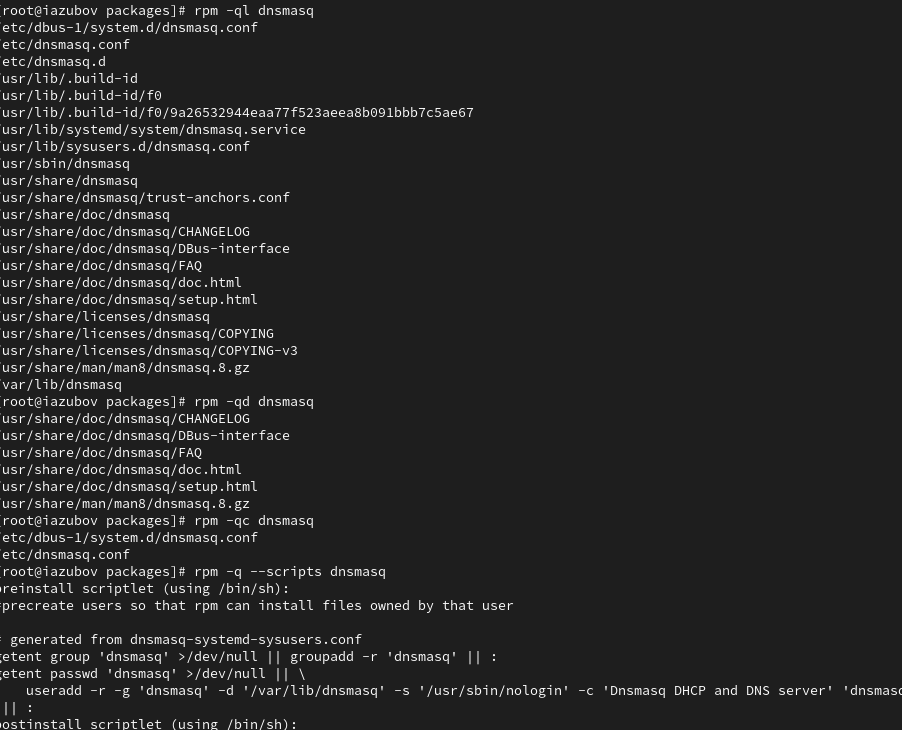

:::
::::::::::::::

## Удаляем пакет rpm

:::::::::::::: {.columns align=center}
::: {.column width="30%"}

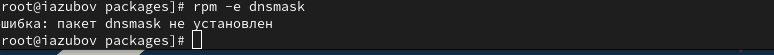

:::
::::::::::::::

## Контрольные вопросы

1. Какая команда позволяет вам искать пакет rpm, содержащий файл useradd? rpm -qf $(which useradd)
2. Какие команды вам нужно использовать, чтобы показать имя группы dnf, которая
содержит инструменты безопасности и показывает, что находится в этой группе? dnf group list - найти группу, затем dnf group info "Security Tools"
3. Какая команда позволяет вам установить rpm, который вы загрузили из Интернета
и который не находится в репозиториях? rpm -i package_name.rpm или dnf install ./package_name.rpm
4. Вы хотите убедиться, что пакет rpm, который вы загрузили, не содержит никакого
опасного кода сценария. Какая команда позволяет это сделать? rpm --checksig package_name.rpm
5. Какая команда показывает всю документацию в rpm? rpm -qd package_name
6. Какая команда показывает, какому пакету rpm принадлежит файл? rpm -qf /path/to/file

