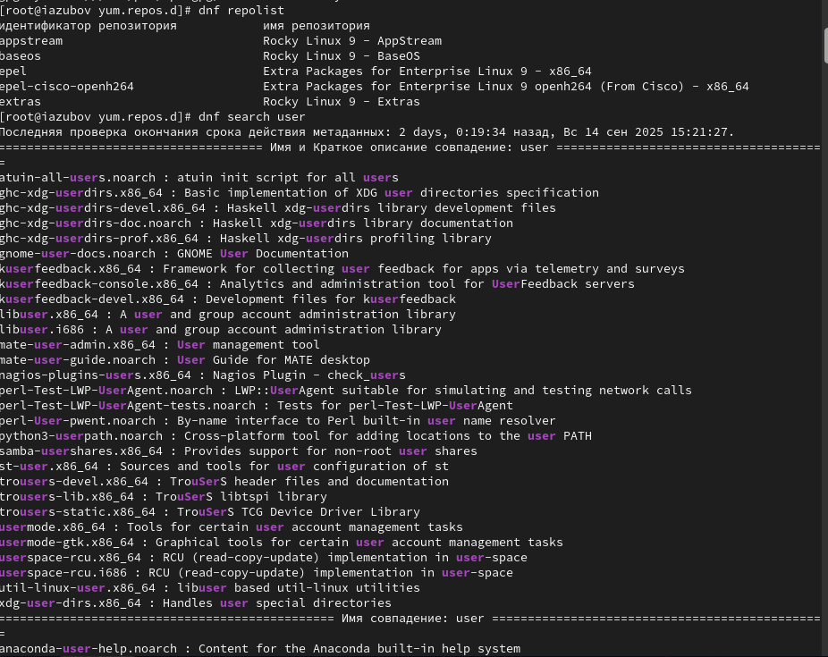
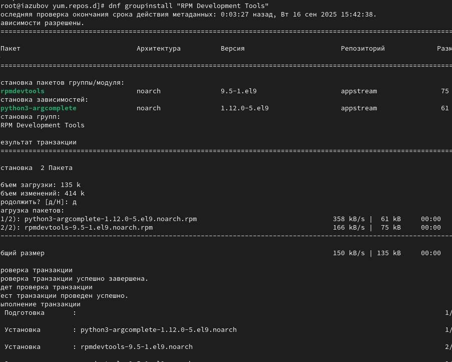
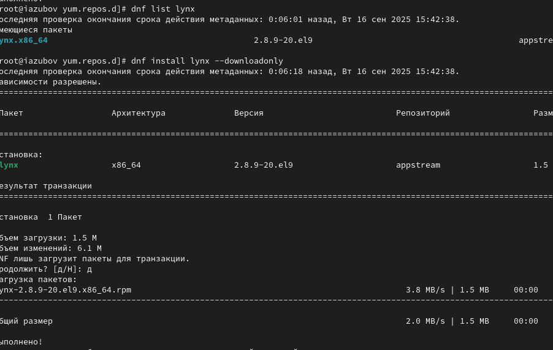
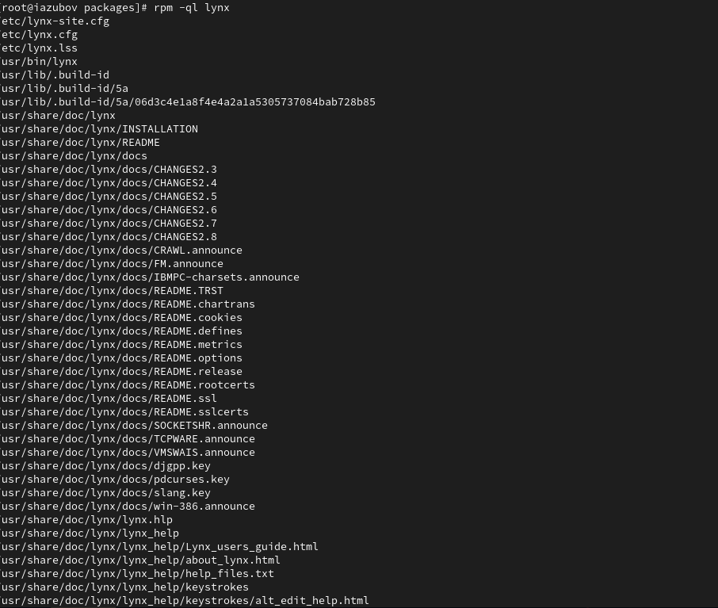
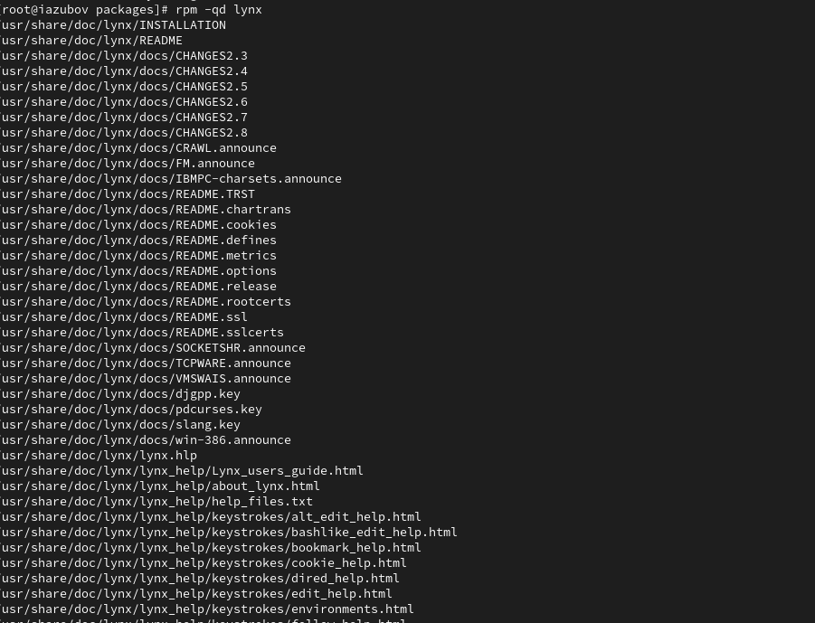

---
## Front matter
title: "Лабораторная работа №4"
subtitle: "Отчет"
author: "Зубов Иван Александрович"

## Generic otions
lang: ru-RU
toc-title: "Содержание"

## Bibliography
bibliography: bib/cite.bib
csl: pandoc/csl/gost-r-7-0-5-2008-numeric.csl

## Pdf output format
toc: true # Table of contents
toc-depth: 2
lof: true # List of figures
lot: true # List of tables
fontsize: 12pt
linestretch: 1.5
papersize: a4
documentclass: scrreprt
## I18n polyglossia
polyglossia-lang:
  name: russian
  options:
	- spelling=modern
	- babelshorthands=true
polyglossia-otherlangs:
  name: english
## I18n babel
babel-lang: russian
babel-otherlangs: english
## Fonts
mainfont: IBM Plex Serif
romanfont: IBM Plex Serif
sansfont: IBM Plex Sans
monofont: IBM Plex Mono
mathfont: STIX Two Math
mainfontoptions: Ligatures=Common,Ligatures=TeX,Scale=0.94
romanfontoptions: Ligatures=Common,Ligatures=TeX,Scale=0.94
sansfontoptions: Ligatures=Common,Ligatures=TeX,Scale=MatchLowercase,Scale=0.94
monofontoptions: Scale=MatchLowercase,Scale=0.94,FakeStretch=0.9
mathfontoptions:
## Biblatex
biblatex: true
biblio-style: "gost-numeric"
biblatexoptions:
  - parentracker=true
  - backend=biber
  - hyperref=auto
  - language=auto
  - autolang=other*
  - citestyle=gost-numeric
## Pandoc-crossref LaTeX customization
figureTitle: "Рис."
tableTitle: "Таблица"
listingTitle: "Листинг"
lofTitle: "Список иллюстраций"
lotTitle: "Список таблиц"
lolTitle: "Листинги"
## Misc options
indent: true
header-includes:
  - \usepackage{indentfirst}
  - \usepackage{float} # keep figures where there are in the text
  - \floatplacement{figure}{H} # keep figures where there are in the text
---

# Цель работы

Освоение процедуры компиляции и сборки программ, написанных на ассемблере NASM.
# Задание

Написать 2 программы (Hello world, lab4, (Имя Фамилия) )

# Выполнение лабораторной работы

# Программа Hello world!

Создаем каталог для работы с программами на языке ассемблера NASM 

{#fig:001 width=70%}

Переходим в созданный каталог

{#fig:002 width=70%}

Создаем текстовый файл hello.asm

{#fig:003 width=70%}

Открываем созданный файл в текстовом редакторе

{#fig:004 width=70%}

# Транслятор NASM

Преобразуем текст программы в объектный вид

{#fig:005 width=70%}

# Расширенный синтаксис командной строки NASM

Компилируем исходный файл 

{#fig:006 width=70%}

# Компоновщик LD

Передаем объектный файл на обработку компоновщику и проверяем создался ли исполняемый файл hello

{#fig:007 width=70%}

# Запуск исполняемого файла

Запускаем на выполнение созданный исполняемый файл

{#fig:008 width=70%}

#Задание для самостоятельной работы

Создаем копию файла hello.asm

{#fig:009 width=70%}

Открываем файл и редактируем его

{#fig:010 width=70%}

Открываем файл в текстовом редакторе

{#fig:011 width=70%}

Прописывем те же команды, что и с первой программой

{#fig:012 width=70%}

Копируем файлы в локальный репозиторий

{#fig:013 width=70%}

Переходим в каталог лабораторных работ и загружаем файлы на Github

{#fig:014 width=70%}

{#fig:015 width=70%}

# Выводы

Мы познакомились с языком ассемблера NASM и создали две работающих
программы.

