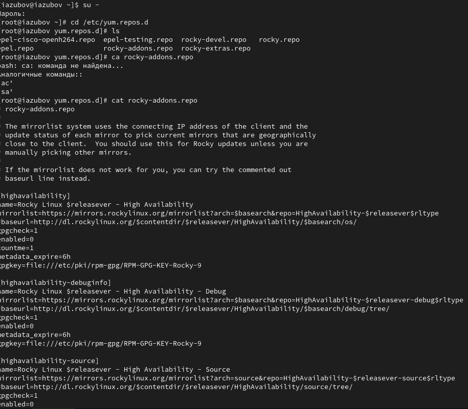
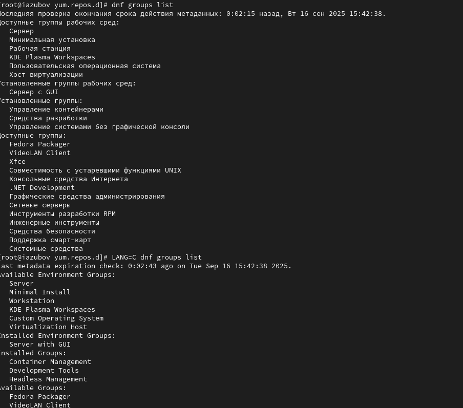
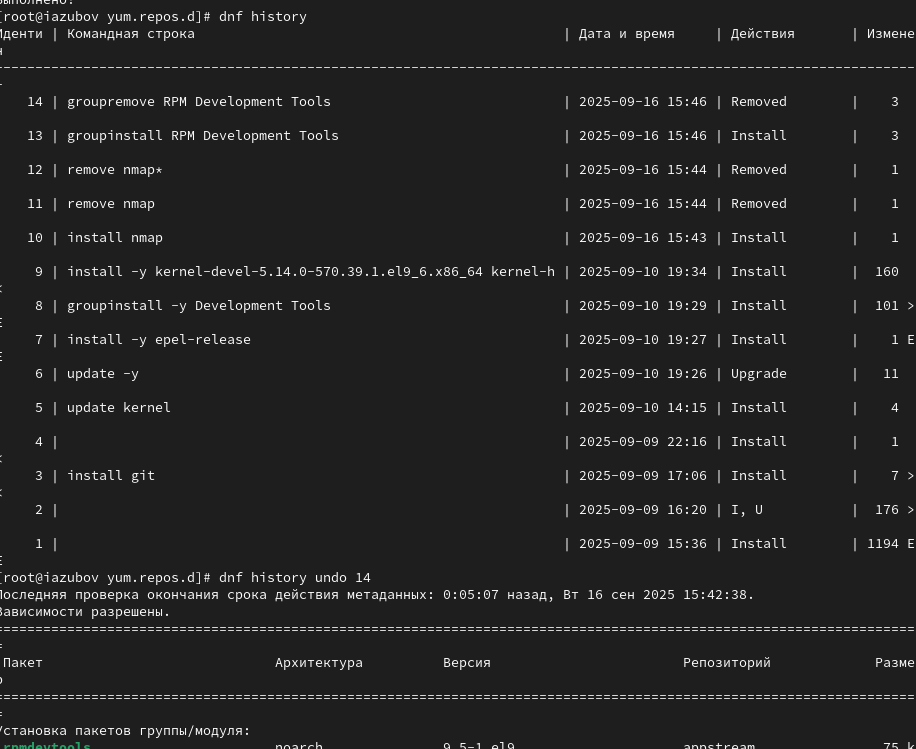

---
## Front matter
title: "Лабораторная работа №4"
subtitle: "Отчет"
author: "Зубов Иван Александрович"

## Generic otions
lang: ru-RU
toc-title: "Содержание"

## Bibliography
bibliography: bib/cite.bib
csl: pandoc/csl/gost-r-7-0-5-2008-numeric.csl

## Pdf output format
toc: true # Table of contents
toc-depth: 2
lof: true # List of figures
lot: true # List of tables
fontsize: 12pt
linestretch: 1.5
papersize: a4
documentclass: scrreprt
## I18n polyglossia
polyglossia-lang:
  name: russian
  options:
	- spelling=modern
	- babelshorthands=true
polyglossia-otherlangs:
  name: english
## I18n babel
babel-lang: russian
babel-otherlangs: english
## Fonts
mainfont: IBM Plex Serif
romanfont: IBM Plex Serif
sansfont: IBM Plex Sans
monofont: IBM Plex Mono
mathfont: STIX Two Math
mainfontoptions: Ligatures=Common,Ligatures=TeX,Scale=0.94
romanfontoptions: Ligatures=Common,Ligatures=TeX,Scale=0.94
sansfontoptions: Ligatures=Common,Ligatures=TeX,Scale=MatchLowercase,Scale=0.94
monofontoptions: Scale=MatchLowercase,Scale=0.94,FakeStretch=0.9
mathfontoptions:
## Biblatex
biblatex: true
biblio-style: "gost-numeric"
biblatexoptions:
  - parentracker=true
  - backend=biber
  - hyperref=auto
  - language=auto
  - autolang=other*
  - citestyle=gost-numeric
## Pandoc-crossref LaTeX customization
figureTitle: "Рис."
tableTitle: "Таблица"
listingTitle: "Листинг"
lofTitle: "Список иллюстраций"
lotTitle: "Список таблиц"
lolTitle: "Листинги"
## Misc options
indent: true
header-includes:
  - \usepackage{indentfirst}
  - \usepackage{float} # keep figures where there are in the text
  - \floatplacement{figure}{H} # keep figures where there are in the text
---

# Цель работы

Получить навыки работы с репозиториями и менеджерами пакетов

# Задание

1. Изучите, как и в каких файлах подключаются репозитории для установки программного обеспечения; изучите основные возможности (поиск, установка, обновление,удаление пакета, работа с историей действий) команды dnf 
2. Изучите и повторите процесс установки/удаления определённого пакета с использованием возможностей dnf 
3. Изучите и повторите процесс установки/удаления определённого пакета с использованием возможностей rpm 

# Выполнение лабораторной работы

# Работа с репозитириями

Заходим в режим суперпользователя. Перейдем в каталог /etc/yum.repos.d и изучим содержание каталога и файлов
репозиториев с помощью команды сat

{#fig:001 width=70%}

Выведим на экран список репозиториев с помощью команды dnf repolist.
Также выводим список пакетов в названии котрого есть слова user

{#fig:002 width=70%}

Изучаем информацию о пакетах nmap и устанавливаем их

Разницу между dnf install nmap и dnf install nmap\* в том, что при первой команде скачивается весь пакет,а при второй команде лишь те,что начинается с nmap\*

{#fig:0014 width=70%}

Удаляем nmap

{#fig:003 width=70%}

Получите список имеющихся групп пакетов с помощью команды dnf groups

{#fig:004 width=70%}

Установите группу пакетов RPM Development Tools,а затем с помощью команды groupremove удалим группу пакетов

{#fig:005 width=70%}

Посмотрите историю использования команды dnf и отмените последнее

{#fig:006 width=70%}

Скачиваем rpm-пакет lynx

{#fig:007 width=70%}

Найдем каталог, в который был помещён пакет после загрузки командой find /var/cache/dnf/ -name lynx*
Перейдем в этот каталог и затем установите rpm-пакет
Определим расположение исполняемого файла командой which lynx

{#fig:015 width=70%}

Используя rpm, определите по имени файла, к какому пакету принадлежит lynx командой rpm -qf $(which lynx)
и получите дополнительную информацию о содержимом пакета, введя rpm -qi lynx
Получите список всех файлов в пакете, используя rpm -ql lynx
Также выведите перечень файлов с документацией пакета, введя rpm -qd lynx
Посмотрите файлы документации, применив команду man lynx.
Выведите на экран перечень и месторасположение конфигурационных файлов пакета rpm -qc lynx

{#fig:008 width=70%}

{#fig:009 width=70%}

Вернемся в терминал с учётной записью root и удалите пакет

{#fig:010 width=70%}

Установите пакет dnsmasq и определите расположение исполняемого файла командой which dnsmasq

{#fig:011 width=70%}

Прописывем те же команды, что и с первой программой.Используя rpm, определите по имени файла, к какому пакету принадлежит lynx командой rpm -qf $(which lynx)
и получим дополнительную информацию о содержимом пакета, введя rpm -qi lynx
Получим список всех файлов в пакете, используя rpm -ql lynx
Также выведим перечень файлов с документацией пакета, введя rpm -qd lynx
Посмотрим файлы документации, применив команду man lynx.
Выведим на экран перечень и месторасположение конфигурационных файлов пакета rpm -qc lynx

{#fig:012 width=70%}

Удаляем пакет rpm

{#fig:013 width=70%}

# Контрольные вопросы
1. Какая команда позволяет вам искать пакет rpm, содержащий файл useradd? rpm -qf $(which useradd)
2. Какие команды вам нужно использовать, чтобы показать имя группы dnf, которая
содержит инструменты безопасности и показывает, что находится в этой группе? dnf group list - найти группу, затем dnf group info "Security Tools"
3. Какая команда позволяет вам установить rpm, который вы загрузили из Интернета
и который не находится в репозиториях? rpm -i package_name.rpm или dnf install ./package_name.rpm
4. Вы хотите убедиться, что пакет rpm, который вы загрузили, не содержит никакого
опасного кода сценария. Какая команда позволяет это сделать? rpm --checksig package_name.rpm
5. Какая команда показывает всю документацию в rpm? rpm -qd package_name
6. Какая команда показывает, какому пакету rpm принадлежит файл? rpm -qf /path/to/file

# Выводы

Я получил навыки работы с репозиториями и менеджерами пакетов.

