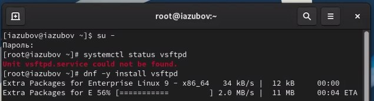
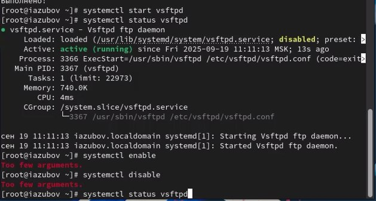
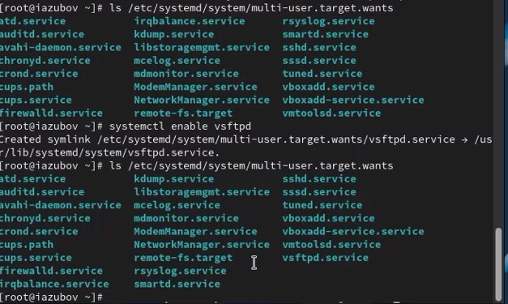
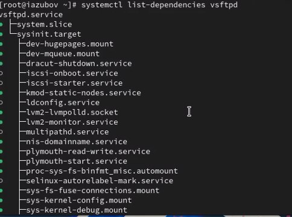
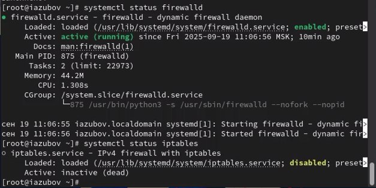
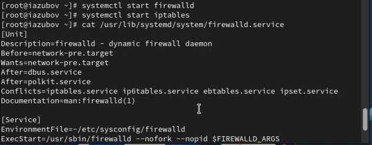
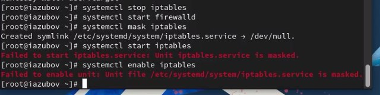
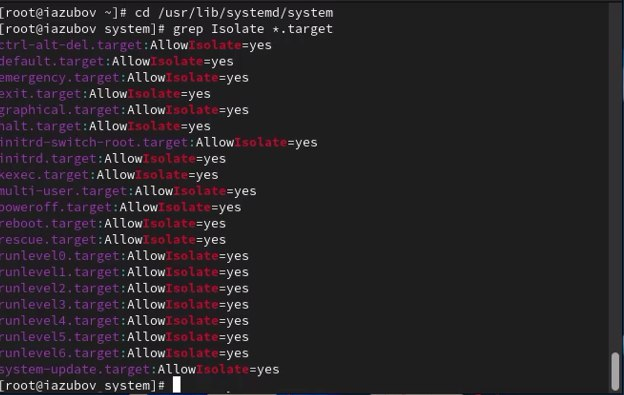
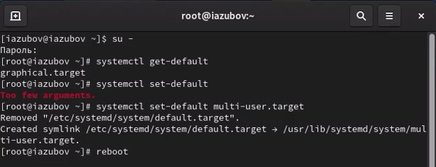
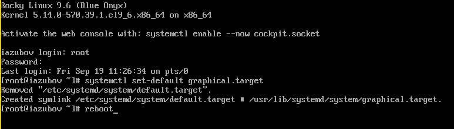

---
## Front matter
lang: ru-RU
title: Лабораторная работа №5
subtitle: Презентация
author:
  - Зубов И.А.
institute:
  - Российский университет дружбы народов, Москва, Россия
  
## i18n babel
babel-lang: russian
babel-otherlangs: english

## Formatting pdf
toc: false
toc-title: Содержание
slide_level: 2
aspectratio: 169
section-titles: true
theme: metropolis
header-includes:
 - \metroset{progressbar=frametitle,sectionpage=progressbar,numbering=fraction}
---

# Информация

## Докладчик

  * Зубов Иван Александрович
  * Студент
  * Российский университет дружбы народов
  * 1132243112@pfur.ru

# Выполнение лабораторной работы

## Установим службу Very Secure FTP

:::::::::::::: {.columns align=center}
::: {.column width="70%"}

:::
::::::::::::::

## Запустим службу Very Secure FTP

Запустим службу Very Secure FTP и проверим статус
Добавим службу Very Secure FTP в автозапуск при загрузке операционной системы, используя команду systemctl enable. Затем проверьте статус службы. Удалим службу из автозапуска, используя команду systemctl disable

:::::::::::::: {.columns align=center}
::: {.column width="70%"}

:::
::::::::::::::

## Символические ссылки

Выводим их на экран и работаем с ними

:::::::::::::: {.columns align=center}
::: {.column width="70%"}

:::
::::::::::::::

## Список юнитов

Выведим на экран список зависимостей юнита и список юнитов,которые зависят от данного юнита командой systemctl list-dependencies vsftpd --reverse

:::::::::::::: {.columns align=center}
::: {.column width="70%"}

:::
::::::::::::::

## Проверка статус firewalld и iptables:

:::::::::::::: {.columns align=center}
::: {.column width="70%"}

:::
::::::::::::::

## Запускаем firewalld и iptables

Запускаем firewalld и iptables и находим настройки конфликтов для этого юнита командами
cat /usr/lib/systemd/system/firewalld.service и cat /usr/lib/systemd/system/iptables.service

:::::::::::::: {.columns align=center}
::: {.column width="70%"}

:::
::::::::::::::

## Смотрим историю использования dnf

:::::::::::::: {.columns align=center}
::: {.column width="70%"}

:::
::::::::::::::

## Конфликты

Выгружаем службу iptables (на всякий случай, чтобы убедиться, что данная службане загружена в систему):
systemctl stop iptables
Загружаем службу firewalld
Заблокируем запуск iptables, введя:
systemctl mask iptables
Дальше попробуем запустить iptables. Система выдает ошибку и запускаем iptables в автозапуск, чтоб все прошло коректно

:::::::::::::: {.columns align=center}
::: {.column width="70%"}

:::
::::::::::::::

## Изолируемые цели

Получаем полномочия администратора. Переходим в каталог systemd и найдем список всех целей, которые можно изолировать
Переключаем операционную систему в режим восстановления:
systemctl isolate rescue.target
При этом необходимо ввести пароль root на консоли сервера для входа в систему.
И перезапустим операционную систему следующим образом:
systemctl isolate reboot.target

:::::::::::::: {.columns align=center}
::: {.column width="70%"}

:::
::::::::::::::

## Запускаем текстовый режим

:::::::::::::: {.columns align=center}
::: {.column width="70%"}

:::
::::::::::::::

## Графический режим

В текстовом режиме вводим команду и возвращаем обратно в графический режим

:::::::::::::: {.columns align=center}
::: {.column width="70%"}

:::
::::::::::::::

## Контрольные вопросы

1. Что такое юнит (unit)? Приведите примеры. Юнит (unit) - базовый объект systemd для управления ресурсами системы (сервисы, сокеты, устройства, точки монтирования и т.д.). Примеры: httpd.service, sshd.socket, home.mount.
2. Какая команда позволяет вам убедиться, что цель больше не входит в список автоматического запуска при загрузке системы?systemctl is-enabled target-name - покажет состояние автозапуска цели.
3. Какую команду вы должны использовать для отображения всех сервисных юнитов,
которые в настоящее время загружены?systemctl list-units --type=service - отображает все загруженные сервисные юниты.
4. Как создать потребность (wants) в сервисе?systemctl add-wants unit-name service-name - создает потребность (wants) в сервисе.
5. Как переключить текущее состояние на цель восстановления (rescue target)? systemctl rescue - переключает на цель восстановления (rescue target).
6. Поясните причину получения сообщения о том, что цель не может быть изолирована. Цель не может быть изолирована если она конфликтует с другими юнитами или имеет обязательные зависимости.
7. Вы хотите отключить службу systemd, но, прежде чем сделать это, вы хотите узнать,
какие другие юниты зависят от этой службы. Какую команду вы бы использовали? systemctl list-dependencies unit-name --reverse - показывает какие юниты зависят от указанного сервиса.
