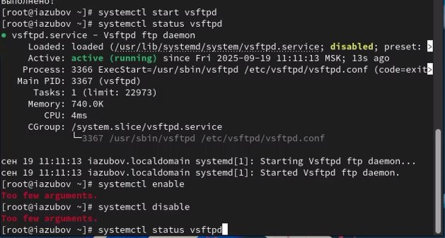

---
## Front matter
title: "Лабораторная работа №5"
subtitle: "Отчет"
author: "Зубов Иван Александрович"

## Generic otions
lang: ru-RU
toc-title: "Содержание"

## Bibliography
bibliography: bib/cite.bib
csl: pandoc/csl/gost-r-7-0-5-2008-numeric.csl

## Pdf output format
toc: true # Table of contents
toc-depth: 2
lof: true # List of figures
lot: true # List of tables
fontsize: 12pt
linestretch: 1.5
papersize: a4
documentclass: scrreprt
## I18n polyglossia
polyglossia-lang:
  name: russian
  options:
	- spelling=modern
	- babelshorthands=true
polyglossia-otherlangs:
  name: english
## I18n babel
babel-lang: russian
babel-otherlangs: english
## Fonts
mainfont: IBM Plex Serif
romanfont: IBM Plex Serif
sansfont: IBM Plex Sans
monofont: IBM Plex Mono
mathfont: STIX Two Math
mainfontoptions: Ligatures=Common,Ligatures=TeX,Scale=0.94
romanfontoptions: Ligatures=Common,Ligatures=TeX,Scale=0.94
sansfontoptions: Ligatures=Common,Ligatures=TeX,Scale=MatchLowercase,Scale=0.94
monofontoptions: Scale=MatchLowercase,Scale=0.94,FakeStretch=0.9
mathfontoptions:
## Biblatex
biblatex: true
biblio-style: "gost-numeric"
biblatexoptions:
  - parentracker=true
  - backend=biber
  - hyperref=auto
  - language=auto
  - autolang=other*
  - citestyle=gost-numeric
## Pandoc-crossref LaTeX customization
figureTitle: "Рис."
tableTitle: "Таблица"
listingTitle: "Листинг"
lofTitle: "Список иллюстраций"
lotTitle: "Список таблиц"
lolTitle: "Листинги"
## Misc options
indent: true
header-includes:
  - \usepackage{indentfirst}
  - \usepackage{float} # keep figures where there are in the text
  - \floatplacement{figure}{H} # keep figures where there are in the text
---

# Цель работы

Получить навыки управления системными службами операционной системы посредством systemd.

# Задание

1. Выполните основные операции по запуску (останову), определению статуса, добавлению (удалению) в автозапуск и пр. службы Very Secure FTP 
2. Продемонстрируйте навыки по разрешению конфликтов юнитов для служб
firewalld и iptables 
3. Продемонстрируйте навыки работы с изолированными целями 

# Выполнение лабораторной работы

# Управление сервисами

Получим полномочия администратора и установим службу Very Secure FTP

{#fig:001 width=70%}

Запустим службу Very Secure FTP и проверим статус
Добавим службу Very Secure FTP в автозапуск при загрузке операционной системы, используя команду systemctl enable. Затем проверьте статус службы. Удалим службу из автозапуска, используя команду systemctl disable

{#fig:002 width=70%}

Выведим на экран символические ссылки, ответственные за запуск различных сервисов:
ls /etc/systemd/system/multi-user.target.wants
Должно отобразиться, что ссылка на vsftpd.service не существует.
Снова добавим службу Very Secure FTP в автозапуск:
systemctl enable vsftpd
Выведим на экран символические ссылки, ответственные за запуск различных
сервисов.
Вывод команды покажет, что создана символическая ссылка для
файла /usr/lib/systemd/system/vsftpd.service в каталоге
/etc/systemd/system/multi-user.target.wants.
Снова проверим статус службы Very Secure FTP:
{#fig:003 width=70%}

Выведим на экран список зависимостей юнита и список юнитов,которые зависят от данного юнита командой systemctl list-dependencies vsftpd --reverse

{#fig:004 width=70%}

# Конфликты юнитов

Выведим на экран список зависимостей юнита и список юнитов,которые зависят от данного юнита командой systemctl list-dependencies vsftpd --reverse

{#fig:005 width=70%}

Запускаем firewalld и iptables и находим настройки конфликтов для этого юнита командами
cat /usr/lib/systemd/system/firewalld.service и cat /usr/lib/systemd/system/iptables.service

{#fig:006 width=70%}

Выгружаем службу iptables (на всякий случай, чтобы убедиться, что данная службане загружена в систему):
systemctl stop iptables
Загружаем службу firewalld
Заблокируем запуск iptables, введя:
systemctl mask iptables
Дальше попробуем запустить iptables. Система выдает ошибку и запускаем iptables в автозапуск, чтоб все прошло коректно

{#fig:007 width=70%}

# Изолируемые цели

Получаем полномочия администратора. Переходим в каталог systemd и найдем список всех целей, которые можно изолировать
Переключаем операционную систему в режим восстановления:
systemctl isolate rescue.target
При этом необходимо ввести пароль root на консоли сервера для входа в систему.
И перезапустим операционную систему следующим образом:
systemctl isolate reboot.target

{#fig:008 width=70%}

Выводим на экран цель по умолчанию и запускаем ее в текстовом режиме,и перезапускаем

{#fig:009 width=70%}

В тексттовом режиме вводим команду и возвращаем обратно в графический режим

{#fig:010 width=70%}

# Контрольные вопросы

1. Что такое юнит (unit)? Приведите примеры. Юнит (unit) - базовый объект systemd для управления ресурсами системы (сервисы, сокеты, устройства, точки монтирования и т.д.). Примеры: httpd.service, sshd.socket, home.mount.
2. Какая команда позволяет вам убедиться, что цель больше не входит в список автоматического запуска при загрузке системы?systemctl is-enabled target-name - покажет состояние автозапуска цели.
3. Какую команду вы должны использовать для отображения всех сервисных юнитов,
которые в настоящее время загружены?systemctl list-units --type=service - отображает все загруженные сервисные юниты.
4. Как создать потребность (wants) в сервисе?systemctl add-wants unit-name service-name - создает потребность (wants) в сервисе.
5. Как переключить текущее состояние на цель восстановления (rescue target)? systemctl rescue - переключает на цель восстановления (rescue target).
6. Поясните причину получения сообщения о том, что цель не может быть изолирована. Цель не может быть изолирована если она конфликтует с другими юнитами или имеет обязательные зависимости.
7. Вы хотите отключить службу systemd, но, прежде чем сделать это, вы хотите узнать,
какие другие юниты зависят от этой службы. Какую команду вы бы использовали? systemctl list-dependencies unit-name --reverse - показывает какие юниты зависят от указанного сервиса.

# Выводы

Я получил навыки управления системными службами операционной системы посредством systemd.

