---
## Front matter
lang: ru-RU
title: Лабораторная работа №6
subtitle: Презентация
author:
  - Зубов.И.А.
institute:
  - Российский университет дружбы народов, Москва, Россия

## i18n babel
babel-lang: russian
babel-otherlangs: english

## Formatting pdf
toc: false
toc-title: Содержание
slide_level: 2
aspectratio: 169
section-titles: true
theme: metropolis
header-includes:
 - \metroset{progressbar=frametitle,sectionpage=progressbar,numbering=fraction}
---

# Информация

## Докладчик

  * Зубов Иван Александрович
  * Студент
  * Российский университет дружбы народов
  * 1132243112@pfur.ru

# Выполнение лабораторной работы

## Первые команды

Зайдем в режим суперпользователя и выполним следующие команды. Введем команду jobs и, что два задания запущены и третье останавлено

:::::::::::::: {.columns align=center}
::: {.column width="80%"}

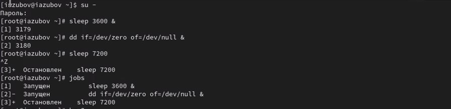

:::
::::::::::::::

## Изменение статуса задания

Для продолжения выполнения задания 3 в фоновом режиме введем : bg 3
С помощью команды jobs посмотрим изменения в статусе заданий.
С помощью команды fg отменяем задания и проверяем

:::::::::::::: {.columns align=center}
::: {.column width="80%"}

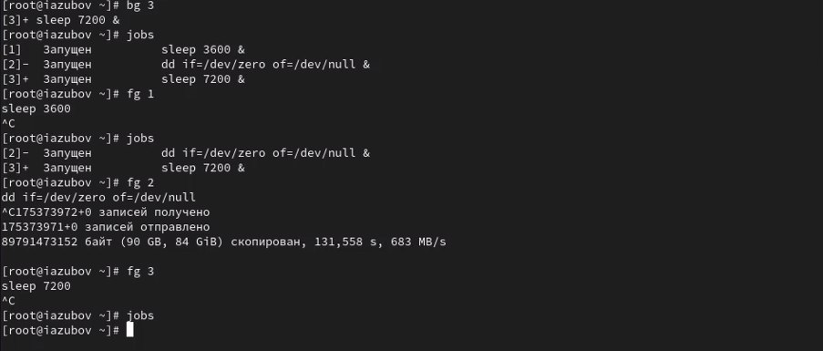

:::
::::::::::::::

## В другом терминале запускаем задание

Откроем второй терминал и запустим задание dd 

:::::::::::::: {.columns align=center}
::: {.column width="80%"}

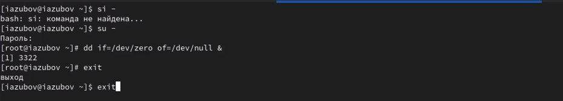

:::
::::::::::::::

## Убиваем задание

:::::::::::::: {.columns align=center}
::: {.column width="80%"}

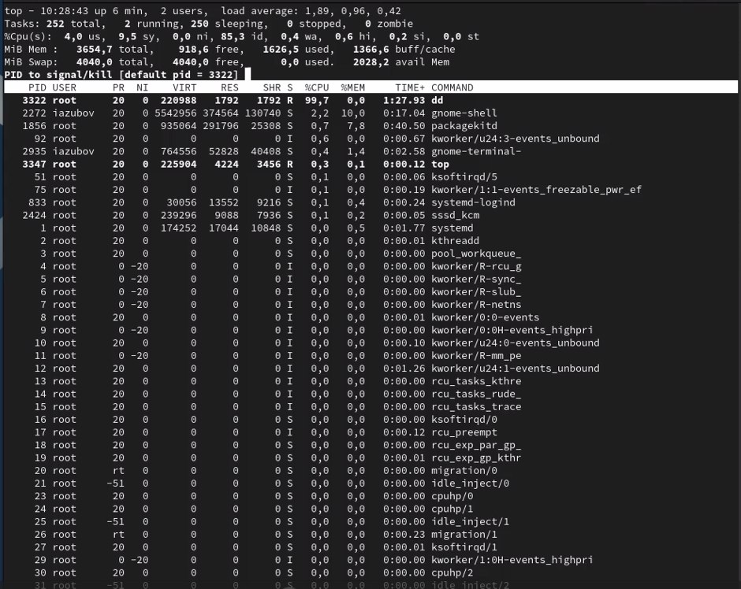

:::
::::::::::::::

## Меняем приоритет процессы

Вводим команды и запускаем процессы.
Командой ps aux | grep dd выводим все строки, в которых есть буквы dd. Запущенные процессы dd идут
последними
Меняем приоритит процессы

:::::::::::::: {.columns align=center}
::: {.column width="80%"}

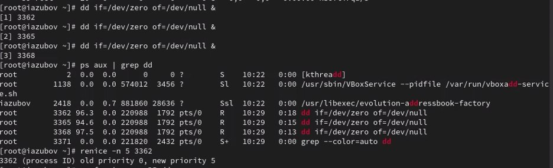

:::
::::::::::::::

## Запускаем firewalld и iptables

Запускаем firewalld и iptables и находим настройки конфликтов для этого юнита командами
cat /usr/lib/systemd/system/firewalld.service и cat /usr/lib/systemd/system/iptables.service

:::::::::::::: {.columns align=center}
::: {.column width="80%"}

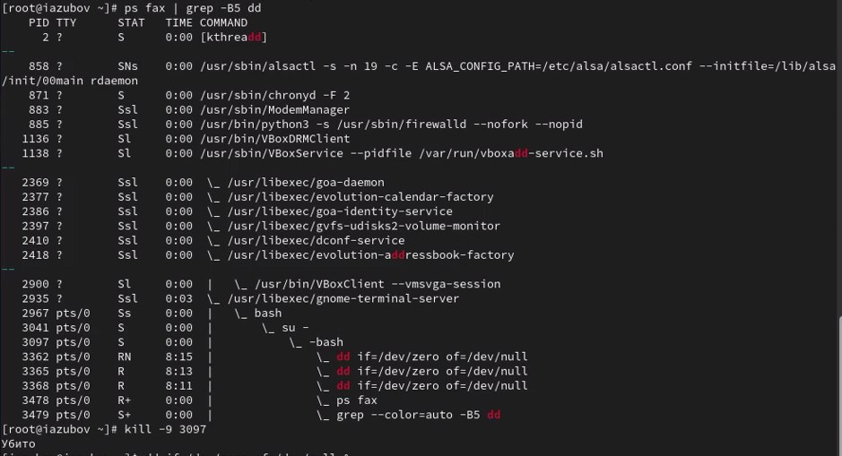

:::
::::::::::::::

## Закрываем корневую оболочку

Введем
ps fax | grep -B5 dd
Параметр -B5 показывает соответствующие запросу строки, включая пять строк до
этого. 
Закроем корневую оболочку

:::::::::::::: {.columns align=center}
::: {.column width="80%"}

:::
::::::::::::::

## Задание 1

Трижды запускаем фоновые задания. Меняем приоритет одной из команд и завершаем все процессы

:::::::::::::: {.columns align=center}
::: {.column width="80%"}

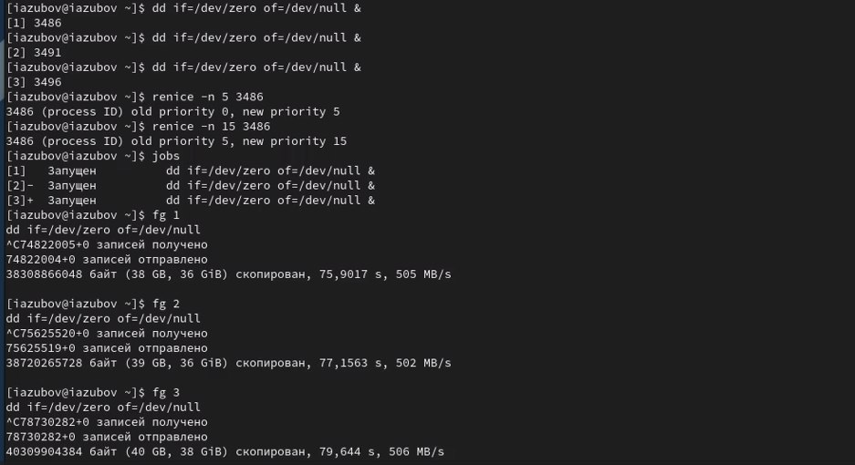

:::
::::::::::::::

## Программа в фоновом режиме и на переднем плане

1. Запускаем программу yes в фоновом режиме с подавлением потока вывода.
2. Запускаем программу yes на переднем плане с подавлением потока вывода. Приостановим выполнение программы. Заново запускаем программу yes с теми же параметрами, затем завершите её выполнение.

:::::::::::::: {.columns align=center}
::: {.column width="80%"}

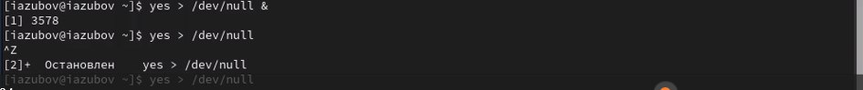

:::
::::::::::::::

## Программа без подавления потока

Запускаем программу yes на переднем плане без подавления потока вывода. Приостановим выполнение программы. Заново запустим программу yes с теми же параметрами, затем завершим её выполнение.
Проверим состояния заданий, воспользовавшись командой jobs.

:::::::::::::: {.columns align=center}
::: {.column width="80%"}

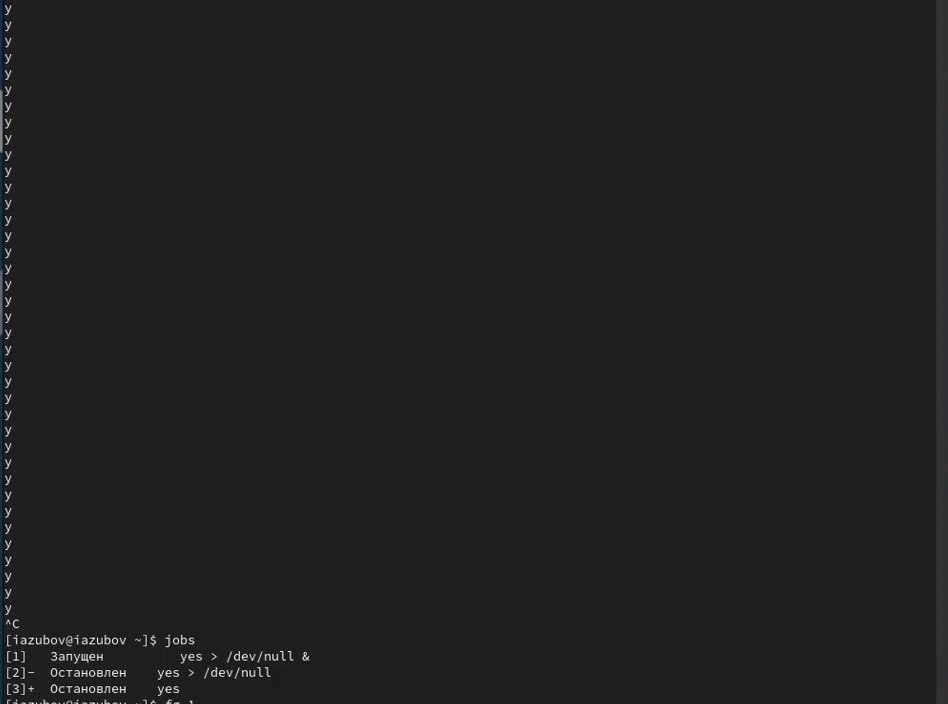

:::
::::::::::::::

## Останавливаем процессы

Переведем процесс, который у нас выполняется в фоновом режиме, на передний план, затем остановим его.
Переведем любой ваш процесс с подавлением потока вывода в фоновый режим.
Проверим состояния заданий, воспользовавшись командой jobs. Обратим внимание,что процесс стал выполняющимся (Running) в фоновом режиме.
Запустим процесс в фоновом режиме таким образом, чтобы он продолжил свою работу даже после отключения от терминала.
закрываем терминал

:::::::::::::: {.columns align=center}
::: {.column width="80%"}

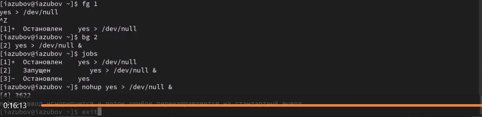

:::
::::::::::::::

## Запускаем три программы в фоновом режиме

Получим информацию о запущенных в операционной системе процессах с помощью
утилиты top.
Запустим ещё три программы yes в фоновом режиме с подавлением потока вывода.

:::::::::::::: {.columns align=center}
::: {.column width="80%"}

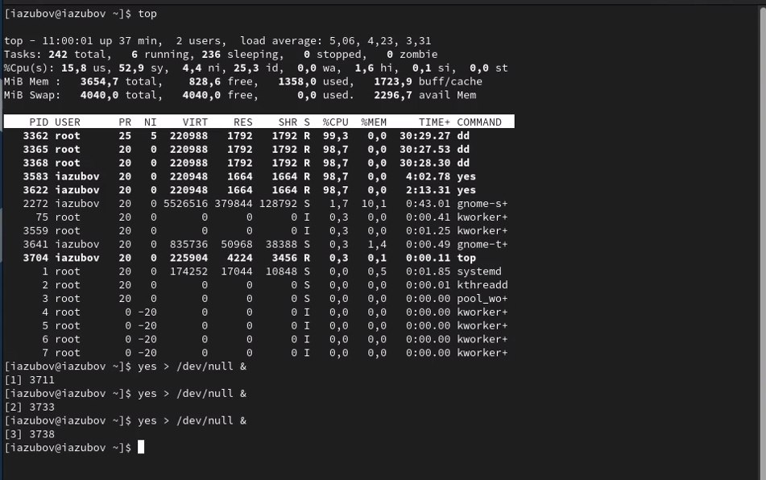

:::
::::::::::::::

## Работа с процессами

Убиваем два процесса: для одного используйте его PID, а для другого — его идентификатор конкретного задания.
Попробуем послать сигнал 1 (SIGHUP) процессу, запущенному с помощью nohup, и обычному процессу.
Запустим ещё несколько программ yes в фоновом режиме с подавлением потока вывода.
Завершим их работу одновременно, используя команду killall.

:::::::::::::: {.columns align=center}
::: {.column width="80%"}

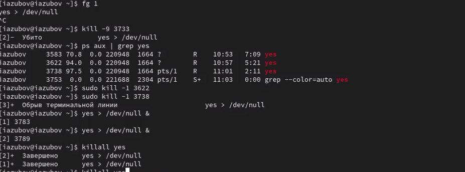

:::
::::::::::::::

## Меняем приоритеты, что они были равны

Запустим программу yes в фоновом режиме с подавлением потока вывода. Используяутилиту nice, запустим программу yes с теми же параметрами и с приоритетом,большим на 5. 
Используя утилиту renice, изменим приоритет у одного из потоков yes таким образом, чтобы у обоих потоков приоритеты были равны.

:::::::::::::: {.columns align=center}
::: {.column width="80%"}

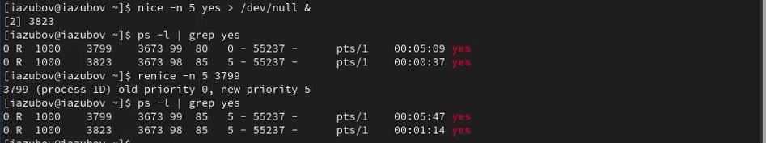

:::
::::::::::::::

## Контрольные вопросы

1. Какая команда даёт обзор всех текущих заданий оболочки? jobs

2. Как остановить текущее задание оболочки, чтобы продолжить его выполнение в фоновом режиме? Ctrl+Z

3. Какую комбинацию клавиш можно использовать для отмены текущего задания оболочки? Ctrl+C

4. Необходимо отменить одно из начатых заданий. Доступ к оболочке, в которой в данный момент работает пользователь, невозможен. Что можно сделать, чтобы отменить задание? kill <PID>

5. Какая команда используется для отображения отношений между родительскими и дочерними процессами? pstree

6. Какая команда позволит изменить приоритет процесса с идентификатором 1234 на более высокий? renice -n -10 -p 1234

7. В системе в настоящее время запущено 20 процессов dd. Как проще всего остановить  их все сразу? killall dd

8. Какая команда позволяет остановить команду с именем mycommand? pkill mycommand

9. Какая команда используется в top, чтобы убить процесс? k

10. Как запустить команду с достаточно высоким приоритетом, не рискуя, что не хватит ресурсов для других процессов? nice -n 10 <команда>

