---
## Front matter
title: "Лабораторная работа №6"
subtitle: "Отчет"
author: "Зубов Иван Александрович"

## Generic otions
lang: ru-RU
toc-title: "Содержание"

## Bibliography
bibliography: bib/cite.bib
csl: pandoc/csl/gost-r-7-0-5-2008-numeric.csl

## Pdf output format
toc: true # Table of contents
toc-depth: 2
lof: true # List of figures
lot: true # List of tables
fontsize: 12pt
linestretch: 1.5
papersize: a4
documentclass: scrreprt
## I18n polyglossia
polyglossia-lang:
  name: russian
  options:
	- spelling=modern
	- babelshorthands=true
polyglossia-otherlangs:
  name: english
## I18n babel
babel-lang: russian
babel-otherlangs: english
## Fonts
mainfont: IBM Plex Serif
romanfont: IBM Plex Serif
sansfont: IBM Plex Sans
monofont: IBM Plex Mono
mathfont: STIX Two Math
mainfontoptions: Ligatures=Common,Ligatures=TeX,Scale=0.94
romanfontoptions: Ligatures=Common,Ligatures=TeX,Scale=0.94
sansfontoptions: Ligatures=Common,Ligatures=TeX,Scale=MatchLowercase,Scale=0.94
monofontoptions: Scale=MatchLowercase,Scale=0.94,FakeStretch=0.9
mathfontoptions:
## Biblatex
biblatex: true
biblio-style: "gost-numeric"
biblatexoptions:
  - parentracker=true
  - backend=biber
  - hyperref=auto
  - language=auto
  - autolang=other*
  - citestyle=gost-numeric
## Pandoc-crossref LaTeX customization
figureTitle: "Рис."
tableTitle: "Таблица"
listingTitle: "Листинг"
lofTitle: "Список иллюстраций"
lotTitle: "Список таблиц"
lolTitle: "Листинги"
## Misc options
indent: true
header-includes:
  - \usepackage{indentfirst}
  - \usepackage{float} # keep figures where there are in the text
  - \floatplacement{figure}{H} # keep figures where there are in the text
---

# Цель работы

Получить навыки управления процессами операционной системы

# Задание

1. Продемонстрируйте навыки управления заданиями операционной системы 
2. Продемонстрируйте навыки управления процессами операционной системы 
3. Выполните задания для самостоятельной работы 

# Выполнение лабораторной работы

Зайдем в режим суперпользователя и выполним следующие команды. Введем команду jobs и, что два задания запущены и третье останавлено

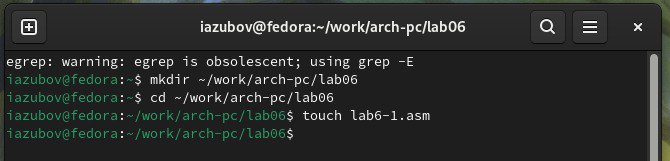{#fig:001 width=70%}

Для продолжения выполнения задания 3 в фоновом режиме введем : bg 3
С помощью команды jobs посмотрим изменения в статусе заданий.
С помощью команды fg отменяем задания и проверяем

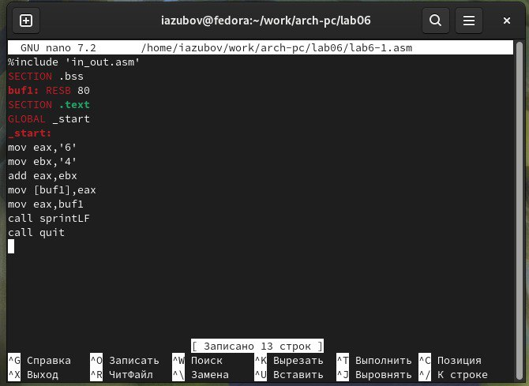{#fig:002 width=70%}

Откроем второй терминал и запустим задание dd 

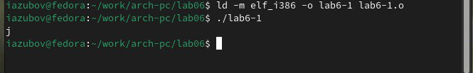{#fig:003 width=70%}

Возвращаемся в свой терминал. Вводим команду top и убиваем задание dd

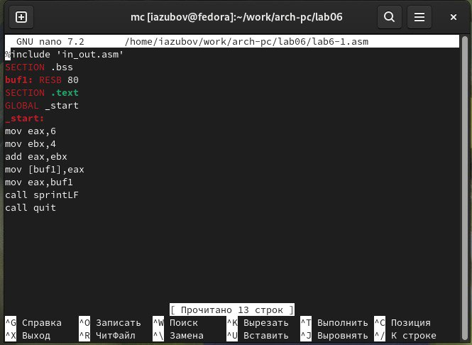{#fig:004 width=70%}

Вводим команды и запускаем процессы.
Командой ps aux | grep dd выводим все строки, в которых есть буквы dd. Запущенные процессы dd идут
последними
Меняем приоритит процессы

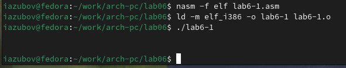{#fig:005 width=70%}

Введем
ps fax | grep -B5 dd
Параметр -B5 показывает соответствующие запросу строки, включая пять строк до
этого. 
Закроем корневую оболочку

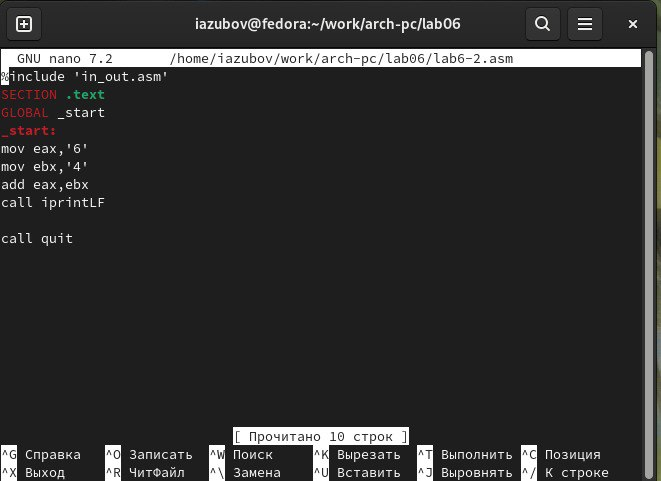{#fig:006 width=70%}

# Самостоятельная работа  

Трижды запускаем фоновые задания. Меняем приоритет одной из команд и завершаем все процессы

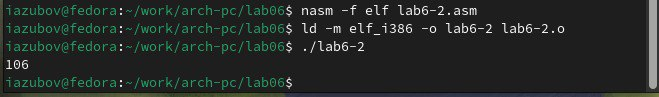{#fig:007 width=70%}

1. Запускаем программу yes в фоновом режиме с подавлением потока вывода.
2. Запускаем программу yes на переднем плане с подавлением потока вывода. Приостановим выполнение программы. Заново запускаем программу yes с теми же параметрами, затем завершите её выполнение.

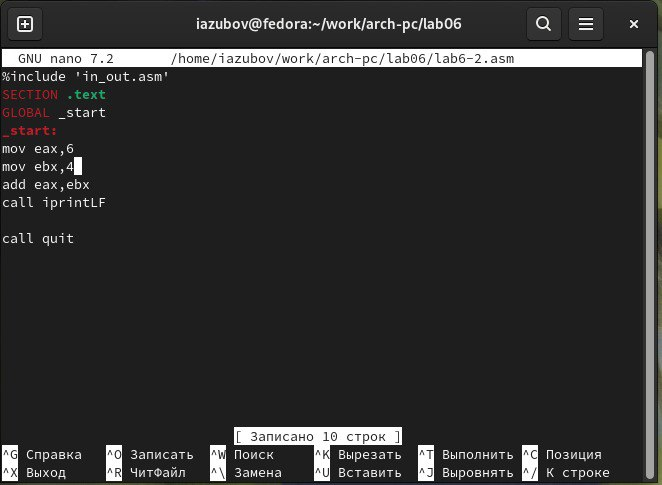{#fig:008 width=70%}

Запускаем программу yes на переднем плане без подавления потока вывода. Приостановим выполнение программы. Заново запустим программу yes с теми же параметрами, затем завершим её выполнение.
Проверим состояния заданий, воспользовавшись командой jobs.

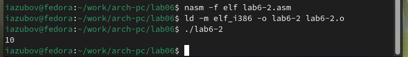{#fig:009 width=70%}

Переведем процесс, который у нас выполняется в фоновом режиме, на передний
план, затем остановим его.
Переведем любой ваш процесс с подавлением потока вывода в фоновый режим.
Проверим состояния заданий, воспользовавшись командой jobs. Обратим внимание,что процесс стал выполняющимся (Running) в фоновом режиме.
Запустим процесс в фоновом режиме таким образом, чтобы он продолжил свою работу даже после отключения от терминала.
закрываем терминал

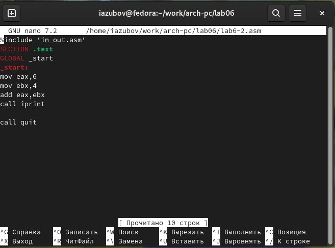{#fig:010 width=70%}

Получим информацию о запущенных в операционной системе процессах с помощью
утилиты top.
Запустим ещё три программы yes в фоновом режиме с подавлением потока вывода.

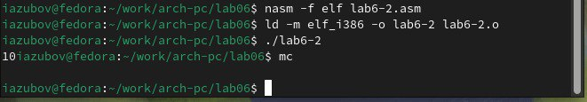{#fig:011 width=70%}

Убиваем два процесса: для одного используйте его PID, а для другого — его идентификатор конкретного задания.
Попробуем послать сигнал 1 (SIGHUP) процессу, запущенному с помощью nohup, и обычному процессу.
Запустим ещё несколько программ yes в фоновом режиме с подавлением потока вывода.
Завершим их работу одновременно, используя команду killall.

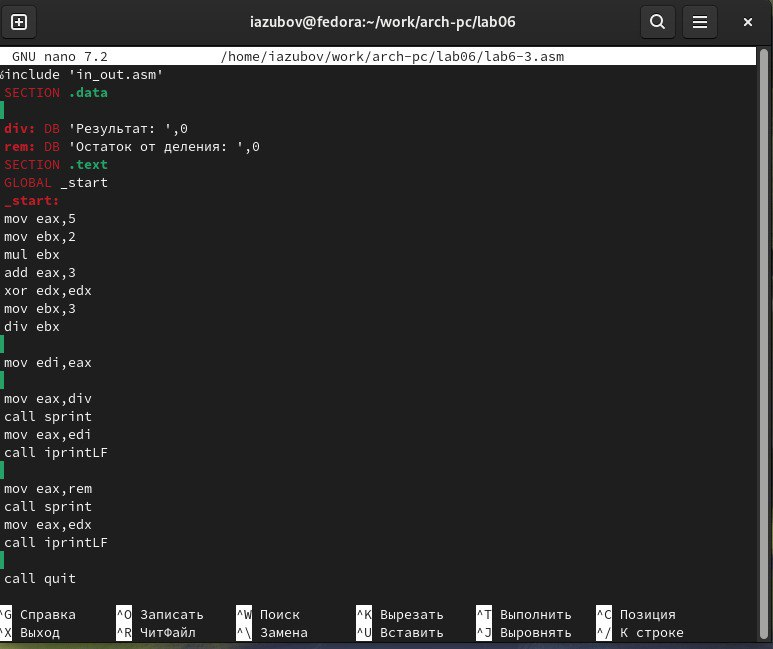{#fig:012 width=70%}

Запустим программу yes в фоновом режиме с подавлением потока вывода. Используяутилиту nice, запустим программу yes с теми же параметрами и с приоритетом,большим на 5. 
Используя утилиту renice, изменим приоритет у одного из потоков yes таким образом, чтобы у обоих потоков приоритеты были равны.

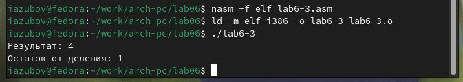{#fig:013 width=70%}

# Контрольные вопросы
1. Какая команда даёт обзор всех текущих заданий оболочки? jobs

2. Как остановить текущее задание оболочки, чтобы продолжить его выполнение в фоновом режиме? Ctrl+Z

3. Какую комбинацию клавиш можно использовать для отмены текущего задания оболочки? Ctrl+C

4. Необходимо отменить одно из начатых заданий. Доступ к оболочке, в которой в данный момент работает пользователь, невозможен. Что можно сделать, чтобы отменить задание? kill <PID>

5. Какая команда используется для отображения отношений между родительскими и дочерними процессами? pstree

6. Какая команда позволит изменить приоритет процесса с идентификатором 1234 на более высокий? renice -n -10 -p 1234

7. В системе в настоящее время запущено 20 процессов dd. Как проще всего остановить  их все сразу? killall dd

8. Какая команда позволяет остановить команду с именем mycommand? pkill mycommand

9. Какая команда используется в top, чтобы убить процесс? k

10. Как запустить команду с достаточно высоким приоритетом, не рискуя, что не хватит ресурсов для других процессов? nice -n 10 <команда>

# Выводы

Я получил навыки управления процессами операционной системы.

