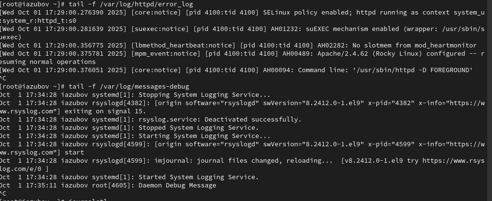

---
## Front matter
lang: ru-RU
title: Лабораторная работа №7
subtitle: Презентация
author:
  - Зубов.И.А.
institute:
  - Российский университет дружбы народов, Москва, Россия

## i18n babel
babel-lang: russian
babel-otherlangs: english

## Formatting pdf
toc: false
toc-title: Содержание
slide_level: 2
aspectratio: 169
section-titles: true
theme: metropolis
header-includes:
 - \metroset{progressbar=frametitle,sectionpage=progressbar,numbering=fraction}
---

# Информация

## Докладчик

  * Зубов Иван Александрович
  * Студент
  * Российский университет дружбы народов
  * 1132243112@pfur.ru

# Выполнение лабораторной работы

## Мониторинг журнала системных событий в реальном времени

Открываем три разных терминала. В первом входим в режим суперпользователя.
На второй вкладке терминала запустите мониторинг системных событий в реальном времени
В третьей вкладке зайдем в режим суперпользователя и попробуем ввести неправильный пароль, в системных собитиях увидим ошибку.
Также в третьем терминале введем logger hello и увидим отображаемое сообщение

:::::::::::::: {.columns align=center}
::: {.column width="50%"}

:::
::::::::::::::

:::::::::::::: {.columns align=center}
::: {.column width="50%"}

:::
::::::::::::::

## Устанавливаем Apache 

:::::::::::::: {.columns align=center}
::: {.column width="80%"}

:::
::::::::::::::

## Запустим веб-службу

:::::::::::::: {.columns align=center}
::: {.column width="80%"}

:::
::::::::::::::

## Посмотрим журнал сообщений об ошибках веб-службы

:::::::::::::: {.columns align=center}
::: {.column width="80%"}

:::
::::::::::::::

## Редактируем файл

В каталоге /etc/rsyslog.d создаем файл мониторинга событий веб-службы. Редактируем его,прописывая в нем строку local1.* -/var/log/httpd-error.log

:::::::::::::: {.columns align=center}
::: {.column width="80%"}

:::
::::::::::::::

## Перезагружаем систему

Переходим в первую вкладку терминала и перезагрузим конфигурацию rsyslogd и веб-службу

:::::::::::::: {.columns align=center}
::: {.column width="80%"}

:::
::::::::::::::

## Создаем файл и вводим информацию

В третьей вкладке терминала создаем отдельный файл конфигурации для мониторинга отладочной информации. 
Вводим в терминале echo "*.debug /var/log/messages-debug" > /etc/rsyslog.d/debug.conf и перезапустим систему

:::::::::::::: {.columns align=center}
::: {.column width="80%"}

:::
::::::::::::::

## Отладочная информация

В третьей вкладке терминала введем logger -p daemon.debug "Daemon Debug Message", а во второй вкладке увидим выведенное сообщение на отладочной информации

:::::::::::::: {.columns align=center}
::: {.column width="80%"}

:::
::::::::::::::

## Использование journalctl

1. Во второй вкладке терминала посмотрим содержимое журнала с событиями с момента последнего запуска системы:
journalctl
2. Просмотр содержимого журнала без использования пейджера:
journalctl --no-pager
3. Режим просмотра журнала в реальном времени:
journalctl -f
4. Для использования фильтрации просмотра конкретных параметров журнала введите
journalctl 
5. Просмотрите события для UID0:
journalctl _UID=0
6. Для отображения последних 20 строк журнала введите
journalctl -n 20
7. Для просмотра только сообщений об ошибках введите
journalctl -p err
8. Если мы хотим просмотреть сообщения журнала, записанные за определённый период времени, вы можете использовать параметры --since и --until.
YYYY-MM-DD hh:mm:ss
9. Если мы хотим показать все сообщения с ошибкой приоритета, которые были зафиксированы со вчерашнего дня, то используйте
journalctl --since yesterday -p err
10. Если нам нужна детальная информация, то используем
journalctl -o verbose
11. Для просмотра дополнительной информации о модуле sshd введем
journalctl _SYSTEMD_UNIT=sshd.service

:::::::::::::: {.columns align=center}
::: {.column width="80%"}

:::
::::::::::::::

:::::::::::::: {.columns align=center}
::: {.column width="80%"}

:::
::::::::::::::

## Постоянный журнал journald

Создаем каталог для хранения записей журнала. Скорректируем права доступа для каталога. Перезагрузим систему и посмотрим сообщения с момента последней перезагрузки.

:::::::::::::: {.columns align=center}
::: {.column width="80%"}

:::
::::::::::::::

## Контрольные вопросы

1. Какой файл используется для настройки rsyslogd? /etc/rsyslog.conf
2. В каком файле журнала rsyslogd содержатся сообщения, связанные с аутентификацией? /var/log/secure
3. Если вы ничего не настроите, то сколько времени потребуется для ротации файлов журналов? 1 неделя
4. Какую строку следует добавить в конфигурацию для записи всех сообщений с приоритетом info в файл /var/log/messages.info? *.info /var/log/messages.info
5. Какая команда позволяет вам видеть сообщения журнала в режиме реального времени? tail -f /var/log/messages или journalctl -f
6. Какая команда позволяет вам видеть все сообщения журнала, которые были написаны для PID 1 между 9:00 и 15:00? journalctl _PID=1 --since="09:00" --until="15:00"
7. Какая команда позволяет вам видеть сообщения journald после последней перезагрузки системы? journalctl -b
8. Какая процедура позволяет сделать журнал journald постоянным? Создать директорию /var/log/journal и перезапустить systemd-journald
