---
## Front matter
title: "Лабораторная работа №7"
subtitle: "Отчет"
author: "Зубов Иван Александрович"

## Generic otions
lang: ru-RU
toc-title: "Содержание"

## Bibliography
bibliography: bib/cite.bib
csl: pandoc/csl/gost-r-7-0-5-2008-numeric.csl

## Pdf output format
toc: true # Table of contents
toc-depth: 2
lof: true # List of figures
lot: true # List of tables
fontsize: 12pt
linestretch: 1.5
papersize: a4
documentclass: scrreprt
## I18n polyglossia
polyglossia-lang:
  name: russian
  options:
	- spelling=modern
	- babelshorthands=true
polyglossia-otherlangs:
  name: english
## I18n babel
babel-lang: russian
babel-otherlangs: english
## Fonts
mainfont: IBM Plex Serif
romanfont: IBM Plex Serif
sansfont: IBM Plex Sans
monofont: IBM Plex Mono
mathfont: STIX Two Math
mainfontoptions: Ligatures=Common,Ligatures=TeX,Scale=0.94
romanfontoptions: Ligatures=Common,Ligatures=TeX,Scale=0.94
sansfontoptions: Ligatures=Common,Ligatures=TeX,Scale=MatchLowercase,Scale=0.94
monofontoptions: Scale=MatchLowercase,Scale=0.94,FakeStretch=0.9
mathfontoptions:
## Biblatex
biblatex: true
biblio-style: "gost-numeric"
biblatexoptions:
  - parentracker=true
  - backend=biber
  - hyperref=auto
  - language=auto
  - autolang=other*
  - citestyle=gost-numeric
## Pandoc-crossref LaTeX customization
figureTitle: "Рис."
tableTitle: "Таблица"
listingTitle: "Листинг"
lofTitle: "Список иллюстраций"
lotTitle: "Список таблиц"
lolTitle: "Листинги"
## Misc options
indent: true
header-includes:
  - \usepackage{indentfirst}
  - \usepackage{float} # keep figures where there are in the text
  - \floatplacement{figure}{H} # keep figures where there are in the text
---

# Цель работы

Получить навыки работы с журналами мониторинга различных событий в системе

# Задание

1. Продемонстрируйте навыки работы с журналом мониторинга событий в реальном
времени 
2. Продемонстрируйте навыки создания и настройки отдельного файла конфигурации
мониторинга отслеживания событий веб-службы 
3. Продемонстрируйте навыки работы с journalctl 
4. Продемонстрируйте навыки работы с journald 

# Выполнение лабораторной работы

Открываем три разных терминала. В первом входим в режим суперпользователя.
На второй вкладке терминала запустите мониторинг системных событий в реальном времени
В третьей вкладке зайдем в режим суперпользователя и попробуем ввести неправильный пароль, в системных собитиях увидим ошибку.
Также в третьем терминале введем logger hello и увидим отображаемое сообщение

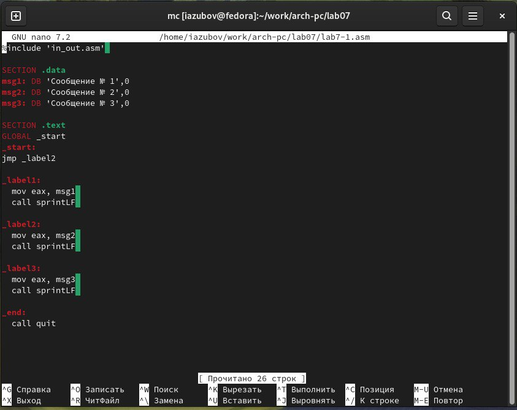{#fig:001 width=70%}

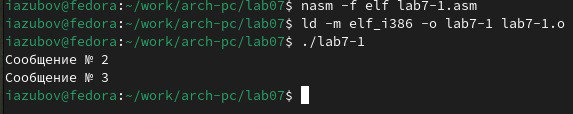{#fig:002 width=70%}

В первой вкладке терминала установим Apache 

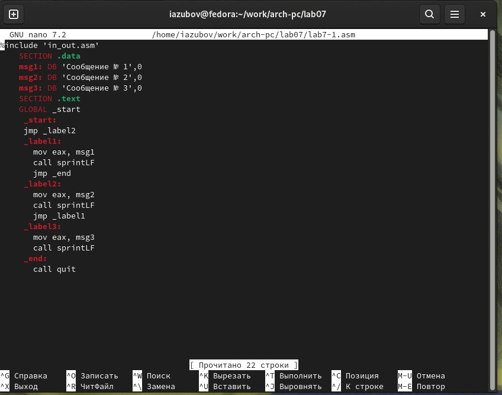{#fig:003 width=70%}

После окончания процесса установки запустим веб-службу

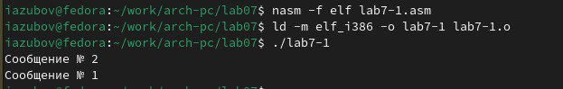{#fig:004 width=70%}

Во второй вкладке терминала посмотрим журнал сообщений об ошибках веб-службы

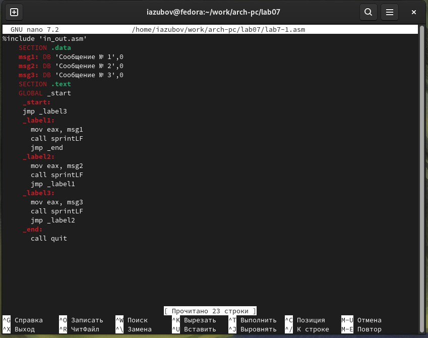{#fig:005 width=70%}

В каталоге /etc/rsyslog.d создаем файл мониторинга событий веб-службы. Редактируем его,прописывая в нем строку local1.* -/var/log/httpd-error.log

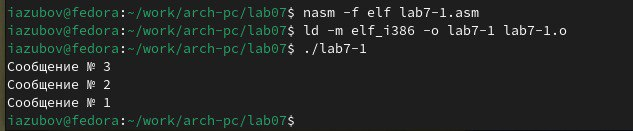{#fig:006 width=70%}

Переходим в первую вкладку терминала и перезагрузим конфигурацию rsyslogd и веб-службу

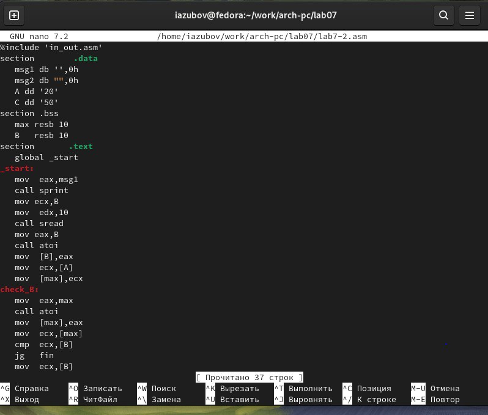{#fig:007 width=70%}

В третьей вкладке терминала создаем отдельный файл конфигурации для мониторинга отладочной информации. 
Вводим в терминале echo "*.debug /var/log/messages-debug" > /etc/rsyslog.d/debug.conf и перезапустим систему

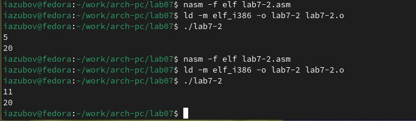{#fig:008 width=70%}

В третьей вкладке терминала введем logger -p daemon.debug "Daemon Debug Message", а во второй вкладке увидим выведенное сообщение на отладочной информации

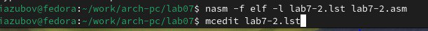{#fig:009 width=70%}

# Использование journalctl

1. Во второй вкладке терминала посмотрим содержимое журнала с событиями с момента последнего запуска системы:
journalctl
2. Просмотр содержимого журнала без использования пейджера:
journalctl --no-pager
3. Режим просмотра журнала в реальном времени:
journalctl -f
4. Для использования фильтрации просмотра конкретных параметров журнала введите
journalctl 
5. Просмотрите события для UID0:
journalctl _UID=0
6. Для отображения последних 20 строк журнала введите
journalctl -n 20
7. Для просмотра только сообщений об ошибках введите
journalctl -p err
8. Если мы хотим просмотреть сообщения журнала, записанные за определённый период времени, вы можете использовать параметры --since и --until.
YYYY-MM-DD hh:mm:ss
9. Если мы хотим показать все сообщения с ошибкой приоритета, которые были зафиксированы со вчерашнего дня, то используйте
journalctl --since yesterday -p err
10. Если нам нужна детальная информация, то используем
journalctl -o verbose
11. Для просмотра дополнительной информации о модуле sshd введем
journalctl _SYSTEMD_UNIT=sshd.service

{#fig:010 width=70%}

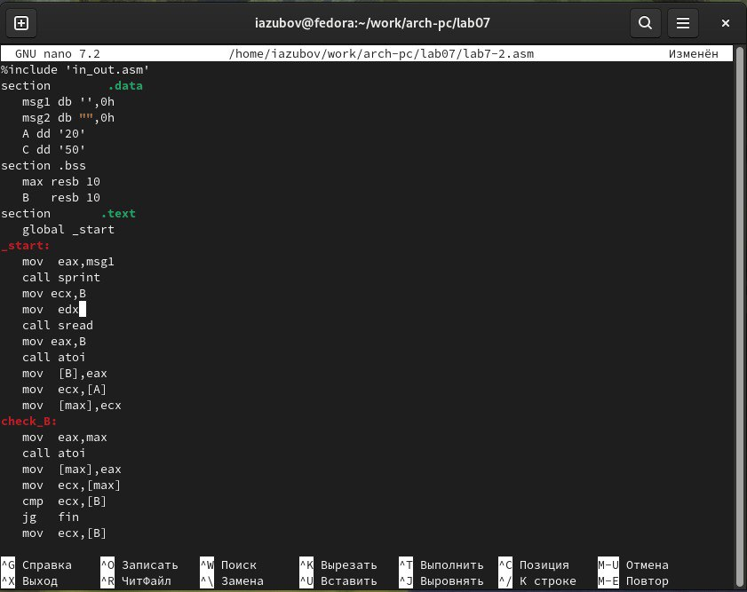{#fig:011 width=70%}

# Постоянный журнал journald

Создаем каталог для хранения записей журнала. Скорректируем права доступа для каталога. Перезагрузим систему и посмотрим сообщения с момента последней перезагрузки.

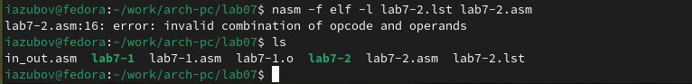{#fig:012 width=70%}

# Контрольные вопросы

1. Какой файл используется для настройки rsyslogd? /etc/rsyslog.conf
2. В каком файле журнала rsyslogd содержатся сообщения, связанные с аутентификацией? /var/log/secure
3. Если вы ничего не настроите, то сколько времени потребуется для ротации файлов журналов? 1 неделя
4. Какую строку следует добавить в конфигурацию для записи всех сообщений с приоритетом info в файл /var/log/messages.info? *.info /var/log/messages.info
5. Какая команда позволяет вам видеть сообщения журнала в режиме реального времени? tail -f /var/log/messages или journalctl -f
6. Какая команда позволяет вам видеть все сообщения журнала, которые были написаны для PID 1 между 9:00 и 15:00? journalctl _PID=1 --since="09:00" --until="15:00"
7. Какая команда позволяет вам видеть сообщения journald после последней перезагрузки системы? journalctl -b
8. Какая процедура позволяет сделать журнал journald постоянным? Создать директорию /var/log/journal и перезапустить systemd-journald

# Выводы

Я получил навыки работы с журналами мониторинга различных событий в системе.

