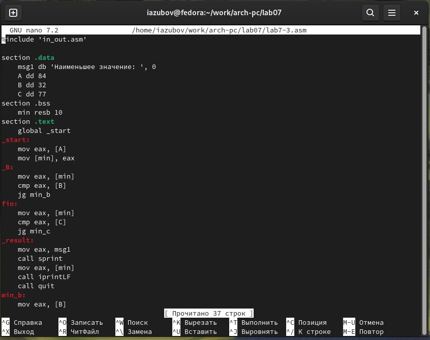
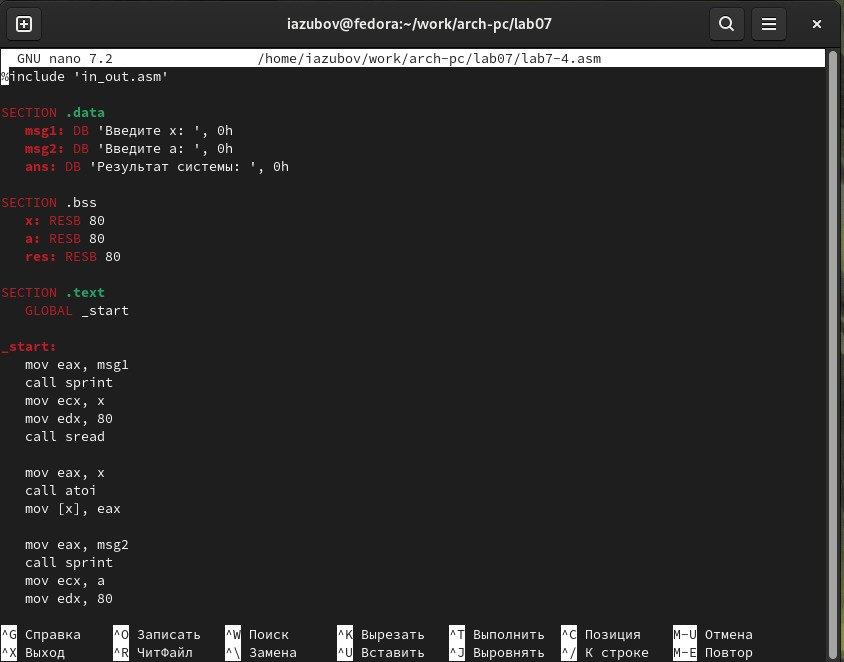
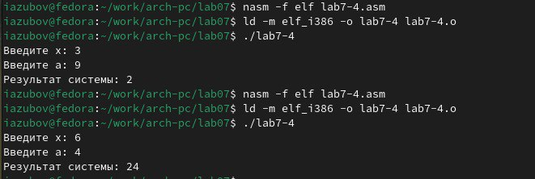

---
## Front matter
title: "Лабораторная работа №7"
subtitle: "Отчет"
author: "Зубов Иван Александрович"

## Generic otions
lang: ru-RU
toc-title: "Содержание"

## Bibliography
bibliography: bib/cite.bib
csl: pandoc/csl/gost-r-7-0-5-2008-numeric.csl

## Pdf output format
toc: true # Table of contents
toc-depth: 2
lof: true # List of figures
lot: true # List of tables
fontsize: 12pt
linestretch: 1.5
papersize: a4
documentclass: scrreprt
## I18n polyglossia
polyglossia-lang:
  name: russian
  options:
	- spelling=modern
	- babelshorthands=true
polyglossia-otherlangs:
  name: english
## I18n babel
babel-lang: russian
babel-otherlangs: english
## Fonts
mainfont: IBM Plex Serif
romanfont: IBM Plex Serif
sansfont: IBM Plex Sans
monofont: IBM Plex Mono
mathfont: STIX Two Math
mainfontoptions: Ligatures=Common,Ligatures=TeX,Scale=0.94
romanfontoptions: Ligatures=Common,Ligatures=TeX,Scale=0.94
sansfontoptions: Ligatures=Common,Ligatures=TeX,Scale=MatchLowercase,Scale=0.94
monofontoptions: Scale=MatchLowercase,Scale=0.94,FakeStretch=0.9
mathfontoptions:
## Biblatex
biblatex: true
biblio-style: "gost-numeric"
biblatexoptions:
  - parentracker=true
  - backend=biber
  - hyperref=auto
  - language=auto
  - autolang=other*
  - citestyle=gost-numeric
## Pandoc-crossref LaTeX customization
figureTitle: "Рис."
tableTitle: "Таблица"
listingTitle: "Листинг"
lofTitle: "Список иллюстраций"
lotTitle: "Список таблиц"
lolTitle: "Листинги"
## Misc options
indent: true
header-includes:
  - \usepackage{indentfirst}
  - \usepackage{float} # keep figures where there are in the text
  - \floatplacement{figure}{H} # keep figures where there are in the text
---

# Цель работы

Изучение команд условного и безусловного переходов. Приобретение навыков написания программ с использованием переходов. Знакомство с назначением и структурой файла листинга.

# Задание

Написать программы для решения выражений.

# Выполнение лабораторной работы

Создаем каталог для программам лабораторной работы № 7 с помощью команды mkdir, перейдем в него и создадим файл lab7-1.asm с помощью команды touch. Откроем файл в Midnight Commander и заполняем его в соответствии с листингом 7.1

{#fig:001 width=70%}

Создаем исполняемый файл и запускаем его

{#fig:002 width=70%}

Снова открываем файл для редактирования и изменяем его в соответствии с
листингом 7.2

{#fig:003 width=70%}

Создаем исполняемый файл и запускаем его

{#fig:004 width=70%}

Снова открываем файл для редактирования и изменяем его, чтобы произошел
данный вывод

{#fig:005 width=70%}

Создаем исполняемый файл и запускаем его

{#fig:006 width=70%}

Создаем новый файл с помощью команды touch, открываем файл в Midnight Commander и заполняем его в соответствии с листингом 7.3

{#fig:007 width=70%}

Создаем исполняемый файл и проверяем его работу, вводя разные значения B

{#fig:008 width=70%}

Создаем файл листинга дла программы lab7-2.asm

{#fig:009 width=70%}

Открываем файл листинга с помощью команды mcedit и изучаем его

{#fig:010 width=70%}

Строка 5 - 00000001 89C3 mov ebx, eax 00000001 - адрес в сегменте кода 89C3 - машинный код для инструкции mov ebx,eax - присваивание переменной ebx значения, хранящееся в регистре eax
Строка 26 - 00000012 50 push eax 00000012 - адрес в сегменте кода 50 - машинный код для инструкции push eax - значение из регистра eax помещается в стек
Строка 53 - 0000003B E8CFFFFFFF call sprint 0000003B - адрес в сегменте кода E8CFFFFFFF - машинный код для инструкции call sprint - вызов функции sprint, которая выводит данные на экран

Открываем файл и удаляем один операндум

{#fig:011 width=70%}

Транслируем с получением файла листинга

{#fig:012 width=70%}

При трансляции файла, выдается ошибка, но создаются исполнительный файл
lab7-2 и lab7-2.lst

# Самостоятельная работа

Вариант 13

1) Напишите программу нахождения наименьшей из 3 целочисленных переменных 𝑎,𝑏 и .
Значения переменных выбрать из табл. 7.5 в соответствии с вариантом, полученным
при выполнении лабораторной работы № 7. Создайте исполняемый файл и проверьте
его работу.

Создаем новый файл,открываем его и пишем программу, которая выберет наименьшее число из
трех 

{#fig:013 width=70%}

Транслируем файл и смотрим на работу программы

{#fig:014 width=70%}

2) Напишите программу, которая для введенных с клавиатуры значений 𝑥 и 𝑎 вычисляет
значение заданной функции 𝑓(𝑥) и выводит результат вычислений. Вид функции 𝑓(𝑥)
выбрать из таблицы 7.6 вариантов заданий в соответствии с вариантом, полученным
при выполнении лабораторной работы № 7. Создайте исполняемый файл и проверьте
его работу для значений 𝑥 и 𝑎 из 7.6.

Создаем новый файл в каталоге,открываем его и пишем программу, которая решит систему уравнений, при известных данных

{#fig:015 width=70%}

Транслируем файл и проверяем его работу при x=3 и а=9, при х=6 и а=4

{#fig:016 width=70%}

# Выводы

Мы познакомились с структурой файла листинга, изучили команды условного и безусловного перехода.

