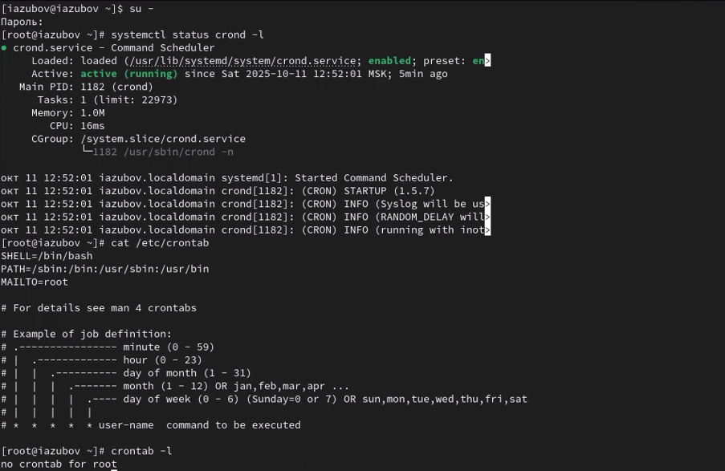
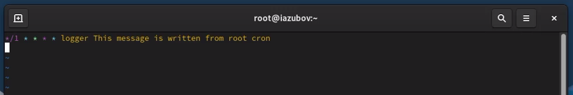
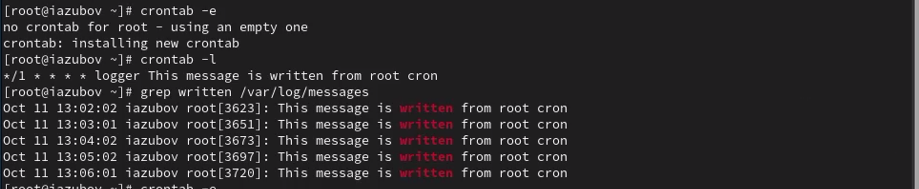
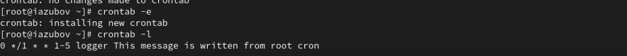
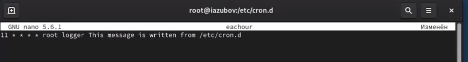
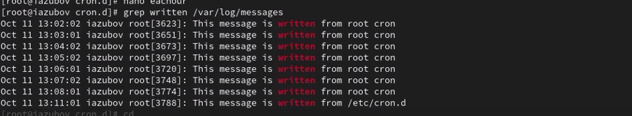
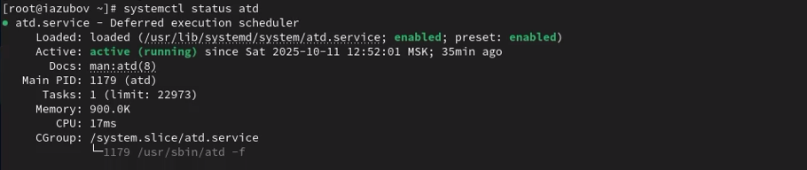
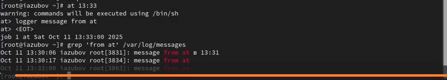

---
## Front matter
lang: ru-RU
title: Лабораторная работа №8
subtitle: Презентация
author:
  - Зубов И.А.
institute:
  - Российский университет дружбы народов, Москва, Россия

## i18n babel
babel-lang: russian
babel-otherlangs: english

## Formatting pdf
toc: false
toc-title: Содержание
slide_level: 2
aspectratio: 169
section-titles: true
theme: metropolis
header-includes:
 - \metroset{progressbar=frametitle,sectionpage=progressbar,numbering=fraction}
---

# Информация

## Докладчик

  * Зубов Иван Александрович
  * Студент
  * Российский университет дружбы народов
  * 1132243112@pfur.ru

# Выполнение лабораторной работы

## Посмотрим статус демона crond и посмотрим  содержимое файла

:::::::::::::: {.columns align=center}
::: {.column width="70%"}

:::
::::::::::::::

## Редактируем файд

:::::::::::::: {.columns align=center}
::: {.column width="70%"}

:::
::::::::::::::

## Список заданий

:::::::::::::: {.columns align=center}
::: {.column width="80%"}

:::
::::::::::::::

## Редактируем запись и смотрим список

:::::::::::::: {.columns align=center}
::: {.column width="80%"}

:::
::::::::::::::

## Создаем файл для дальнейших действий

:::::::::::::: {.columns align=center}
::: {.column width="80%"}

:::
::::::::::::::

## Создаем другой файл  и помещаем в него следующее содержимое

:::::::::::::: {.columns align=center}
::: {.column width="80%"}

:::
::::::::::::::

## Смотрим журнал системных событий

:::::::::::::: {.columns align=center}
::: {.column width="80%"}

:::
::::::::::::::

## Проверим, что служба atd загружена и включена

:::::::::::::: {.columns align=center}
::: {.column width="80%"}

:::
::::::::::::::

## Задаем выполнение команды logger message from at в 13:31

:::::::::::::: {.columns align=center}
::: {.column width="80%"}

:::
::::::::::::::

## Контрольные вопросы

1. Как настроить задание cron, чтобы оно выполнялось раз в 2 недели? 0 0 */14 * * /path/script.sh
2. Как настроить задание cron, чтобы оно выполнялось 1-го и 15-го числа каждого месяца в 2 часа ночи? 0 2 1,15 * * /path/script.sh
3. Как настроить задание cron, чтобы оно выполнялось каждые 2 минуты каждый день? */2 * * * * /path/script.sh
4. Как настроить задание cron, чтобы оно выполнялось 19 сентября ежегодно? 0 0 19 9 * /path/script.sh
5. Как настроить задание cron, чтобы оно выполнялось каждый четверг сентября ежегодно? 0 0 * 9 4 /path/script.sh
6. Какая команда позволяет вам назначить задание cron для пользователя alice? Приведите подтверждающий пример. crontab -u alice -e Пример: sudo crontab -u alice -e
7. Как указать, что пользователю bob никогда не разрешено назначать задания через cron? Приведите подтверждающий пример.echo "bob" >> /etc/cron.deny Пример: 
touch /etc/cron.deny
echo "bob" >> /etc/cron.deny
8. Вам нужно убедиться, что задание выполняется каждый день, даже если сервер во время выполнения временно недоступен. Как это сделать?Использовать anacron или добавить в скрипт проверку пропущенных выполнений или настроить повторение задания несколько раз в день
9. Какая команда позволяет узнать, запланированы ли какие-либо задания на выполнение планировщиком atd? atq
