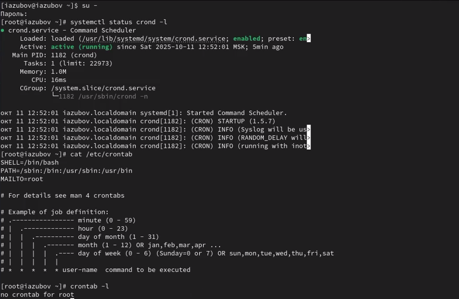
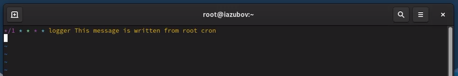
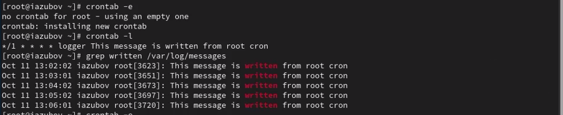
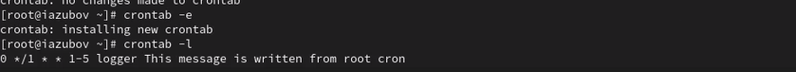
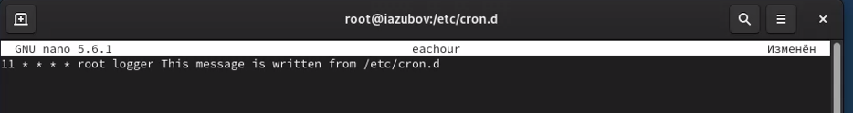

---
## Front matter
title: "Лабораторная работа №8"
subtitle: "Отчет"
author: "Зубов Иван Александрович"

## Generic otions
lang: ru-RU
toc-title: "Содержание"

## Bibliography
bibliography: bib/cite.bib
csl: pandoc/csl/gost-r-7-0-5-2008-numeric.csl

## Pdf output format
toc: true # Table of contents
toc-depth: 2
lof: true # List of figures
lot: true # List of tables
fontsize: 12pt
linestretch: 1.5
papersize: a4
documentclass: scrreprt
## I18n polyglossia
polyglossia-lang:
  name: russian
  options:
	- spelling=modern
	- babelshorthands=true
polyglossia-otherlangs:
  name: english
## I18n babel
babel-lang: russian
babel-otherlangs: english
## Fonts
mainfont: IBM Plex Serif
romanfont: IBM Plex Serif
sansfont: IBM Plex Sans
monofont: IBM Plex Mono
mathfont: STIX Two Math
mainfontoptions: Ligatures=Common,Ligatures=TeX,Scale=0.94
romanfontoptions: Ligatures=Common,Ligatures=TeX,Scale=0.94
sansfontoptions: Ligatures=Common,Ligatures=TeX,Scale=MatchLowercase,Scale=0.94
monofontoptions: Scale=MatchLowercase,Scale=0.94,FakeStretch=0.9
mathfontoptions:
## Biblatex
biblatex: true
biblio-style: "gost-numeric"
biblatexoptions:
  - parentracker=true
  - backend=biber
  - hyperref=auto
  - language=auto
  - autolang=other*
  - citestyle=gost-numeric
## Pandoc-crossref LaTeX customization
figureTitle: "Рис."
tableTitle: "Таблица"
listingTitle: "Листинг"
lofTitle: "Список иллюстраций"
lotTitle: "Список таблиц"
lolTitle: "Листинги"
## Misc options
indent: true
header-includes:
  - \usepackage{indentfirst}
  - \usepackage{float} # keep figures where there are in the text
  - \floatplacement{figure}{H} # keep figures where there are in the text
---

# Цель работы

Получение навыков работы с планировщиками событий cron и at.

# Задание

1. Выполните задания по планированию задач с помощью crond 
2. Выполните задания по планированию задач с помощью atd

# Выполнение лабораторной работы

Получаем полномочия администратора. Посмотрим статус демона crond и посмотрим  содержимое файла конфигурации /etc/crontab.  С помощью команды crontab -l увидимя,что список заданий в расписании пуст
 
{#fig:001 width=70%}

Откроем файл расписание на редактирования с помощью команды crontab -e и впишем нужный текст
Объясню синтаксис
Esc - клавиша выхода из режима ввода в командный режим
: - начало ввода команды редактора
w - write (запись, сохранение файла)
q - quit (выход из редактора)

{#fig:002 width=70%}

Посмотрим список заданий в расписании. Дальше ждем некоторое время и посмотрим журнал системных событий.

{#fig:003 width=70%}

Изменим запись в расписании crontab и посмотрим список заданий в расписании

{#fig:004 width=70%}

Перейдем в каталог /etc/cron.hourly и создайте в нём файл сценария с именем eachhour. Редактируем этот файл с помощью команды nano и сделаем файл исполняемым

{#fig:005 width=70%}

Создаем другой файл  и помещаем в него следующее содержимое

{#fig:006 width=70%}

Не выключая систему, через некоторое время просмотрим журнал системных событий

{#fig:007 width=70%}

# Планирование заданий с помощью at

Проверим, что служба atd загружена и включена

{#fig:008 width=70%}

Задаем выполнение команды logger message from at в 13:31.С помощью команды grep 'from at' /var/log/messages посмотрим, появилось ли соответствующее сообщение в лог-файле в указанное нами время.

{#fig:009 width=70%}

# Контрольные вопросы

1. Как настроить задание cron, чтобы оно выполнялось раз в 2 недели? 0 0 */14 * * /path/script.sh
2. Как настроить задание cron, чтобы оно выполнялось 1-го и 15-го числа каждого месяца в 2 часа ночи? 0 2 1,15 * * /path/script.sh
3. Как настроить задание cron, чтобы оно выполнялось каждые 2 минуты каждый день? */2 * * * * /path/script.sh
4. Как настроить задание cron, чтобы оно выполнялось 19 сентября ежегодно? 0 0 19 9 * /path/script.sh
5. Как настроить задание cron, чтобы оно выполнялось каждый четверг сентября ежегодно? 0 0 * 9 4 /path/script.sh
6. Какая команда позволяет вам назначить задание cron для пользователя alice? Приведите подтверждающий пример. crontab -u alice -e Пример: sudo crontab -u alice -e
7. Как указать, что пользователю bob никогда не разрешено назначать задания через cron? Приведите подтверждающий пример.echo "bob" >> /etc/cron.deny Пример: 
touch /etc/cron.deny
echo "bob" >> /etc/cron.deny
8. Вам нужно убедиться, что задание выполняется каждый день, даже если сервер во время выполнения временно недоступен. Как это сделать?Использовать anacron или добавить в скрипт проверку пропущенных выполнений или настроить повторение задания несколько раз в день
9. Какая команда позволяет узнать, запланированы ли какие-либо задания на выполнение планировщиком atd? atq

# Выводы

Я получил навыкы работы с планировщиками событий cron и at.

