---
## Front matter
lang: ru-RU
title: Лабораторная работа №9
subtitle: Презентация
author:
  - Зубов И.А.
institute:
  - Российский университет дружбы народов, Москва, Россия

## i18n babel
babel-lang: russian
babel-otherlangs: english

## Formatting pdf
toc: false
toc-title: Содержание
slide_level: 2
aspectratio: 169
section-titles: true
theme: metropolis
header-includes:
 - \metroset{progressbar=frametitle,sectionpage=progressbar,numbering=fraction}
---

# Информация

## Докладчик

  * Зубов Иван Александрович
  * Студент
  * Российский университет дружбы народов
  * 1132243112@pfur.ru

# Выполнение лабораторной работы

## Смотрим информацию

:::::::::::::: {.columns align=center}
::: {.column width="70%"}

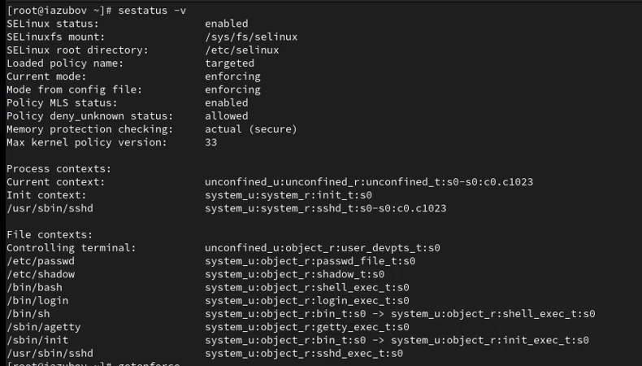

:::
::::::::::::::

## Изменяем режим

:::::::::::::: {.columns align=center}
::: {.column width="70%"}

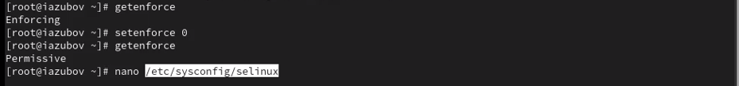

:::
::::::::::::::

## Редактируем файл

:::::::::::::: {.columns align=center}
::: {.column width="80%"}

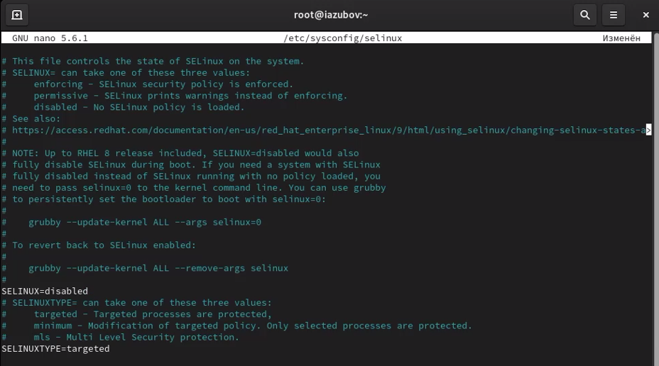

:::
::::::::::::::

## Смотрим статус и редактируем файл

:::::::::::::: {.columns align=center}
::: {.column width="80%"}

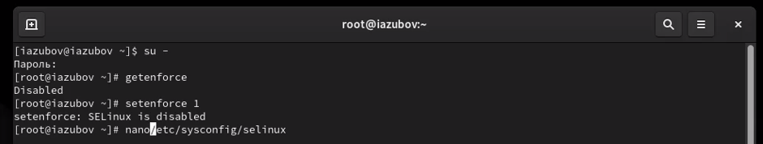

:::
::::::::::::::

## Проверяем контексты файлов

:::::::::::::: {.columns align=center}
::: {.column width="80%"}

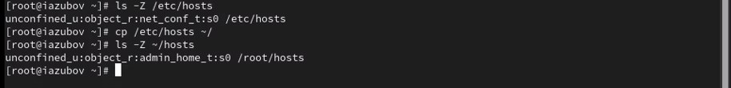

:::
::::::::::::::

## Изменяем тип контекста

:::::::::::::: {.columns align=center}
::: {.column width="80%"}

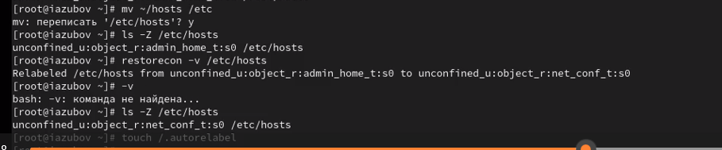

:::
::::::::::::::

## Установка ПО

:::::::::::::: {.columns align=center}
::: {.column width="80%"}

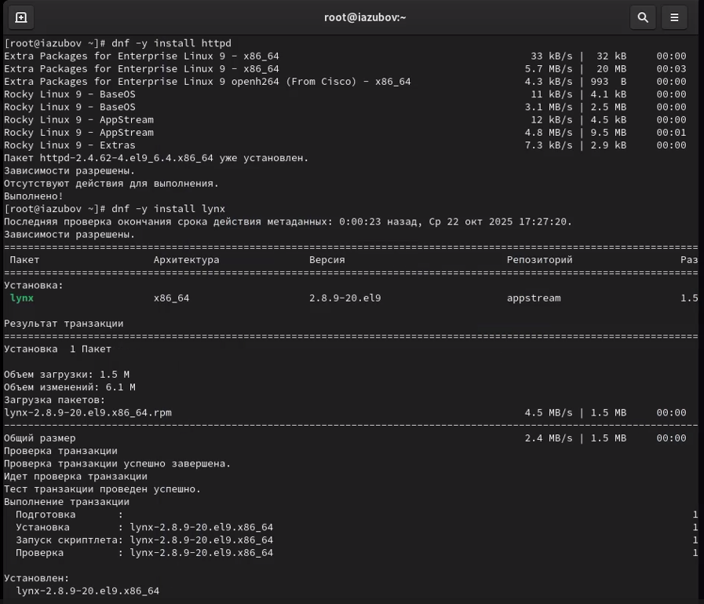

:::
::::::::::::::

## Создаем новое хранилище для файлов web-сервера и файл

:::::::::::::: {.columns align=center}
::: {.column width="80%"}

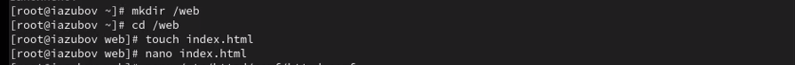

:::
::::::::::::::

## Редактируем файл

:::::::::::::: {.columns align=center}
::: {.column width="80%"}

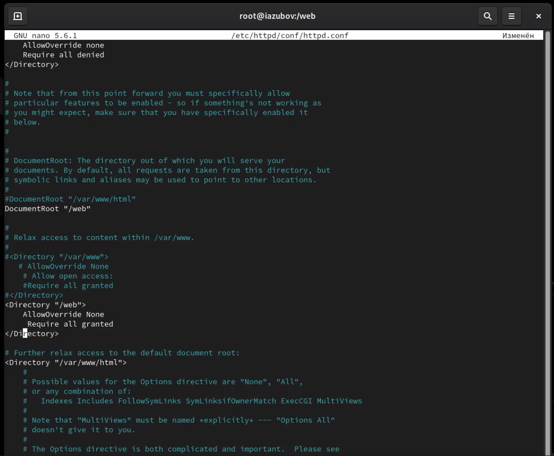

:::
::::::::::::::

## Запускаем веб страница.

:::::::::::::: {.columns align=center}
::: {.column width="70%"}

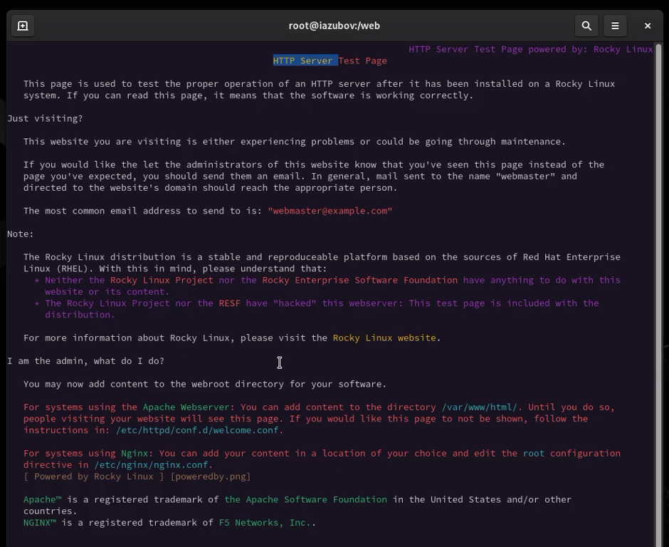

:::
::::::::::::::

## Применяем новую метку контекста и восстановим метку безопасности

:::::::::::::: {.columns align=center}
::: {.column width="80%"}

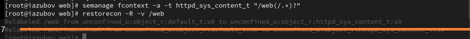

:::
::::::::::::::

## Запускаем наш веб сервер

:::::::::::::: {.columns align=center}
::: {.column width="80%"}

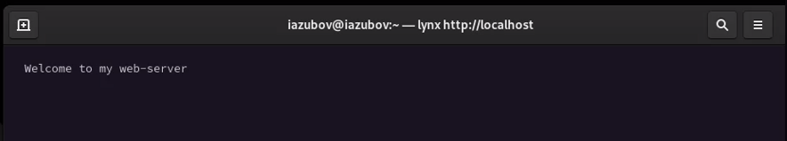

:::
::::::::::::::

## Смотрим списки переключателей и изменяем их

:::::::::::::: {.columns align=center}
::: {.column width="80%"}

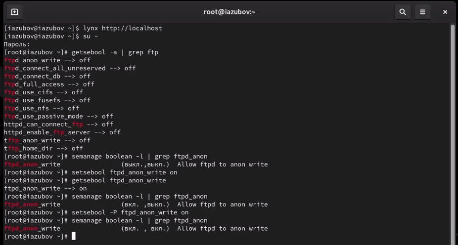

:::
::::::::::::::

## Контрольные вопросы

1. Вы хотите временно поставить SELinux в разрешающем режиме. Какую команду вы используете? setenforce 0
2. Вам нужен список всех доступных переключателей SELinux. Какую команду вы используете? getsebool -a
3. Каково имя пакета, который требуется установить для получения легко читаемых сообщений журнала SELinux в журнале аудита? selinux-policy-doc
4. Какие команды вам нужно выполнить, чтобы применить тип контекста httpd_sys_content_t к каталогу /web?
semanage fcontext -a -t httpd_sys_content_t "/web(/.*)?"
restorecon -R /web
5. Какой файл вам нужно изменить, если вы хотите полностью отключить SELinux? /etc/selinux/config (изменить SELINUX=disabled
6. Где SELinux регистрирует все свои сообщения? /var/log/messages
7. Вы не знаете, какие типы контекстов доступны для службы ftp. Какая команда позволяет получить более конкретную информацию?seinfo -t | grep ftp
8. Ваш сервис работает не так, как ожидалось, и вы хотите узнать, связано ли это с SELinux или чем-то ещё. Какой самый простой способ узнать? Временно перевести SELinux в режим setenforce Permissive и проверить работу сервиса
