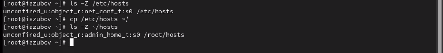
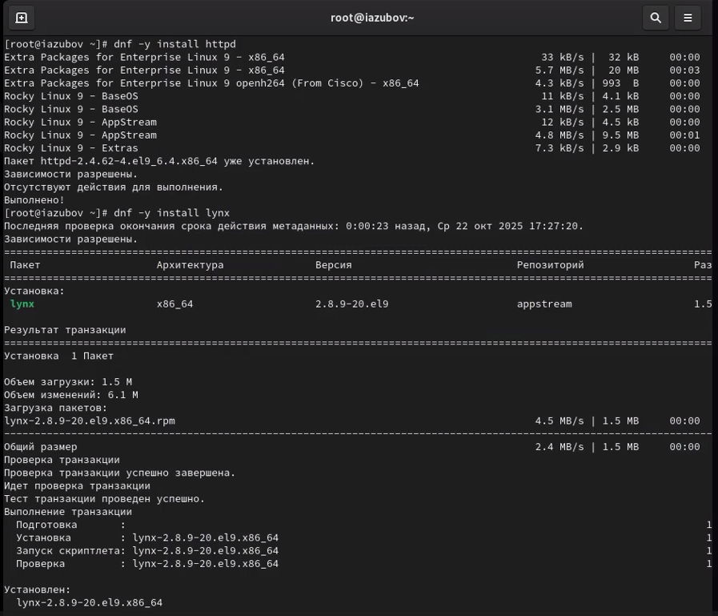

---
## Front matter
title: "Отчёта по лабораторной работе №9"
subtitle: "Отчет"
author: "Зубов Иван Александрович"

## Generic otions
lang: ru-RU
toc-title: "Содержание"

## Bibliography
bibliography: bib/cite.bib
csl: pandoc/csl/gost-r-7-0-5-2008-numeric.csl

## Pdf output format
toc: true # Table of contents
toc-depth: 2
lof: true # List of figures
fontsize: 12pt
linestretch: 1.5
papersize: a4
documentclass: scrreprt
## I18n polyglossia
polyglossia-lang:
  name: russian
  options:
	- spelling=modern
	- babelshorthands=true
polyglossia-otherlangs:
  name: english
## I18n babel
babel-lang: russian
babel-otherlangs: english
## Fonts
mainfont: PT Serif
romanfont: PT Serif
sansfont: PT Sans
monofont: PT Mono
mainfontoptions: Ligatures=TeX
romanfontoptions: Ligatures=TeX
sansfontoptions: Ligatures=TeX,Scale=MatchLowercase
monofontoptions: Scale=MatchLowercase,Scale=0.9
## Biblatex
biblatex: true
biblio-style: "gost-numeric"
biblatexoptions:
  - parentracker=true
  - backend=biber
  - hyperref=auto
  - language=auto
  - autolang=other*
  - citestyle=gost-numeric
## Pandoc-crossref LaTeX customization
figureTitle: "Рис."
tableTitle: "Таблица"
listingTitle: "Листинг"
lofTitle: "Список иллюстраций"
lolTitle: "Листинги"
## Misc options
indent: true
header-includes:
  - \usepackage{indentfirst}
  - \usepackage{float} # keep figures where there are in the text
  - \floatplacement{figure}{H} # keep figures where there are in the text
---

# Цель работы

Получить навыки работы с контекстом безопасности и политиками SELinux.

# Задание

1. Продемонстрируйте навыки по управлению режимами SELinux 
2. Продемонстрируйте навыки по восстановлению контекста безопасности SELinux 
3. Настройте контекст безопасности для нестандартного расположения файлов вебслужбы 
4. Продемонстрируйте навыки работы с переключателями SELinux

# Выполнение лабораторной работы

## Управление режимами SELinux

Получаем полномочия администратора и смотрим текущую информацию о состоянии SELinux

Построчное пояснение информации на экране

SELinux status: enabled — SELinux включен в системе.
SELinuxfs mount — точка монтирования виртуальной ФС SELinux.
SELinux root directory — корневая директория конфигурации SELinux.
Loaded policy name: targeted — загружена политика «targeted» (ограничивает только определённые сервисы).
Current mode: enforcing — текущий режим: принудительный (правила применяются).
Mode from config file: enforcing — режим из конфигурационного файла тоже «enforcing».
Policy MLS status: enabled — поддержка Multi-Level Security включена.
Policy deny_unknown status: allowed — неизвестные действия по умолчанию разрешены.
Memory protection checking — проверка защиты памяти активна.
Max kernel policy version — максимальная версия политики, поддерживаемая ядром.

{#fig:001 width=70%}

Посмотрим, в каком режиме работает SELinux и изменим режим работы SELinux на разрешающий (Permissive)

{#fig:002 width=70%}

Редактируем файл /etc/sysconfig/selinux и перезагружаем систему

{#fig:003 width=70%}

Посмотрим статус SELinux и увидим,что он отключен. Переключаем режим работы
Дальше откроем файл /etc/sysconfig/selinux с помощью редактора и установим:
SELINUX=enforcing
Перезагружаем систему
Во время перезагрузки мы получили предупреждающее сообщение и убедились потом ,что система работает в принудительном режиме
{#fig:004 width=70%}

##  Использование restorecon для восстановления контекста безопасности

Посмотрите контекст безопасности файла /etc/hosts
Скопируйте файл /etc/hosts в домашний каталог и проверим контекст файла ~/hosts

{#fig:005 width=70%}

Попытаемся перезаписать существующий файл hosts из домашнего каталога в каталог /etc и изменяем тип контекста

{#fig:006 width=70%}

## Настройка контекста безопасности для нестандартного расположения файлов веб-сервера

Устанавливаем программное обеспечение

{#fig:007 width=70%}

Создаем новое хранилище для файлов web-сервера и файл

{#fig:008 width=70%}

С помощью редактора nano редактируем файл index.html

{#fig:009 width=70%}

Запускаем веб сервер и службу httpd
Запускаем веб страница. Она будет просто по умолчанию

{#fig:010 width=70%}

В терминале применим новую метку контекста к /web и восстановим контекст безопасности

{#fig:011 width=70%}

Запускаем наш веб сервер

{#fig:012 width=70%}

## Работа с переключателями SELinux

Смотрим списки переключателей и изменяем их

{#fig:013 width=70%}

# Выводы

Я получил навыки работы с контекстом безопасности и политиками SELinux.

# Контрольные вопросы

1. Вы хотите временно поставить SELinux в разрешающем режиме. Какую команду вы используете? setenforce 0
2. Вам нужен список всех доступных переключателей SELinux. Какую команду вы используете? getsebool -a
3. Каково имя пакета, который требуется установить для получения легко читаемых сообщений журнала SELinux в журнале аудита? selinux-policy-doc
4. Какие команды вам нужно выполнить, чтобы применить тип контекста httpd_sys_content_t к каталогу /web?
semanage fcontext -a -t httpd_sys_content_t "/web(/.*)?"
restorecon -R /web
5. Какой файл вам нужно изменить, если вы хотите полностью отключить SELinux? /etc/selinux/config (изменить SELINUX=disabled
6. Где SELinux регистрирует все свои сообщения? /var/log/messages
7. Вы не знаете, какие типы контекстов доступны для службы ftp. Какая команда позволяет получить более конкретную информацию?seinfo -t | grep ftp
8. Ваш сервис работает не так, как ожидалось, и вы хотите узнать, связано ли это с SELinux или чем-то ещё. Какой самый простой способ узнать? Временно перевести SELinux в режим setenforce Permissive и проверить работу сервиса

