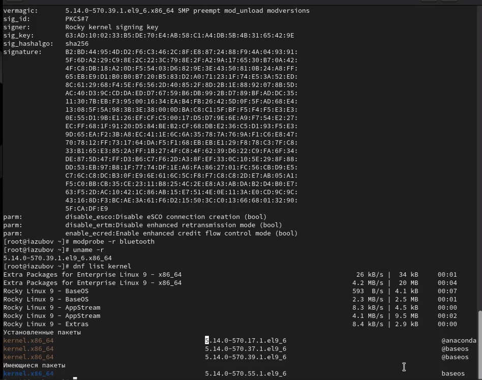

---
## Front matter
title: "Лабораторной работе №10"
subtitle: "Отчет"
author: "Зубов Иван Александрович"

## Generic otions
lang: ru-RU
toc-title: "Содержание"

## Bibliography
bibliography: bib/cite.bib
csl: pandoc/csl/gost-r-7-0-5-2008-numeric.csl

## Pdf output format
toc: true # Table of contents
toc-depth: 2
lof: true # List of figures
fontsize: 12pt
linestretch: 1.5
papersize: a4
documentclass: scrreprt
## I18n polyglossia
polyglossia-lang:
  name: russian
  options:
	- spelling=modern
	- babelshorthands=true
polyglossia-otherlangs:
  name: english
## I18n babel
babel-lang: russian
babel-otherlangs: english
## Fonts
mainfont: PT Serif
romanfont: PT Serif
sansfont: PT Sans
monofont: PT Mono
mainfontoptions: Ligatures=TeX
romanfontoptions: Ligatures=TeX
sansfontoptions: Ligatures=TeX,Scale=MatchLowercase
monofontoptions: Scale=MatchLowercase,Scale=0.9
## Biblatex
biblatex: true
biblio-style: "gost-numeric"
biblatexoptions:
  - parentracker=true
  - backend=biber
  - hyperref=auto
  - language=auto
  - autolang=other*
  - citestyle=gost-numeric
## Pandoc-crossref LaTeX customization
figureTitle: "Рис."
tableTitle: "Таблица"
listingTitle: "Листинг"
lofTitle: "Список иллюстраций"
lolTitle: "Листинги"
## Misc options
indent: true
header-includes:
  - \usepackage{indentfirst}
  - \usepackage{float} # keep figures where there are in the text
  - \floatplacement{figure}{H} # keep figures where there are in the text
---

# Цель работы

Получить навыки работы с утилитами управления модулями ядра операционной системы.

# Задание

1. Продемонстрируйте навыки работы по управлению модулями ядра 
2. Продемонстрируйте навыки работы по загрузке модулей ядра с параметрами

# Выполнение лабораторной работы

Запустим терминал и получим полномочия администратора
Посмотрите, какие устройства имеются в вашей системе и какие модули ядра с ними связаны
Команда lspci -k показывает список PCI-устройств в системе и связанные с ними драйверы ядра.
1. Host bridge (00:00.0)
Производитель: Intel Corporation 440FX - 82441FX PMC
Назначение: Основной мост (Host bridge) - центральный компонент чипсета
2. ISA bridge (00:01.0)
Производитель: Intel Corporation 82371SB PIIX3 ISA
Назначение: Мост для подключения ISA-устройств
3. IDE interface (00:01.1)
Производитель: Intel Corporation 82371AB/EB/MB PIIX4 IDE
Драйвер ядра: ata_piix
Модули ядра: ata_piix, ata_generic
Назначение: Контроллер IDE-интерфейса для подключения жестких дисков
4. VGA compatible controller (00:02.0)
Производитель: VMware SVGA II Adapter
Драйвер и модуль ядра: vmwgfx
Назначение: Видеоконтроллер VMware для виртуальной машины
5. Ethernet controller (00:03.0)
Производитель: Intel Corporation 82540EN Gigabit Ethernet Controller
Драйвер и модуль ядра: e1000
Назначение: Сетевой адаптер Gigabit Ethernet
6. System peripheral (00:04.0)
Производитель: InnoTek Systemberatung GmbH VirtualBox Guest Service
Драйвер и модуль ядра: vboxguest
Назначение: Сервисы гостевой ОС VirtualBox
7. Multimedia audio controller (00:05.0)
Производитель: Intel Corporation 82801AA AC'97 Audio Controller
Драйвер ядра: snd_intel8x0
Назначение: Аудиоконтроллер AC'97
8. USB controller (00:06.0)
Производитель: Apple Inc. KeyLargo/Intrepid USB
Драйвер ядра: ohci-pci
Назначение: Контроллер USB (OHCI)
9. Bridge (00:07.0)
Производитель: Intel Corporation 82371AB/EB/MB PIIX4 ACPI
Драйвер ядра: piix4_smbus
Модули ядра: i2c_piix4
Назначение: Мост для управления питанием (ACPI)
10. USB controller (00:09.0)
Производитель: Intel Corporation 82801FB/FBM/FR/FW/FEW (ICH6 Family) USB2 EHCI Controller
Драйвер ядра: ehci-pci
Назначение: Контроллер USB 2.0 (EHCI)
11. SATA controller (00:10.0)
Производитель: Intel Corporation 82801HM/HEN (ICH8M/ICH8M-E) SATA Controller
Драйвер и модуль ядра: ahci
Назначение: Контроллер SATA в режиме AHCI для подключения современных жестких дисков

{#fig:001 width=70%}

Посмотрим, какие модули ядра загружены

{#fig:002 width=70%}

Увидим ,что модуль ext4 не загружен и загружаем его

{#fig:003 width=70%}

Посмотрим информацию о модуле ядра ext4

Основная информация о модуле:
Имя файла: /lib/modules/5.14.0-570.39.1.e19_6.x86_64/kernel/fs/ext4/ext4.ko.xz

Описание: Fourth Extended Filesystem (Четвертая расширенная файловая система)

Версия ядра: 5.14.0-570.39.1.e19_6.x86_64

Лицензия: GPL

Авторы: Remy Card, Stephen Tweedie, Andrew Norton, Andreas Dilger, Theodore Ts'o и другие

Дистрибутив: Rocky Linux 9.6 (определяется по rhelversion: 9.6)

Зависимости: jbd2, mbcache (журналирование и кэширование)

Предварительная зависимость: crc32c (загружается перед ext4)

Псевдонимы (aliases):

fs-ext4, ext3, fs-ext3, ext2, fs-ext2

Модуль поддерживает файловые системы ext2, ext3 и ext4

Подпись: Модуль подписан Rocky kernel signing key

Алгоритм подписи: SHA256

Защита: Поддержка retpoline (защита от Spectre)

Архитектура: x86_64

Состояние: Встроен в дерево ядра (intree: Y)

Поддержка модулей: Поддержка выгрузки модулей (mod_unload) и версий (modversions)

{#fig:004 width=70%}

Выгружаем модуль ext4
Модуль xfs выгрузить не можем ,потому что  модуль ядра в данный момент используется.

{#fig:005 width=70%}

Загрузим модуль ядра bluetooth и посмотрим список модулей ядра, отвечающих за работу с Bluetooth

{#fig:006 width=70%}

Посмотрим информацию о модуле bluetooth и выгрузим его

{#fig:007 width=70%}

Посмотрим версию ядра, используемую в операционной системе
Выведем на экран список пакетов, относящихся к ядру операционной системы

{#fig:008 width=70%}

Обновляем систему

{#fig:009 width=70%}

Обновим ядро операционной системы, а затем саму операционную систему
Перезагружаем систему

{#fig:010 width=70%}

Посмотрим версию ядра, используемую в операционной системы

{#fig:011 width=70%}

# Контрольные вопросы

1. Какая команда показывает текущую версию ядра, которая используется на вашей системе? uname -r
2. Как можно посмотреть более подробную информацию о текущей версии ядра операционной системы? uname -a
3. Какая команда показывает список загруженных модулей ядра? lsmod
4. Какая команда позволяет вам определять параметры модуля ядра? modinfo имя_модуля
5. Как выгрузить модуль ядра? rmmod имя_модуля
6. Что вы можете сделать, если получите сообщение об ошибке при попытке выгрузить модуль ядра? Проверить зависимости: lsmod | grep имя_модуля
7. Как определить, какие параметры модуля ядра поддерживаются? modinfo -p имя_модуля
8. Как установить новую версию ядра? yum install kernel-версия

# Выводы

Я получил навыки работы с утилитами управления модулями ядра операционной системы.
