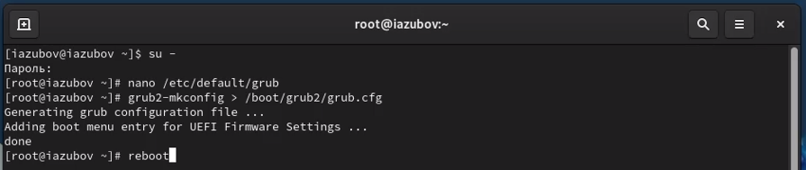
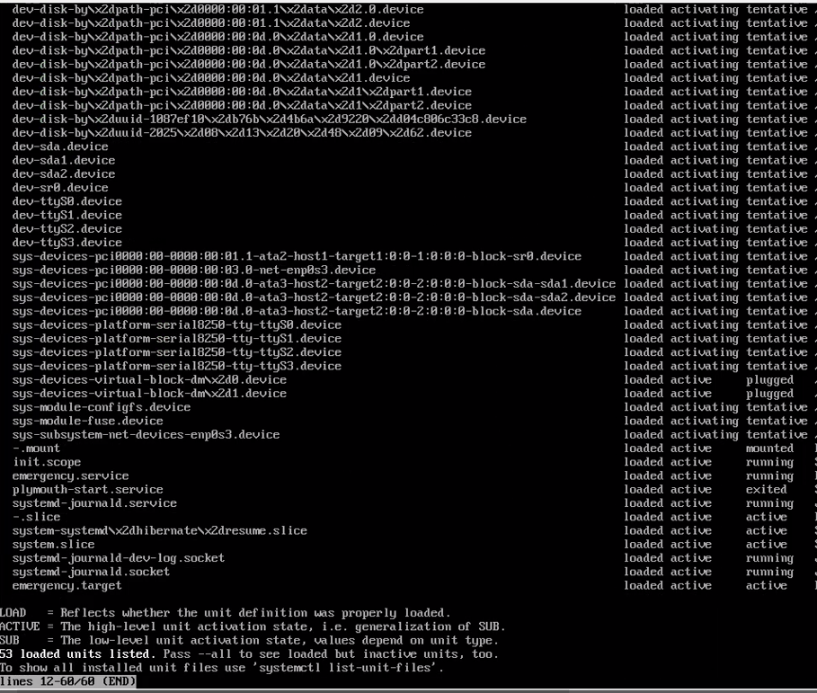
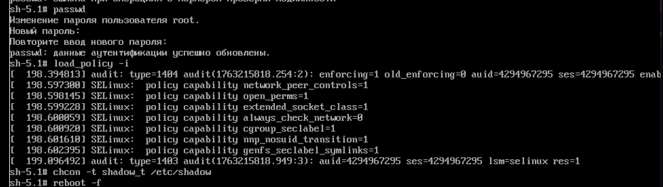

---
## Front matter
title: "Лабораторная работа №11"
subtitle: "Отчет"
author: "Зубов Иван Александрович"

## Generic otions
lang: ru-RU
toc-title: "Содержание"

## Bibliography
bibliography: bib/cite.bib
csl: pandoc/csl/gost-r-7-0-5-2008-numeric.csl

## Pdf output format
toc: true # Table of contents
toc-depth: 2
lof: true # List of figures
lot: true # List of tables
fontsize: 12pt
linestretch: 1.5
papersize: a4
documentclass: scrreprt
## I18n polyglossia
polyglossia-lang:
  name: russian
  options:
	- spelling=modern
	- babelshorthands=true
polyglossia-otherlangs:
  name: english
## I18n babel
babel-lang: russian
babel-otherlangs: english
## Fonts
mainfont: IBM Plex Serif
romanfont: IBM Plex Serif
sansfont: IBM Plex Sans
monofont: IBM Plex Mono
mathfont: STIX Two Math
mainfontoptions: Ligatures=Common,Ligatures=TeX,Scale=0.94
romanfontoptions: Ligatures=Common,Ligatures=TeX,Scale=0.94
sansfontoptions: Ligatures=Common,Ligatures=TeX,Scale=MatchLowercase,Scale=0.94
monofontoptions: Scale=MatchLowercase,Scale=0.94,FakeStretch=0.9
mathfontoptions:
## Biblatex
biblatex: true
biblio-style: "gost-numeric"
biblatexoptions:
  - parentracker=true
  - backend=biber
  - hyperref=auto
  - language=auto
  - autolang=other*
  - citestyle=gost-numeric
## Pandoc-crossref LaTeX customization
figureTitle: "Рис."
tableTitle: "Таблица"
listingTitle: "Листинг"
lofTitle: "Список иллюстраций"
lotTitle: "Список таблиц"
lolTitle: "Листинги"
## Misc options
indent: true
header-includes:
  - \usepackage{indentfirst}
  - \usepackage{float} # keep figures where there are in the text
  - \floatplacement{figure}{H} # keep figures where there are in the text
---

# Цель работы

Получить навыки работы с загрузчиком системы GRUB2.

# Задание

1. Продемонстрируйте навыки по изменению параметров GRUB и записи изменений в файл конфигурации
2. Продемонстрируйте навыки устранения неполадок при работе с GRUB .
3. Продемонстрируйте навыки работы с GRUB без использования root1. Продемонстрируйте навыки работы по управлению модулями ядра 
2. Продемонстрируйте навыки работы по загрузке модулей ядра с параметрами

# Выполнение лабораторной работы

Запустим терминал и получим полномочия администратора
Редактируем файл  /etc/default/grub и задаем таймер 10 секунд. После этого запишем изменения в GRUB2 и перезагрузим систему

{#fig:001 width=70%}

Открываем меню редактирования GRUB. Прокрутите вниз до строки, начинающейся с linux ($root)/vmlinuz-. В конце этой строки введем systemd.unit=rescue.target и удалим опции rhgb и quit из этой строки. 

{#fig:002 width=70%}

Посмотрим список всех файлов модулей, которые загружены в настоящее время:

{#fig:003 width=70%}

Посмотрим задействованные переменные среды оболочки,после этого перезагружаем систему

{#fig:004 width=70%}

Открываем вновь меню редактирования GRUB.В конце строки, загружающей ядро, введем systemd.unit=emergency.target и удалим опции rhgb и quit из этой строки.

{#fig:005 width=70%}

После успешного входа в систему посмотрим список всех загруженных файлов модулей и перезагрузим систему

{#fig:006 width=70%}

Открываем меню редактирования GRUB.В конце строки, загружающей ядро, введем rd.break

{#fig:007 width=70%}

Получим доступ к системному образу для чтения и записи
Сделаем содержимое каталога /sysimage новым корневым каталогом

{#fig:008 width=70%}

Устанавливаем новый пароль. 
Загружаем политику SELinux и устанавливаем правильный тип контекста

{#fig:009 width=70%}

# Контрольные вопросы 

1. Какой файл конфигурации следует изменить для применения общих изменений в GRUB2? /etc/default/grub
2. Как называется конфигурационный файл GRUB2, в котором вы применяете изменения для GRUB2? /etc/default/grub
3. После внесения изменений в конфигурацию GRUB2, какую команду вы должны выполнить, чтобы изменения сохранились и воспринялись при загрузке системы? update-grub или grub-mkconfig -o /boot/grub/grub.cfg

# Вывод

Я получил навыки работы с загрузчиком системы GRUB2.

