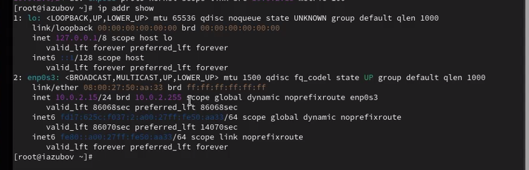
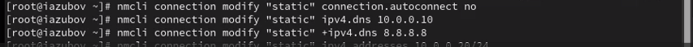

---
## Front matter
lang: ru-RU
title: Лабораторная работа №12
subtitle: Презентация
author:
  - Зубов И.А.
institute:
  - Российский университет дружбы народов, Москва, Россия
date: 22 ноября 2025

## i18n babel
babel-lang: russian
babel-otherlangs: english

## Formatting pdf
toc: false
toc-title: Содержание
slide_level: 2
aspectratio: 169
section-titles: true
theme: metropolis
header-includes:
 - \metroset{progressbar=frametitle,sectionpage=progressbar,numbering=fraction}
---

# Информация

## Докладчик

  * Зубов Иван Александрович
  * Студент
  * Российский университет дружбы народов
  * 1132243112@pfur.ru

# Выполнение лабораторной работы

## Информация о существующих сетевых подключениях

:::::::::::::: {.columns align=center}
::: {.column width="70%"}

:::
::::::::::::::

## Информация о текущих маршрутах

:::::::::::::: {.columns align=center}
::: {.column width="70%"}

:::
::::::::::::::

## Информацию о текущих назначениях адресов для сетевых интерфейсов на устройстве

:::::::::::::: {.columns align=center}
::: {.column width="80%"}

:::
::::::::::::::

## Дополнительный адрес

:::::::::::::: {.columns align=center}
::: {.column width="80%"}

:::
::::::::::::::

## Управление сетевыми подключениями с помощью nmcli

:::::::::::::: {.columns align=center}
::: {.column width="80%"}

:::
::::::::::::::

## Добавляем два днс сервера

:::::::::::::: {.columns align=center}
::: {.column width="80%"}

:::
::::::::::::::

## Изменяем ip адреса статического соединения и активируем его

:::::::::::::: {.columns align=center}
::: {.column width="80%"}

:::
::::::::::::::
