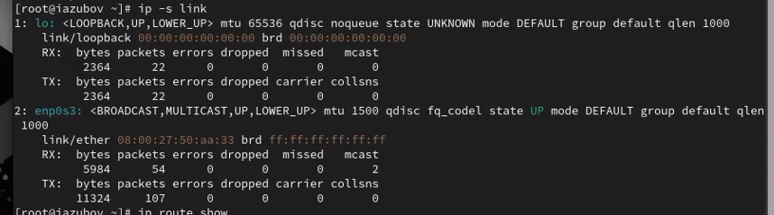
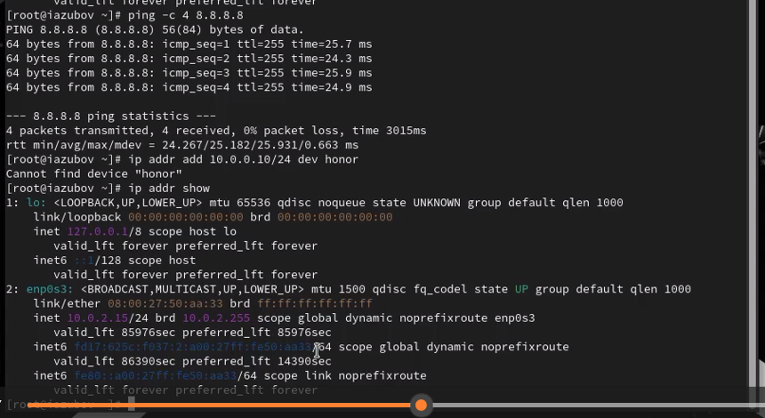
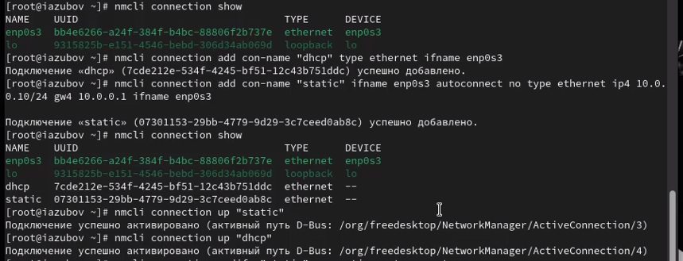

---
## Front matter
title: "Лабораторная работа №12"
subtitle: "Отчет"
author: "Зубов Иван Александрович"

## Generic otions
lang: ru-RU
toc-title: "Содержание"

## Bibliography
bibliography: bib/cite.bib
csl: pandoc/csl/gost-r-7-0-5-2008-numeric.csl

## Pdf output format
toc: true # Table of contents
toc-depth: 2
lof: true # List of figures
lot: true # List of tables
fontsize: 12pt
linestretch: 1.5
papersize: a4
documentclass: scrreprt
## I18n polyglossia
polyglossia-lang:
  name: russian
  options:
	- spelling=modern
	- babelshorthands=true
polyglossia-otherlangs:
  name: english
## I18n babel
babel-lang: russian
babel-otherlangs: english
## Fonts
mainfont: IBM Plex Serif
romanfont: IBM Plex Serif
sansfont: IBM Plex Sans
monofont: IBM Plex Mono
mathfont: STIX Two Math
mainfontoptions: Ligatures=Common,Ligatures=TeX,Scale=0.94
romanfontoptions: Ligatures=Common,Ligatures=TeX,Scale=0.94
sansfontoptions: Ligatures=Common,Ligatures=TeX,Scale=MatchLowercase,Scale=0.94
monofontoptions: Scale=MatchLowercase,Scale=0.94,FakeStretch=0.9
mathfontoptions:
## Biblatex
biblatex: true
biblio-style: "gost-numeric"
biblatexoptions:
  - parentracker=true
  - backend=biber
  - hyperref=auto
  - language=auto
  - autolang=other*
  - citestyle=gost-numeric
## Pandoc-crossref LaTeX customization
figureTitle: "Рис."
tableTitle: "Таблица"
listingTitle: "Листинг"
lofTitle: "Список иллюстраций"
lotTitle: "Список таблиц"
lolTitle: "Листинги"
## Misc options
indent: true
header-includes:
  - \usepackage{indentfirst}
  - \usepackage{float} # keep figures where there are in the text
  - \floatplacement{figure}{H} # keep figures where there are in the text
---

# Цель работы

Получить навыки настройки сетевых параметров системы.

# Задание

1. Продемонстрируйте навыки использования утилиты ip 
2. Продемонстрируйте навыки использования утилиты nmcli

# Выполнение лабораторной работы

Запустим терминал и получим полномочия администратора
Выведем  на экран информацию о существующих сетевых подключениях, а также статистику о количестве отправленных пакетов и связанных с ними сообщениях об ошибках
Имя интерфейса: enp0s3 
Состояние: UP - интерфейс активен и работает
Режим: DEFAULT - стандартный режим работы
MTU: 1500 байт - стандартный размер максимального блока данных
MAC-адрес: 08:00:27:50:aa:33
Тип связи: ETHERNET (проводное соединение)
Широковещательный адрес: ff:ff:ff:ff:ff:ff
Принято байт: 5,984 байт
Принято пакетов: 54 пакета
Ошибок: 0
Потеряно пакетов: 0
Пропущено пакетов: 0
Передано пакетов: 107 пакетов
Ошибок передачи: 0
Потеряно пакетов: 0
Collisions (коллизий): 0

{#fig:001 width=70%}

Информацию о текущих маршрутах
Система имеет IP-адрес 10.0.2.15
Шлюз по умолчанию: 10.0.2.2
Подключение к сети 10.0.2.0/24
Настройки получены по DHCP

{#fig:002 width=70%}

Выведем на экран информацию о текущих назначениях адресов для сетевых интерфейсов на устройстве:

Имя интерфейса: enpos3 (вероятно опечатка, должно быть enp0s3)
Тип: Ethernet адаптер
MAC-адрес: 08:00:27:50:aa:33
Состояние: UP - активно
Основной IPv4: 10.0.2.15/24
Тип: динамический (dynamic)
Broadcast: 10.0.2.255
Время жизни: 86068 секунд
Устройство имеет IPv4-адрес: 10.0.2.15
Сетевой адаптер: empos3 (Ethernet)

{#fig:003 width=70%}

Используем команду ping для проверки правильности подключения к Интернету
Добавляем дополнительный адрес к вашему интерфейсу
Проверяем, что адрес добавился

{#fig:004 width=70%}

Добавляем Ethernet-соединение с именем dhcp к интерфейсу
Добавляем к этому же интерфейсу Ethernet-соединение с именем static, статическим IPv4-адресом адаптера и статическим адресом шлюза
Переключитесь на статическое соединение
Вернемся к соединению dhcp:

{#fig:005 width=70%}

Отключим автоподключение статического соединения и добавим 2 DNS-сервер в статическое соединения

{#fig:006 width=70%}

Изменяем ip адреса статического соединения и активируем его

{#fig:007 width=70%}

# Вывод

Я получил навыки настройки сетевых параметров системы.

# Контрольные вопросы

1. Какая команда отображает только статус соединения, но не IP-адрес? nmcli device status
2. Какая служба управляет сетью в ОС типа RHEL? NetworkManager
3. Какой файл содержит имя узла (устройства) в ОС типа RHEL? /etc/hostname
4. Какая команда позволяет вам задать имя узла (устройства)? hostnamectl set-hostname <имя> или nmcli general hostname <имя>
5. Какой конфигурационный файл можно изменить для включения разрешения имён для конкретного IP-адреса? /etc/hosts
6. Какая команда показывает текущую конфигурацию маршрутизации? ip route show или route -n
7. Как проверить текущий статус службы NetworkManager? systemctl status NetworkManager
8. Какая команда позволяет вам изменить текущий IP-адрес и шлюз по умолчанию для вашего сетевого соединения? nmcli connection modify <имя-подключения> ipv4.addresses <IP/маска> ipv4.gateway <шлюз>

