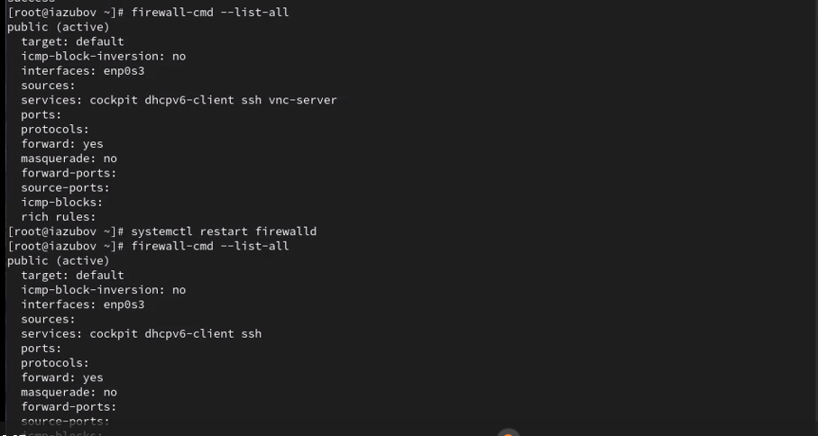
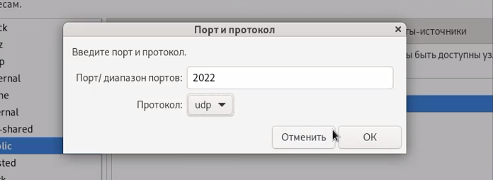
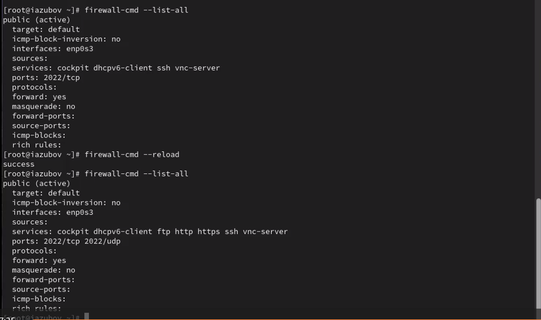
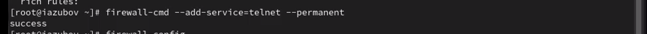

---
## Front matter
title: "Лабораторная работа №13"
subtitle: "Отчет"
author: "Зубов Иван Александрович"

## Generic otions
lang: ru-RU
toc-title: "Содержание"

## Bibliography
bibliography: bib/cite.bib
csl: pandoc/csl/gost-r-7-0-5-2008-numeric.csl

## Pdf output format
toc: true # Table of contents
toc-depth: 2
lof: true # List of figures
lot: true # List of tables
fontsize: 12pt
linestretch: 1.5
papersize: a4
documentclass: scrreprt
## I18n polyglossia
polyglossia-lang:
  name: russian
  options:
	- spelling=modern
	- babelshorthands=true
polyglossia-otherlangs:
  name: english
## I18n babel
babel-lang: russian
babel-otherlangs: english
## Fonts
mainfont: IBM Plex Serif
romanfont: IBM Plex Serif
sansfont: IBM Plex Sans
monofont: IBM Plex Mono
mathfont: STIX Two Math
mainfontoptions: Ligatures=Common,Ligatures=TeX,Scale=0.94
romanfontoptions: Ligatures=Common,Ligatures=TeX,Scale=0.94
sansfontoptions: Ligatures=Common,Ligatures=TeX,Scale=MatchLowercase,Scale=0.94
monofontoptions: Scale=MatchLowercase,Scale=0.94,FakeStretch=0.9
mathfontoptions:
## Biblatex
biblatex: true
biblio-style: "gost-numeric"
biblatexoptions:
  - parentracker=true
  - backend=biber
  - hyperref=auto
  - language=auto
  - autolang=other*
  - citestyle=gost-numeric
## Pandoc-crossref LaTeX customization
figureTitle: "Рис."
tableTitle: "Таблица"
listingTitle: "Листинг"
lofTitle: "Список иллюстраций"
lotTitle: "Список таблиц"
lolTitle: "Листинги"
## Misc options
indent: true
header-includes:
  - \usepackage{indentfirst}
  - \usepackage{float} # keep figures where there are in the text
  - \floatplacement{figure}{H} # keep figures where there are in the text
---

# Цель работы

Получить навыки настройки пакетного фильтра в Linux.

# Задание

1. Используя firewall-cmd:
– определить текущую зону по умолчанию;
– определить доступные для настройки зоны;
– определить службы, включённые в текущую зону;
– добавить сервер VNC в конфигурацию брандмауэра.
2. Используя firewall-config:
– добавьте службы http и ssh в зону public;
– добавьте порт 2022 протокола UDP в зону public;
– добавьте службу ftp.
3. Выполните задание для самостоятельной работы

# Выполнение лабораторной работы

## Управление брандмауэром с помощью firewall-cmd

Получаем полномочия администратора.
Определяем текущую зону по умолчанию
Определяем доступные зоны
Посмотрим службы, доступные на нашем компьютере
Определяем доступные службы в текущей зоне

{#fig:001 width=70%}

Добавим сервер VNC в конфигурацию брандмауэра командой firewall-cmd --add-service=vnc-server
Проверим добавили или нет и перазапустим службу

{#fig:002 width=70%}

Добавим постоянную службу vnc-server
Проверим наличие vnc-server в конфигурации
Перезагрузим конфигурацию firewalld и просмотрим конфигурацию времени выполнения

{#fig:003 width=70%}

Добавьте в конфигурацию межсетевого экрана порт 2022 протокола TCP
Перезагрузим конфигурацию firewalld и сделаем проверку

{#fig:004 width=70%}

##  Управление брандмауэром с помощью firewall-config

Запустим интерфейс GUI firewall-config командой firewall-config

{#fig:005 width=70%}

Выберем конфигурацию "Постоянная". Затем выберем зону public и отметbv службы http, https и ftp, чтобы включить их

{#fig:006 width=70%}

Выберем вкладку Ports и на этой вкладке нажмите Add . Вводим порт 2022 и протокол udp

{#fig:007 width=70%}

Вводя команду firewall-cmd --list-all, мы увидим что  изменения, которые мы только что внесли, ещё не вступили в силу. Это связано с тем, что мы настроили их как постоянные изменения, а не как изменения времени выполнения.
Поэтому дальше перезагружаем конфигурацию и проверяем,что изменения были применены

{#fig:008 width=70%}

## Самостоятельная работа

Через командную строку создаем конфигурацию межсетевого экрана, которая позволяет получить доступ к службе telnet

{#fig:009 width=70%}

Выберем конфигурацию "Постоянная". Затем выберем зону public и отметку службы imap, pop3 и smtp, чтобы включить их

{#fig:010 width=70%}

Перезагружаем службу и смотрим как мы их добавили

{#fig:011 width=70%}

# Контрольные вопросы

1. Какая служба должна быть запущена перед началом работы с менеджером конфигурации брандмауэра firewall-config? firewalld
2. Какая команда позволяет добавить UDP-порт 2355 в конфигурацию брандмауэра
в зоне по умолчанию? firewall-cmd --add-port=2355/udp
3. Какая команда позволяет показать всю конфигурацию брандмауэра во всех зонах? firewall-cmd --list-all-zones
4. Какая команда позволяет удалить службу vnc-server из текущей конфигурации брандмауэра? firewall-cmd --remove-service=vnc-server
5. Какая команда firewall-cmd позволяет активировать новую конфигурацию, добавленную опцией --permanent? firewall-cmd --reload
6. Какой параметр firewall-cmd позволяет проверить, что новая конфигурация была добавлена в текущую зону и теперь активна? --list-all
7. Какая команда позволяет добавить интерфейс eno1 в зону public? firewall-cmd --zone=public --add-interface=eno1
8. Если добавить новый интерфейс в конфигурацию брандмауэра, пока не указана зона, в какую зону он будет добавлен? В зону public

# Вывод

Я получил навыки настройки пакетного фильтра в Linux.
