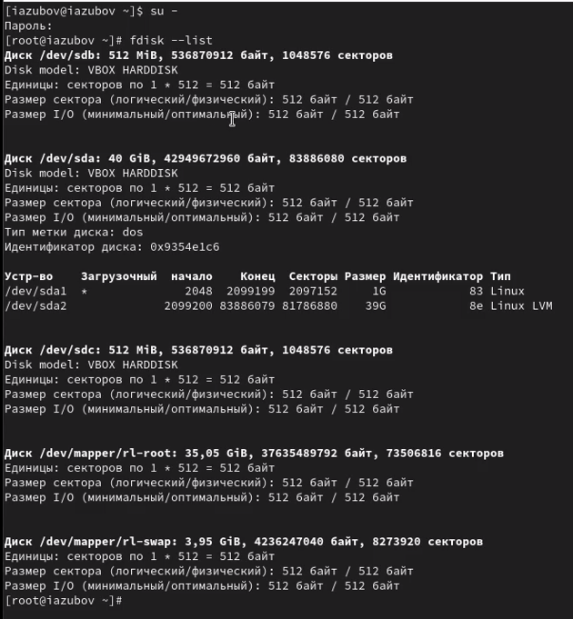
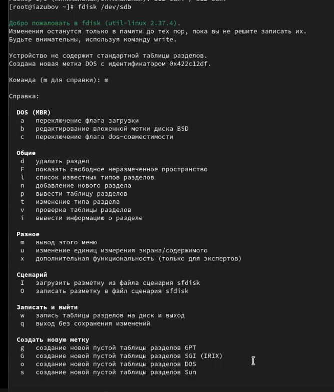
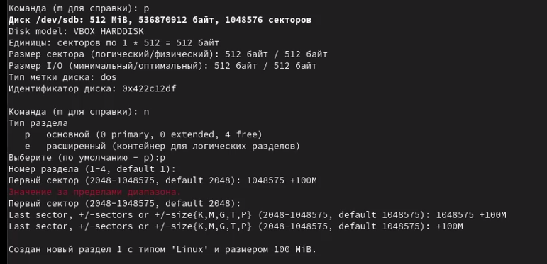
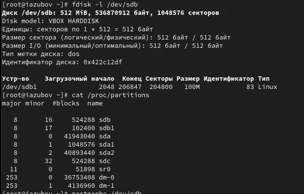
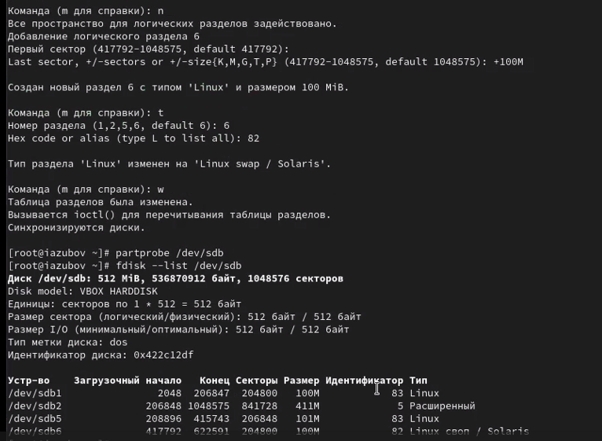
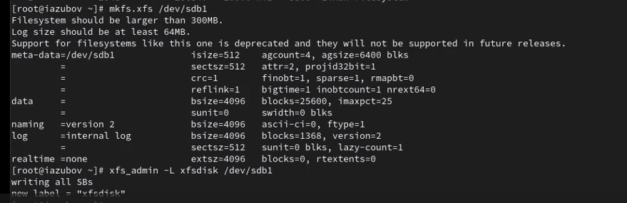
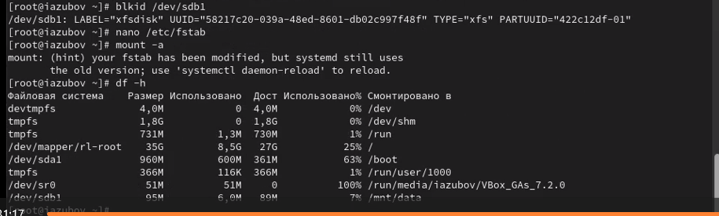
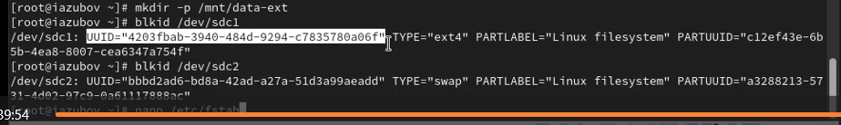

---
## Front matter
lang: ru-RU
title: Лабораторная работа №14
subtitle: Презентация
author:
  - Зубов И.А.
institute:
  - Российский университет дружбы народов, Москва, Россия
date: 22 ноября 2025

## i18n babel
babel-lang: russian
babel-otherlangs: english

## Formatting pdf
toc: false
toc-title: Содержание
slide_level: 2
aspectratio: 169
section-titles: true
theme: metropolis
header-includes:
 - \metroset{progressbar=frametitle,sectionpage=progressbar,numbering=fraction}
---

# Информация

## Докладчик

  * Зубов Иван Александрович
  * Студент
  * Российский университет дружбы народов
  * 1132243112@pfur.ru

# Выполнение лабораторной работы

## Создание виртуальных носителей и  создание разделов MBR с помощью fdisk. Перечень разделов

:::::::::::::: {.columns align=center}
::: {.column width="70%"}

:::
::::::::::::::

## Создание виртуальных носителей и  создание разделов MBR с помощью fdisk. Справка по командам

:::::::::::::: {.columns align=center}
::: {.column width="70%"}

:::
::::::::::::::

## Создание виртуальных носителей и  создание разделов MBR с помощью fdisk. Добавление нового раздела

:::::::::::::: {.columns align=center}
::: {.column width="80%"}

:::
::::::::::::::

## Создание виртуальных носителей и  создание разделов MBR с помощью fdisk. Выбор типа раздела

:::::::::::::: {.columns align=center}
::: {.column width="80%"}

:::
::::::::::::::

##Создание виртуальных носителей и  создание разделов MBR с помощью fdisk. Таблица разделов

Смотрим таблицу разделов разными командами и записываем изменения. 

:::::::::::::: {.columns align=center}
::: {.column width="80%"}

:::
::::::::::::::

## Создание логических разделов. Новый раздел

:::::::::::::: {.columns align=center}
::: {.column width="80%"}

:::
::::::::::::::

## Создание логических разделов. Логический раздел

:::::::::::::: {.columns align=center}
::: {.column width="80%"}

:::
::::::::::::::

## Создание раздела подкачки.Логический раздел

Добавляем логический раздел с номером раздела 6. 
Завершаем процедуру и обновляем таблицу разделов

:::::::::::::: {.columns align=center}
::: {.column width="80%"}

:::
::::::::::::::

## Создание раздела подкачки. Отформатируем раздел подкачки

:::::::::::::: {.columns align=center}
::: {.column width="80%"}

:::
::::::::::::::

## Создание разделов GPT с помощью gdisk

Посмотрим таблицы разделов и разделы на втором добавленном вами ранее диске /dev/sdc и создадим новый раздел. Обновляем таблицу разделов

:::::::::::::: {.columns align=center}
::: {.column width="80%"}

:::
::::::::::::::

## Форматирование файловой системы XFS

:::::::::::::: {.columns align=center}
::: {.column width="80%"}

:::
::::::::::::::

## Ручное монтирование файловых систем

Для создания точки монтирования для раздела введем mkdir -p /mnt/tmp.Смонтируем файловую систему и проверим корректности монтирования раздела

:::::::::::::: {.columns align=center}
::: {.column width="80%"}

:::
::::::::::::::

## Монтирование разделов с помощью /etc/fstab.Точка монтирования для раздела XFS /dev/sdb1 

:::::::::::::: {.columns align=center}
::: {.column width="80%"}

:::
::::::::::::::

## Монтирование разделов с помощью /etc/fstab. Новый раздел

Введем blkid /dev/sdb1 и затем используем мышь, чтобы скопировать значение идентификатора UUID для устройства /dev/sdb1
Откроем файл /etc/fstab на редактирование и вставим UUID. Монтируем все

:::::::::::::: {.columns align=center}
::: {.column width="80%"}

:::
::::::::::::::

## Самостоятельная работа

Запускаем gdisk для диска /dev/sdc и создаем два раздела

:::::::::::::: {.columns align=center}
::: {.column width="80%"}

:::
::::::::::::::

## Самостоятельная работа

Форматирование разделов

:::::::::::::: {.columns align=center}
::: {.column width="80%"}

:::
::::::::::::::

## Самостоятельная работа

Создаем директорию для монтирования ext4 раздела и редактируем файл,вставляя UUID

:::::::::::::: {.columns align=center}
::: {.column width="80%"}

:::
::::::::::::::
