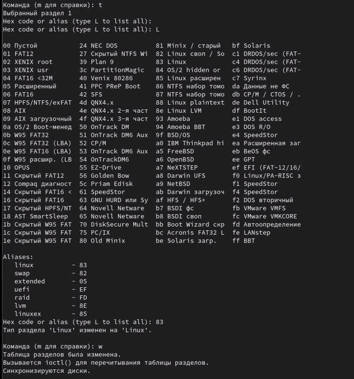
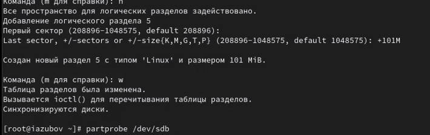
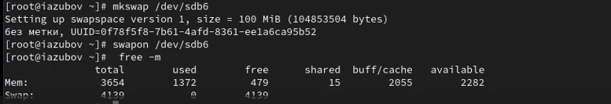
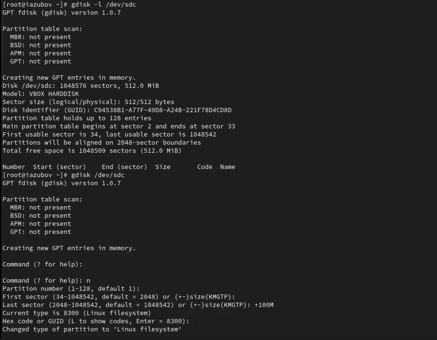
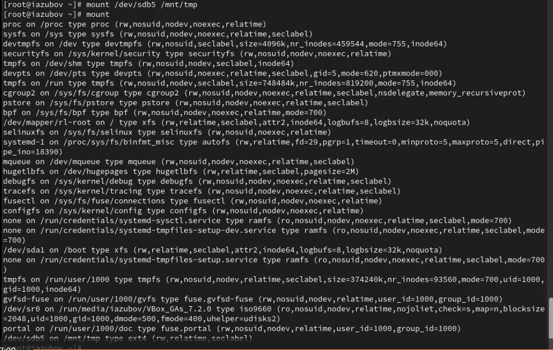
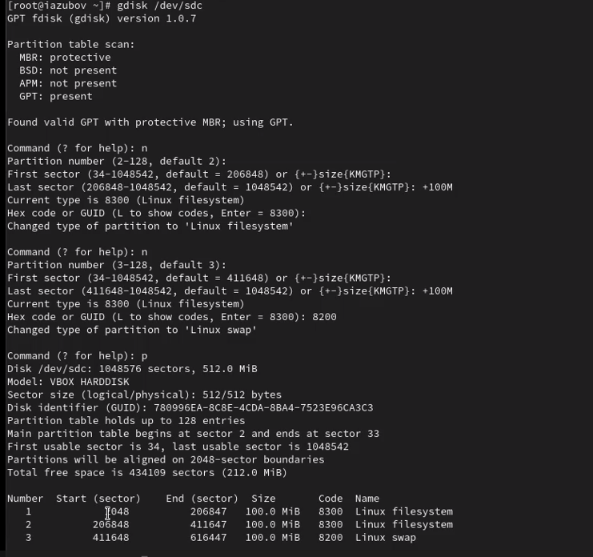

---
## Front matter
title: "Лабораторная работа №14"
subtitle: "Отчет"
author: "Зубов Иван Александрович"

## Generic otions
lang: ru-RU
toc-title: "Содержание"

## Bibliography
bibliography: bib/cite.bib
csl: pandoc/csl/gost-r-7-0-5-2008-numeric.csl

## Pdf output format
toc: true # Table of contents
toc-depth: 2
lof: true # List of figures
lot: true # List of tables
fontsize: 12pt
linestretch: 1.5
papersize: a4
documentclass: scrreprt
## I18n polyglossia
polyglossia-lang:
  name: russian
  options:
	- spelling=modern
	- babelshorthands=true
polyglossia-otherlangs:
  name: english
## I18n babel
babel-lang: russian
babel-otherlangs: english
## Fonts
mainfont: IBM Plex Serif
romanfont: IBM Plex Serif
sansfont: IBM Plex Sans
monofont: IBM Plex Mono
mathfont: STIX Two Math
mainfontoptions: Ligatures=Common,Ligatures=TeX,Scale=0.94
romanfontoptions: Ligatures=Common,Ligatures=TeX,Scale=0.94
sansfontoptions: Ligatures=Common,Ligatures=TeX,Scale=MatchLowercase,Scale=0.94
monofontoptions: Scale=MatchLowercase,Scale=0.94,FakeStretch=0.9
mathfontoptions:
## Biblatex
biblatex: true
biblio-style: "gost-numeric"
biblatexoptions:
  - parentracker=true
  - backend=biber
  - hyperref=auto
  - language=auto
  - autolang=other*
  - citestyle=gost-numeric
## Pandoc-crossref LaTeX customization
figureTitle: "Рис."
tableTitle: "Таблица"
listingTitle: "Листинг"
lofTitle: "Список иллюстраций"
lotTitle: "Список таблиц"
lolTitle: "Листинги"
## Misc options
indent: true
header-includes:
  - \usepackage{indentfirst}
  - \usepackage{float} # keep figures where there are in the text
  - \floatplacement{figure}{H} # keep figures where there are in the text
---

# Цель работы

Получить навыки создания разделов на диске и файловых систем. Получить навыки монтирования файловых систем

# Задание

1. Добавьте два диска на виртуальной машине 
2. Продемонстрируйте навыки создания разделов MBR с помощью fdisk 
3. Продемонстрируйте навыки создания логических разделов с помощью fdisk 
4. Продемонстрируйте навыки создания раздела подкачки с помощью fdisk 
5. Продемонстрируйте навыки создания разделов GPT с помощью gdisk 
6. Продемонстрируйте навыки форматирования файловой системы XFS 
7. Продемонстрируйте навыки форматирования файловой системы EXT4 
8. Продемонстрируйте навыки ручного монтирования файловых систем 
9. Продемонстрируйте навыки монтирования файловых систем с помощью /etc/fstab
10. Выполните задание для самостоятельной работы

# Выполнение лабораторной работы

## Создание виртуальных носителей и  создание разделов MBR с помощью fdisk

Добавляем к нашей виртуальной машине два диска размером 512 МБ
В командной строке с полномочиями администратора с помощью fdisk посмотрим перечень разделов на всех имеющихся в системе устройствах жёстких дисков

{#fig:001 width=70%}

Предположим, что необходимо сделать разметку диска /dev/sdb с помощью утилиты fdisk. Введите m , чтобы получить справку по командам.

{#fig:002 width=70%}

Добавляем новый основной раздел,выбрав первый и последний сектор

{#fig:003 width=70%}

Нажав кнопку t выбираем 83 тип раздела и записываем изменения кнокпкой w 

{#fig:004 width=70%}

Смотрим таблицу разделов разными командами и записываем изменения. Объясним разницу команд:
fdisk -l /dev/sdb: Подробная информация только об одном диске, показывает таблицу разделов, типы, границы, размеры, данные читаются с самого диска, для администраторов
cat /proc/partitions: Минимальная информация о ВСЕХ дисках, только major/minor номера, размер в блоках и имена,данные из ядра ОС (виртуальный файл), для скриптов и быстрой проверки

{#fig:005 width=70%}

## Создание логических разделов

Создадим новый раздел

{#fig:006 width=70%}

Создадим логический раздел,записываем изменения и завершаем процедуру

{#fig:007 width=70%}

## Создание раздела подкачки

Добавляем логический раздел с номером раздела 6. 
Завершаем процедуру и обновляем таблицу разделов
И смотрим информацию о добавленных разделах

{#fig:008 width=70%}

Отформатируем раздел подкачки, используя команду mkswap /dev/sdb6
Для включения вновь выделенного пространства подкачки используем swapon /dev/sdb6

{#fig:009 width=70%}

## Создание разделов GPT с помощью gdisk

Посмотрим таблицы разделов и разделы на втором добавленном вами ранее диске /dev/sdc и создадим новый раздел. Обновляем таблицу разделов

{#fig:010 width=70%}

## Форматирование файловой системы XFS

Создаем файловую систему EXT4. Устанавливаем метки файловой системы в ext4disk
А для установки параметров монтирования по умолчанию для файловой системы используем команду
tune2fs -o acl,user_xattr /dev/sdb5

{#fig:011 width=70%}

## Ручное монтирование файловых систем

Для создания точки монтирования для раздела введем mkdir -p /mnt/tmp.Смонтируем файловую систему и проверим корректности монтирования раздела

{#fig:012 width=70%}

## Монтирование разделов с помощью /etc/fstab

Создаем точку монтирования для раздела XFS /dev/sdb1 и посмотрим информацию об идентификаторах блочных устройств (UUID)

{#fig:013 width=70%}

Введем blkid /dev/sdb1 и затем используем мышь, чтобы скопировать значение идентификатора UUID для устройства /dev/sdb1
Откроем файл /etc/fstab на редактирование и вставим UUID. Монтируем все

{#fig:014 width=70%}

## Самостоятельная работа

Запускаем gdisk для диска /dev/sdc и создаем два раздела

{#fig:015 width=70%}

Форматирование разделов

{#fig:016 width=70%}

Создаем директорию для монтирования ext4 раздела и редактируем файл,вставляя UUID

{#fig:017 width=70%}

# Контрольные вопросы

1. Какой инструмент используется для создания разделов GUID? gdisk 
2. Какой инструмент применяется для создания разделов MBR? fdisk
3. Какой файл используется для автоматического монтирования разделов во время загрузки? /etc/fstab
4. Какой вариант монтирования целесообразно выбрать, если необходимо, чтобы файловая система не была автоматически примонтирована во время загрузки? noauto в опциях монтирования в /etc/fstab
5. Какая команда позволяет форматировать раздел с типом 82 с соответствующей файловой системой? mkswap 
6. Вы только что добавили несколько разделов для автоматического монтирования при загрузке. Как можно безопасно проверить, будет ли это работать без реальной перезагрузки? mount -a
7. Какая файловая система создаётся, если вы используете команду mkfs без какой-либо спецификации файловой системы? EXT2 
8. Как форматировать раздел EXT4? mkfs.ext4 /dev/sdXY или mkfs -t ext4 /dev/sdXY
9. Как найти UUID для всех устройств на компьютере? blkid 

# Вывод

Я получил навыки создания разделов на диске и файловых систем и навыки монтирования файловых систем.
