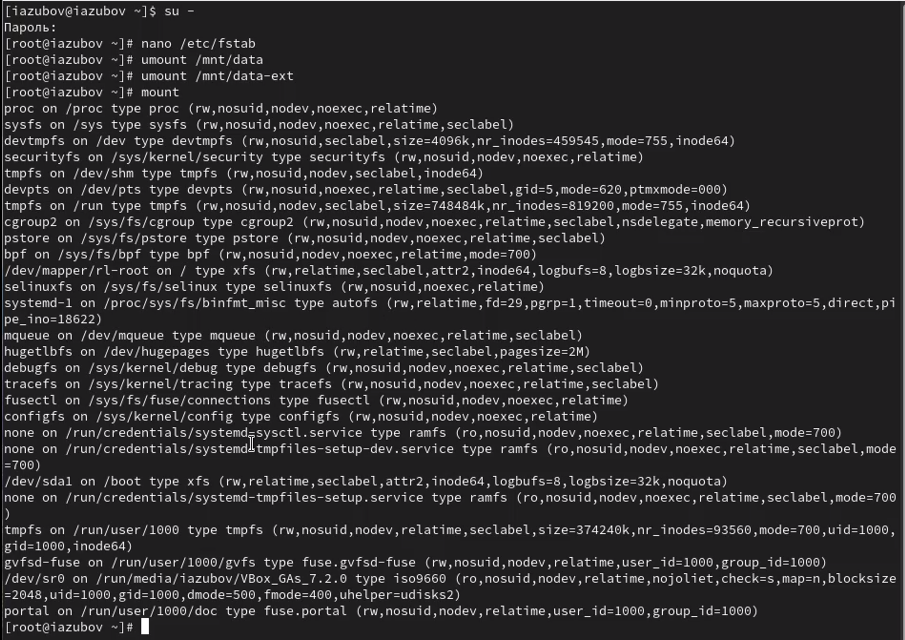
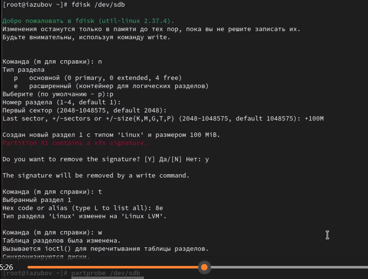
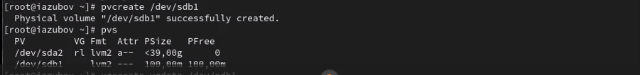
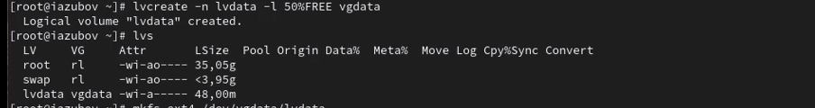
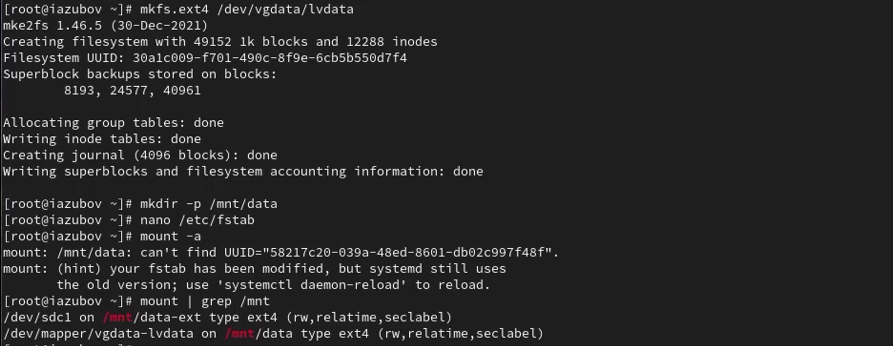
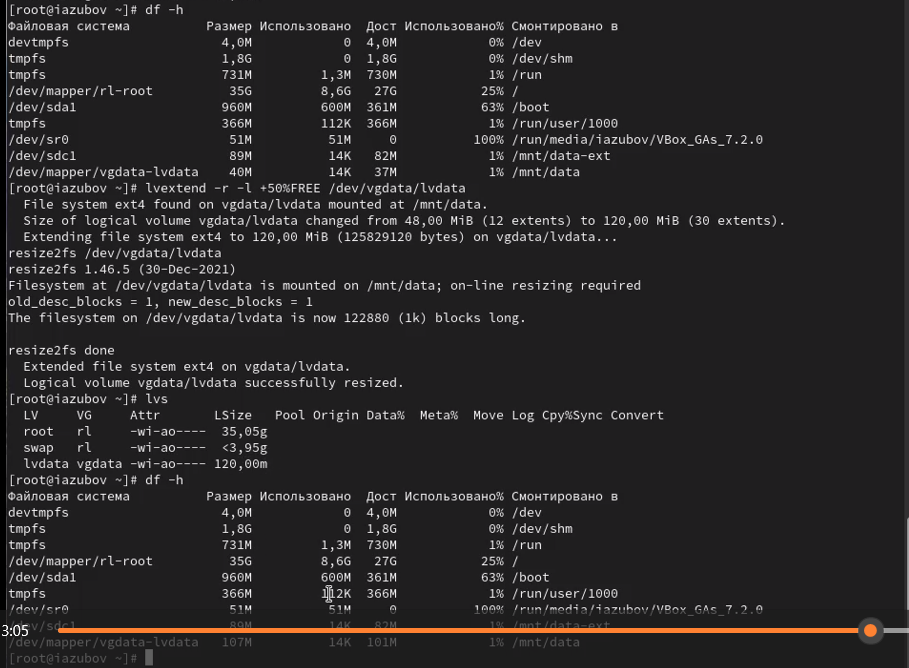
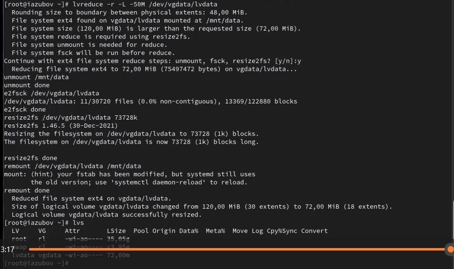
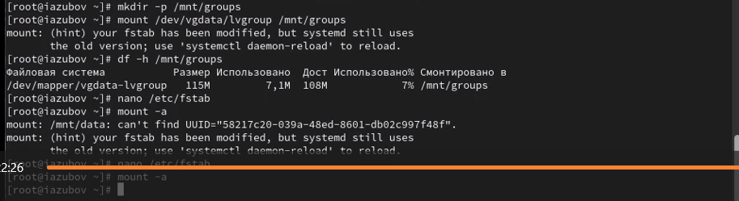
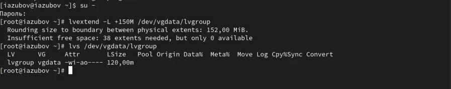

---
## Front matter
lang: ru-RU
title: Лабораторная работа №15
subtitle: Презентация
author:
  - Зубов И.А.
institute:
  - Российский университет дружбы народов, Москва, Россия
date: 22 ноября 2025

## i18n babel
babel-lang: russian
babel-otherlangs: english

## Formatting pdf
toc: false
toc-title: Содержание
slide_level: 2
aspectratio: 169
section-titles: true
theme: metropolis
header-includes:
 - \metroset{progressbar=frametitle,sectionpage=progressbar,numbering=fraction}
---

# Информация

## Докладчик

  * Зубов Иван Александрович
  * Студент
  * Российский университет дружбы народов
  * 1132243112@pfur.ru

# Выполнение лабораторной работы

## Создание физического тома.Монтируем файлы

:::::::::::::: {.columns align=center}
::: {.column width="70%"}

:::
::::::::::::::

## Создание физического тома.Новая разметка

С помощью fdisk сделаем новую разметку для /dev/sdb и /dev/sdc

:::::::::::::: {.columns align=center}
::: {.column width="70%"}

:::
::::::::::::::

## Создание физического тома.Основной раздел с типом LVM

:::::::::::::: {.columns align=center}
::: {.column width="80%"}

:::
::::::::::::::

## Создание физического тома.Физический том

Указываем раздел как физический том LVM

:::::::::::::: {.columns align=center}
::: {.column width="80%"}

:::
::::::::::::::

## Создание физического тома.Создание группы томов

Смотрим таблицу разделов разными командами и записываем изменения. 

:::::::::::::: {.columns align=center}
::: {.column width="80%"}

:::
::::::::::::::

## Создание логических разделов. Логический том

Создаем логический том LVM с именем lvdata, который будет использовать 50% доступного дискового пространства в группе томов vgdata и проверяем

:::::::::::::: {.columns align=center}
::: {.column width="80%"}

:::
::::::::::::::

## Создание логических разделов. Файловая система

Создаем файловую систему поверх логического тома и редактируем необходимый файл

:::::::::::::: {.columns align=center}
::: {.column width="80%"}

:::
::::::::::::::

## Изменение размера логических томов. Новый раздел и новый том

Добавляем раздел /dev/sdb2 размером 100 М и создаем новы том

:::::::::::::: {.columns align=center}
::: {.column width="80%"}

:::
::::::::::::::

## Изменение размера логических томов. Увеличение пространства

:::::::::::::: {.columns align=center}
::: {.column width="80%"}

:::
::::::::::::::

## Изменение размера логических томов. Уменьшение пространства

Посмотрим таблицы разделов и разделы на втором добавленном вами ранее диске /dev/sdc и создадим новый раздел. Обновляем таблицу разделов

:::::::::::::: {.columns align=center}
::: {.column width="80%"}

:::
::::::::::::::

## Самостоятельная работа

Создаем логический том lvgroup размером 200 МБ и форматируем том в XFS

:::::::::::::: {.columns align=center}
::: {.column width="80%"}

:::
::::::::::::::

## Самостоятельная работа

Создаем точку монтирования и временное монтирование. Дальше проверяем правильность. 
Редактируем файл /etc/fstab и сохраняем командой mount -a

:::::::::::::: {.columns align=center}
::: {.column width="80%"}

:::
::::::::::::::

## Самостоятельная работа

Теперь мы перезагружаем и проверяем как все работает после загрузки 

:::::::::::::: {.columns align=center}
::: {.column width="80%"}

:::
::::::::::::::

