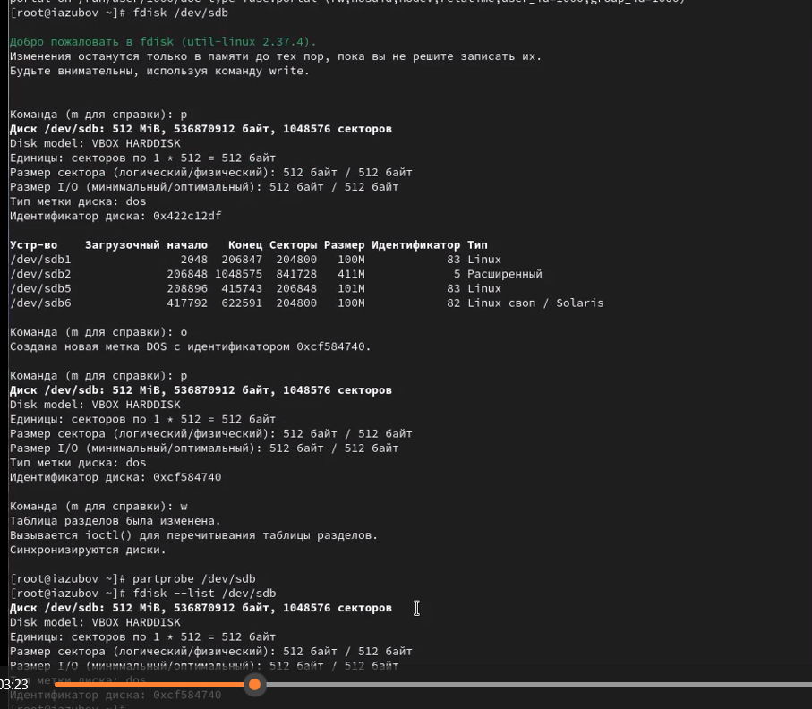
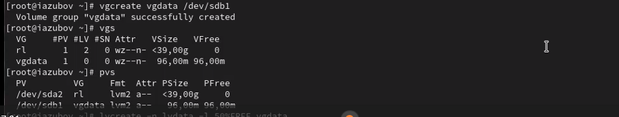
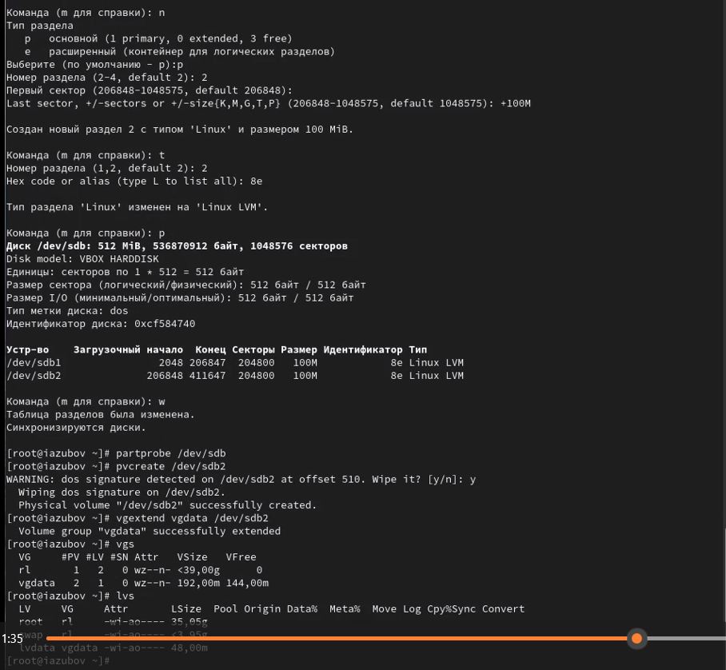
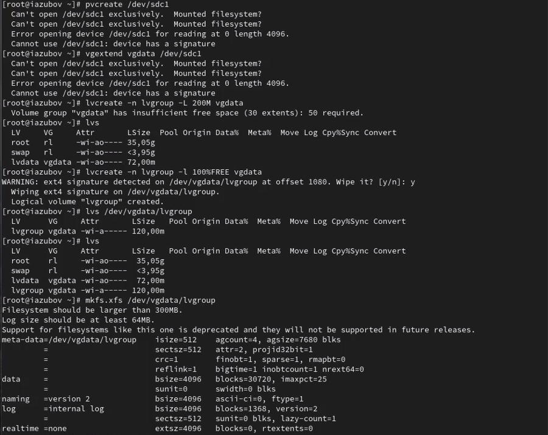

---
## Front matter
title: "Лабораторная работа №15"
subtitle: "Отчет"
author: "Зубов Иван Александрович"

## Generic otions
lang: ru-RU
toc-title: "Содержание"

## Bibliography
bibliography: bib/cite.bib
csl: pandoc/csl/gost-r-7-0-5-2008-numeric.csl

## Pdf output format
toc: true # Table of contents
toc-depth: 2
lof: true # List of figures
lot: true # List of tables
fontsize: 12pt
linestretch: 1.5
papersize: a4
documentclass: scrreprt
## I18n polyglossia
polyglossia-lang:
  name: russian
  options:
	- spelling=modern
	- babelshorthands=true
polyglossia-otherlangs:
  name: english
## I18n babel
babel-lang: russian
babel-otherlangs: english
## Fonts
mainfont: IBM Plex Serif
romanfont: IBM Plex Serif
sansfont: IBM Plex Sans
monofont: IBM Plex Mono
mathfont: STIX Two Math
mainfontoptions: Ligatures=Common,Ligatures=TeX,Scale=0.94
romanfontoptions: Ligatures=Common,Ligatures=TeX,Scale=0.94
sansfontoptions: Ligatures=Common,Ligatures=TeX,Scale=MatchLowercase,Scale=0.94
monofontoptions: Scale=MatchLowercase,Scale=0.94,FakeStretch=0.9
mathfontoptions:
## Biblatex
biblatex: true
biblio-style: "gost-numeric"
biblatexoptions:
  - parentracker=true
  - backend=biber
  - hyperref=auto
  - language=auto
  - autolang=other*
  - citestyle=gost-numeric
## Pandoc-crossref LaTeX customization
figureTitle: "Рис."
tableTitle: "Таблица"
listingTitle: "Листинг"
lofTitle: "Список иллюстраций"
lotTitle: "Список таблиц"
lolTitle: "Листинги"
## Misc options
indent: true
header-includes:
  - \usepackage{indentfirst}
  - \usepackage{float} # keep figures where there are in the text
  - \floatplacement{figure}{H} # keep figures where there are in the text
---

# Цель работы

Получить навыки управления логическими томами.

# Задание

1. Продемонстрировать навыки создания физических томов на LVM 
2. Продемонстрировать навыки создания группы томов и логических томов на LVM 
3. Продемонстрировать навыки изменения размера логических томов на LVM 
4. Выполнить задание для самостоятельной работы

# Выполнение лабораторной работы

## Создание физического тома

В терминале с полномочиями администратора в файле /etc/fstab удалим строки автомонтирования /mnt/data и /mnt/data-ext и отмонтируем /mnt/data и /mnt/data-ext. После этого убедимся, что диски /dev/sdb и /dev/sdc не подмонтированы.

{#fig:001 width=70%}

С помощью fdisk сделаем новую разметку для /dev/sdb и /dev/sdc, удалив ранее созданные партиции. Запишим изменения в таблицу разделов ядра и просмотрим информацию о разделах

{#fig:002 width=70%}

Создаем основной раздел с типом LVM и обновляем таблицу разделов

{#fig:003 width=70%}

Теперь, когда раздел был создан, мы должны указать его как физический том LVM.
Дальше введем pvs, чтобы убедиться, что физический том создан успешно

{#fig:004 width=70%}

Создаем группу томов с присвоенным ей физическим томом и убеждаемся, что группа томов была создана успешно

{#fig:005 width=70%}

Создаем логический том LVM с именем lvdata, который будет использовать 50% доступного дискового пространства в группе томов vgdata и проверяем

{#fig:006 width=70%}

Создаем файловую систему поверх логического тома
Создаем папку, на которую можно смонтировать том
Редактируем файл /etc/fstab и монтируем систему

{#fig:007 width=70%}

## Изменение размера логических томов

Добавляем раздел /dev/sdb2 размером 100 М. Создаем физический том, расширим vgdata и сделаем проверку

{#fig:008 width=70%}

Увеличиваем lvdata на 50% оставшегося доступного дискового пространства в группе томов и после этого убедимся, что добавленное дисковое пространство стало доступным

{#fig:009 width=70%}

А теперь делаем обратное действие и уменьшаем добавленное дисковое пространство

{#fig:010 width=70%}

## Самостоятельная работа

Создаем логический том lvgroup размером 200 МБ и форматируем том в XFS

{#fig:011 width=70%}

Создаем точку монтирования и временное монтирование. Дальше проверяем правильность. 
Редактируем файл /etc/fstab и сохраняем командой mount -a

{#fig:012 width=70%}

Теперь мы перезагружаем и проверяем как все работает после загрузки 

{#fig:013 width=70%}

# Контрольные вопросы

1. Какой тип раздела используется в разделе GUID для работы с LVM? 8е
2. Какой командой можно создать группу томов с именем vggroup, которая содержит физическое устройство /dev/sdb3 и использует физический экстент 4 MiB? vgcreate -s 4M vggroup /dev/sdb3
3. Какая команда показывает краткую сводку физических томов в вашей системе, а также группу томов, к которой они принадлежат? pvs
4. Что вам нужно сделать, чтобы добавить весь жёсткий диск /dev/sdd в группу томов группы? pvcreate /dev/sdd-создаем,а потом добавляем в группу-vgextend группа /dev/sdd
5. Какая команда позволяет вам создать логический том lvvol1 с размером 6 MiB? lvcreate -n lvvol1 -L 6M vggroup
6. Какая команда позволяет вам добавить 100 МБ в логический том lvvol1, если предположить, что дисковое пространство доступно в группе томов? lvextend -L +100M /dev/vggroup/lvvol1
7. Каков первый шаг, чтобы добавить ещё 200 МБ дискового пространства в логический том, если требуемое дисковое пространство недоступно в группе томов? vgextend vggroup /dev/новый_диск
8. Какую опцию нужно использовать с командой lvextend, чтобы также изменить размер файловой системы? -r
9. Как посмотреть, какие логические тома доступны? lvs
10. Какую команду нужно использовать для проверки целостности файловой системы на /dev/vgdata/lvdata? xfs_repair /dev/vgdata/vdata

# Вывод

Я получил навыки управления логическими томами.
