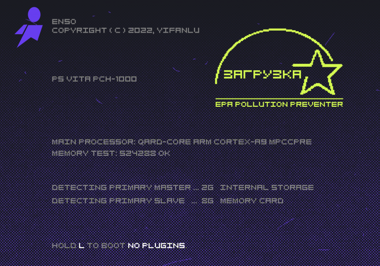
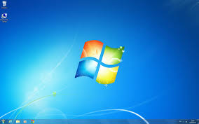

---
## Front matter
lang: ru-RU
title: Загрузка Windows
subtitle: Презентация
author:
  - Зубов И.А.
institute:
  - Российский университет дружбы народов, Москва, Россия
date: 07 ноября 2025

## i18n babel
babel-lang: russian
babel-otherlangs: english

## Formatting pdf
toc: false
toc-title: Содержание
slide_level: 2
aspectratio: 169
section-titles: true
theme: metropolis
header-includes:
 - \metroset{progressbar=frametitle,sectionpage=progressbar,numbering=fraction}
---

# Информация

## Докладчик

  * Зубов Иван Александрович
  * Студент
  * Российский университет дружбы народов
  * 1132243112@pfur.ru

# Вводная часть

Сегодня мы рассмотрим один из фундаментальных процессов, с которым сталкивается каждый пользователь компьютера - загрузка операционной системы Windows.Этот многоэтапный и строго последовательный механизм, который часто называют "boot process", превращает наш выключенный компьютер в готовый к работе инструмент. Понимание этого процесса не только интересно с технической точки зрения, но и полезно на практике, например, для диагностики неисправностей.

# Аппаратная фаза (начало и поиск загрузчика ОС)

• Начало работы - первым делом выполняется самотестирование при включении, или POST.

• Поиск загрузчика операционной системы - BIOS/UEFI приступает к поиску загрузчика операционной системы. Он просматривает подключенные накопители в порядке, заданном в настройках.

{#fig:001 width=45%}

# Аппаратная фаза (современный подход: UEFI и ESP)

:::::::::::::: {.columns align=center}
::: {.column width="70%"}

Здесь на сцену выходит более современный и безопасный подход UEFI. Вместо поиска MBR, он использует специальный раздел на диске, называемый ESP (EFI System Partition). Этот раздел содержит файлы загрузчиков в собственном формате, что делает процесс более надежным и быстрым.

:::
::: {.column width="40%"}

:::
::::::::::::::

# Программная фаза

• Роль диспетчера загрузки Windows 
Независимо от того, был ли использован MBR или UEFI, следующим шагом управление переходит к менеджеру загрузки Windows – файлу Boot Manager.

• Загрузка основного загрузчика и ядра системы
Выбрав нужную систему, Boot Manager загружает в память основной загрузчик – файл winload.exe (Windows OS Loader), который уже находится на системном разделе. 

• Критически важные действия загрузчика
Загрузчик winload.exe выполняет ряд критически важных действий. Он загружает в память ядро операционной системы – ntoskrnl.exe, а также основные драйверы устройств, без которых работа системы невозможна.

# Финальный этап: инициализация системы и вход пользователя

:::::::::::::: {.columns align=center}
::: {.column width="70%"}

Финальный этап — это полная инициализация ядра, запуск служб и процессов входа, которые в конечном итоге загружают пользовательский интерфейс и приложения автозагрузки, делая систему полностью готовой к работе.

:::
::: {.column width="45%"}

:::
::::::::::::::

## Запуск ядра и диспетчера устройств и роль диспетчера сеансов (smss.exe)

После загрузки ядра управление передается ему. Ядро инициализирует все системные компоненты, запускает диспетчер Plug and Play для обнаружения и настройки всего оборудования, а затем стартует сеанс подсистемы Windows. Дальше запускается процесс smss.exe (Session Manager). Это первый процесс, созданный системой, и он играет ключевую роль. 

{#fig:004 width=45%}

## Роль диспетчера сеансов (smss.exe) и процесс входа в систему

Запускается процесс smss.exe (Session Manager). Это первый процесс, созданный системой, и он играет ключевую роль. 

Именно winlogon.exe отвечает за процедуру входа пользователя в систему. Он выводит на экран знакомый нам интерфейс входа – приветственный экран.

## Завершение загрузки: появление рабочего стола

После успешной проверки подлинности winlogon загружает профиль пользователя и запускает оболочку операционной системы – проводник explorer.exe. Одновременно с этим фоновой планировщик задач services.exe запускает все автоматические системные службы и приложения из автозагрузки. И вот, перед нами появляется рабочий стол – операционная система полностью загружена и готова к работе

{#fig:005 width=45%}

# Заключение

Таким образом, загрузка Windows - Это не мгновенное чудо,а сложный и многоуровневый механизм. Он предствляет собой четкую эстафету , где управление последовательно передается от микропрограмм материнской плате к простым загрузчикам , а от них уже к мощному ядру операционной системы и,наконец к пользовательской оболочке. Каждый этап критически важен, и сбой на любом из них может привести к невозможности запуска системы. Понимание этих этапов позволяет не только глубже познать архитектуру ОС, но и грамотно подходить к решению возможных проблем с загрузкой.

